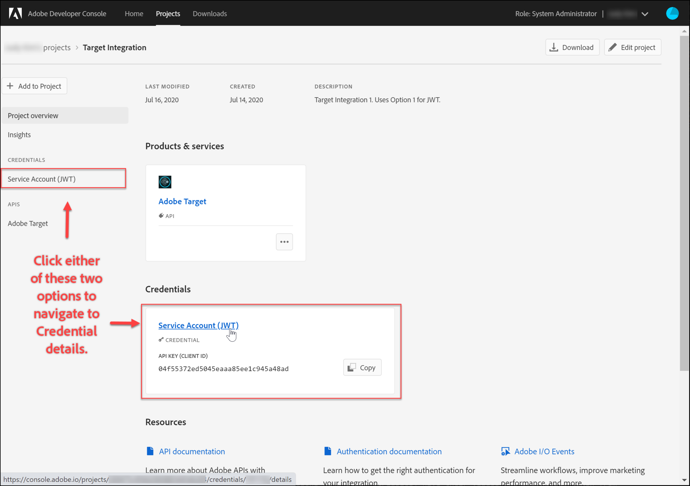

# 为[!DNL Adobe Target] API配置身份验证

[!DNL Adobe Target]管理员API（包括[!DNL Recommendations Admin] API）受身份验证保护，以确保只有授权用户使用它们来访问[!DNL Adobe Target]。 使用[Adobe Developer Console](https://developer.adobe.com/console/home)管理所有[!DNL Adobe Experience Cloud solutions]的此身份验证，包括[!DNL Adobe Target]。

>[!IMPORTANT]
>
>为了支持新的OAuth服务器到服务器凭据，本文中描述的服务帐户(JWT)凭据将被弃用。
>
>服务帐户(JWT)凭据将继续工作到2025年1月1日。 您必须在2025年1月1日之前迁移应用程序或集成，才能使用新的OAuth服务器到服务器凭据。
>
>有关迁移集成的更多信息和分步说明，请参阅&#x200B;*Developer Console*&#x200B;文档中的[从服务帐户(JWT)凭据迁移到OAuth服务器到服务器凭据](https://developer.adobe.com/developer-console/docs/guides/authentication/ServerToServerAuthentication/migration/){target=_blank}。
>
>有关设置新OAuth凭据的信息，请参阅&#x200B;*Developer Console*&#x200B;文档中的[OAuth服务器到服务器凭据实施](https://developer.adobe.com/developer-console/docs/guides/authentication/ServerToServerAuthentication/implementation/){target=_blank}。

以下是生成成功与[!DNL Adobe Target] API交互所需的旧版JWT身份验证令牌所需的初步步骤：

1. 在[!DNL Adobe Developer Console]中创建项目（以前称为集成）。
1. 将项目详细信息导出到Postman。
1. 生成持有者访问令牌。
1. 测试持有者访问令牌。

## 先决条件

| 资源 | 详细信息 |
| --- | --- |
| Postman | 为了成功完成这些步骤，请获取适用于您的操作系统的[Postman应用程序](https://www.postman.com/downloads/)。 Postman basic可在创建帐户时免费使用。 虽然使用[!DNL Adobe Target] API通常不是必需的，但Postman使API工作流更简单，并且[!DNL Adobe Target]提供了多个Postman收藏集以帮助执行其API并了解其操作方式。 本指南的其余部分假定您了解Postman的工作知识。 有关帮助，请参阅[Postman文档](https://learning.getpostman.com/)。 |
| 引用 | 在本指南的其余部分中，均假定您已熟悉以下资源：<ul><li>[Adobe I/OGithub](https://github.com/adobeio)</li><li>[Target管理员和配置文件API文档](../administer/admin-api/admin-api-overview-new.md)</li><li>[Recommendations API文档](https://developer.adobe.com/target/administer/recommendations-api/)</li></ul> |

## 创建Adobe I/O项目

在此部分中，您将访问[!DNL Adobe Developer Console]并为[!DNL Adobe Target]创建项目。 有关详细信息，请参考[有关项目](https://developer.adobe.com/developer-console/docs/guides/projects/)的文档。

&lt;！—(1. 根据[关于身份验证](https://developer.adobe.com/developer-console/docs/guides/authentication/)的文档生成私钥和公共证书。 // [//]： # （如[的&#x200B;**步骤1**&#x200B;中所述）如何设置AdobeIO：身份验证 — 分步](https://helpx.adobe.com/marketing-cloud-core/kb/adobe-io-authentication-step-by-step.html)。 完成步骤1后，返回本指南并继续执行下面的步骤2。//此步骤的结果应该是创建`private.key`文件和`certificate_pub.crt`文件。 生成这两个文件后，请返回本指南。)—>

1. 在[Adobe Admin Console](https://adminconsole.adobe.com/)中，确保您的[!DNL Adobe]用户帐户已被授予[!DNL Target]的[产品管理员](https://helpx.adobe.com/cn/enterprise/using/admin-roles.html)和[开发人员](https://helpx.adobe.com/cn/enterprise/using/manage-developers.html)级别访问权限。

1. 在[Adobe Developer Console](https://developer.adobe.com/console/home)中，选择要为其创建此集成的[!UICONTROL Experience Cloud Organization]。 （请注意，您可能只能访问单个[!UICONTROL Experience Cloud Organization]。）

   

1. 单击 **[!UICONTROL Create new project]**。

   

1. 单击&#x200B;**[!UICONTROL Add API]**&#x200B;将REST API添加到您的项目以访问[!DNL Adobe]服务和产品。

   

1. 选择&#x200B;**[!DNL Adobe Target]**&#x200B;作为要与集成的[!DNL Adobe]服务。 单击显示的&#x200B;**[!UICONTROL Next]**&#x200B;按钮。

   

1. 选择将公钥和私钥与您为[!DNL Target]创建的服务帐户集成关联的选项。 对于此示例，请选择&#x200B;**[!UICONTROL Option 1: Generate a key pair]**&#x200B;并单击&#x200B;**[!UICONTROL Generate keypair]**。

   

1. 按照说明，记下自动下载的配置文件(`config`)，其中包含您的私钥。 单击 **[!UICONTROL Next]**。

   

1. 在您的文件系统中，验证`config`的位置，这是在上一步中创建的压缩配置文件。 同样，此`config`文件包含您的私钥，稍后您将需要这些私钥。 文件系统中的确切位置可能与此处显示的位置不同。

   

1. 返回Adobe Developer Console，选择与您使用Adobe Recommendations的属性对应的[产品配置文件](https://helpx.adobe.com/cn/enterprise/using/manage-products-and-profiles.html)。 (如果您未使用资产，请选择“默认Workspace”选项。) 单击 **[!UICONTROL Save configured API]**。

   

1. 单击&#x200B;**[!UICONTROL Create Integration]**。 您应会收到一条临时消息，指示您的API已成功配置。
1. 最后，将项目重命名为比原始`Project 1`更有意义的名称。 为此，请使用显示形式的导航路径导航到项目，单击&#x200B;**[!UICONTROL Edit project]**&#x200B;以访问&#x200B;**[!UICONTROL Edit Project]**&#x200B;模式窗口，然后重命名项目。

   

>[!NOTE]
>
>在此示例中，我们将项目命名为“[!DNL Target]集成”。 如果您预计使用项目的时间将超过[!DNL Adobe Target]，则可能需要相应地命名该项目。 例如，您可以选择将其命名为“AdobeAPI”或“Experience CloudAPI”，因为它可与Adobe Experience Cloud中的其他解决方案一起使用。

## 导出项目详细信息

现在您拥有了一个可用于访问[!DNL Target]的Adobe项目，您需要确保将该项目的详细信息与AdobeAPI请求一起发送。 要与多个AdobeAPI（包括多个[!DNL Target] API）交互，需要这些详细信息。 例如，集成详细信息包括[!DNL Target]管理员API所需的授权和身份验证信息。 因此，要将API与Postman结合使用，您需要将这些详细信息导入Postman。

可通过多种方式在Postman中指定项目的详细信息，但在本节中，我们利用了某些预建的功能和集合。 首先（在此部分中），您将把集成详情导出到Postman环境中。 接下来（在以下部分中），您将生成持有者访问令牌，以授予您访问必要Adobe资源的权限。

>[!NOTE]
>
>有关适用于任何Experience Cloud解决方案（包括[!DNL Target]）的视频说明，请参阅[将Postman与Experience PlatformAPI结合使用](https://experienceleague.adobe.com/docs/platform-learn/tutorials/platform-api-authentication.html?lang=zh-Hans)。 以下部分与[!DNL Target] API相关： 1. 创建Experience PlatformAPI并将其导出到Postman 2。 使用Postman生成访问令牌。 以下也提供了这些步骤。

1. 仍在[Adobe Developer Console](https://developer.adobe.com/console/home)中，导航以查看新项目的&#x200B;**[!UICONTROL Service Account (JWT)]**&#x200B;凭据。 使用左侧导航或&#x200B;**[!UICONTROL Credentials]**&#x200B;部分，如图所示。

   

   在&#x200B;**[!UICONTROL Credential details]**&#x200B;中，请注意，您可以查看您的&#x200B;**[!UICONTROL Public key(s)]**、**[!UICONTROL Client ID]**&#x200B;以及与您的服务帐户相关的其他信息。

   

1. 单击以导航到有关&#x200B;**[!DNL Adobe Target]** API的信息。 使用左侧导航或&#x200B;**连接的产品和服务**&#x200B;部分，如图所示。

   

1. 单击&#x200B;**[!UICONTROL Download for Postman]** > **[!UICONTROL Service Account (JWT)]**&#x200B;可创建一个用于捕获Postman环境的身份验证信息的JSON文件。

   

   记下文件系统中的该JSON文件。

   

1. 在Postman中，单击齿轮图标以管理环境，然后单击&#x200B;**[!UICONTROL Import]**&#x200B;以导入JSON文件（环境）。

   

1. 选择您的文件并单击&#x200B;**[!UICONTROL Open]**。

   

1. 在Postman **管理环境**&#x200B;模式中，单击新导入环境的名称以检查该环境。 (您的环境名称可能与此处显示的名称不同。 根据需要编辑名称。 它不一定与[!DNL Adobe]项目的名称匹配。)

   

1. 注意`CLIENT_SECRET`和`API_KEY`（以及其他变量）已预填充其值，这些值取自Adobe Developer Console中定义的集成。 (Postman `CLIENT_SECRET`变量应与Developer Console中显示的`CLIENT SECRET`Adobe凭据匹配，Postman中的`API_KEY`应与Developer Console中的`CLIENT ID`同样匹配。) 相反，注释`PRIVATE_KEY`、`JWT_TOKEN`和`ACCESS_TOKEN`为空。 让我们从提供`PRIVATE_KEY`值开始。

   

1. 从您的文件系统打开`config`文件，然后打开`private`密钥文件。

   

1. 选择并复制`private`密钥文件的全部内容。

   

1. 在Postman中，将私钥值粘贴到&#x200B;**[!UICONTROL INITIAL VALUE]**&#x200B;和&#x200B;**[!UICONTROL CURRENT VALUE]**&#x200B;字段中。

   

1. 单击&#x200B;**[!UICONTROL Update]**，然后关闭Environments模式窗口。

## 生成持有者访问令牌

在此部分中，您生成持有者访问令牌，这是验证您与[!DNL Adobe Target] API的交互所必需的。 要生成持有者访问令牌，您需要将集成详细信息（在前面部分中建立）发送到[AdobeIdentity Management服务(IMS)](https://www.adobe.io/authentication/auth-methods.html#!AdobeDocs/adobeio-auth/master/AuthenticationOverview/AuthenticationGuide.md)。 有几种方法可以实现这一点，但在本指南中，我们利用了包含预建IMS调用的Postman集合，该调用可让过程直接而轻松。 导入收藏集后，您可以根据需要重复使用它，以便不仅为[!DNL Adobe Target]，而且还为其他AdobeAPI生成新令牌。

1. 导航到[AdobeIdentity Management服务API示例调用](https://github.com/adobe/experience-platform-postman-samples/tree/master/apis/ims)。

   

1. 单击&#x200B;**[!UICONTROL Adobe I/O Access Token Generation Postman collection]**。

   

1. 通过单击&#x200B;**[!UICONTROL Raw]**&#x200B;获取此收藏集的原始JSON，然后将生成的JSON复制到剪贴板。 （或者，您可以将原始JSON另存为.json文件。）

   

1. 在Postman中，通过粘贴并从剪贴板提交原始JSON来导入收藏集。 （或者，您可以上传已保存的.json文件。） 单击 **[!UICONTROL Continue]**。

   

1. 在Adobe I/O访问令牌生成Postman集合中选择&#x200B;**[!UICONTROL IMS: JWT Generate + Auth via User Token]**&#x200B;请求，确保选择了您的环境，然后单击&#x200B;**[!UICONTROL Send]**&#x200B;以生成令牌。

   

   >[!NOTE]
   >
   >此持有者访问令牌的有效期为24小时。 需要生成新令牌时再次发送请求。

1. 再次打开管理环境模式窗口，然后选择您的环境。

   

1. 请注意，`ACCESS_TOKEN`和`JWT_TOKEN`值现已填充。

   

问题：我是否需要使用Adobe I/O访问令牌生成Postman集合来生成JSON Web令牌(JWT)和持有者访问令牌？

回答：否。 Adobe I/O访问令牌生成Postman集合可方便地在Postman中更轻松地生成JWT和持有者访问令牌。 或者，您可以使用Adobe Developer Console中的功能手动生成持有者访问令牌。

## 测试持有者访问令牌

在本练习中，您将通过发送一个API请求来使用新的持有者访问令牌，该请求将从您的[!DNL Target]帐户中检索活动列表。 成功的响应表示您的[!DNL Adobe]项目和身份验证正在按预期运行，以便使用该API。

1. 导入[[!DNL Adobe Target] 管理员API Postman收藏集](https://developers.adobetarget.com/api/#admin-postman-collection)。 按照所有提示操作，直到在Postman中导入收藏集为止。

   

1. 展开收藏集，并注意&#x200B;**[!UICONTROL List activities]**&#x200B;请求。

   

1. 请注意，变量（如`{{access_token}}`）最初未解析。 您可以通过多种方式解决此问题 — 例如，您可以定义名为`{{access_token}}`的新收藏集变量 — 但在本指南中，您将改为更改API请求以利用您之前使用的Postman环境。 这将使环境能够继续作为跨AdobeAPI共有的所有变量的单一、一致整合。

   

1. 键入以将`{{access_token}}`替换为`{{ACCESS_TOKEN}}`。

   

1. 键入以将`{{api_key}}`替换为`{{API_KEY}}`。

   

1. 键入以将`{{tenant}}`替换为`{{TENANT_ID}}`。 尚未识别注释`{{TENANT_ID}}`。

   

1. 打开管理环境模式窗口，然后选择您的环境。

   

1. 键入以添加新的`{{TENANT_ID}}`环境变量。 将租户ID值复制并粘贴到新`TENANT_ID`环境变量的&#x200B;**[!UICONTROL INITIAL VALUE]**&#x200B;和&#x200B;**[!UICONTROL CURRENT VALUE]**&#x200B;字段中。

   

   >[!NOTE]
   >
   >租户ID与您的[!DNL Target] `clientcode`不同。 登录[!DNL Target]时，URL中存在租户ID。 要获取租户ID，请登录到Adobe Experience Cloud，打开[!DNL Target]，然后单击Target卡片。 使用URL子域中所述的租户ID值。 例如，如果您在登录到[!DNL Adobe Target]时的URL是`<https://mycompany.experiencecloud.adobe.com/...>`，则您的租户ID是“mycompany”。

1. 在确保选择了正确的环境后，发送您的请求。 您应会收到包含活动列表的响应。

   

现在您已验证Adobe身份验证，可以使用该身份验证与[!DNL Adobe Target] API(以及其他AdobeAPI)交互。 例如，您可以[使用Recommendations API](recs-api/overview.md)创建或管理推荐，也可以将其与[Target投放API](/help/dev/implement/delivery-api/overview.md)一起使用。
