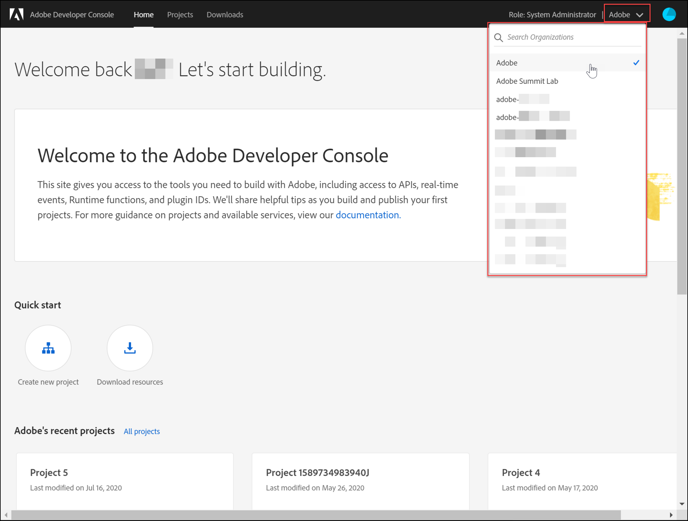

# 配置身份验证 [!DNL Adobe Target] API

此 [!DNL Adobe Target] 管理员API，包括 [!DNL Recommendations Admin] API通过身份验证进行保护，以确保只有授权用户才能使用它们进行访问 [!DNL Adobe Target]. 使用 [Adobe Developer控制台](https://developer.adobe.com/console/home) 以管理所有用户的此身份验证 [!DNL Adobe Experience Cloud solutions]，包括 [!DNL Adobe Target].

>[!IMPORTANT]
>
>为了支持新的OAuth服务器到服务器凭据，本文中描述的服务帐户(JWT)凭据将被弃用。
>
>服务帐户(JWT)凭据将继续工作到2025年1月1日。 您必须在2025年1月1日之前迁移应用程序或集成，才能使用新的OAuth服务器到服务器凭据。
>
>有关迁移集成的更多信息和分步说明，请参阅 [从服务帐户(JWT)凭据迁移到OAuth服务器到服务器凭据](https://developer.adobe.com/developer-console/docs/guides/authentication/ServerToServerAuthentication/migration/){target=_blank} 在 *开发人员控制台* 文档。
>
>有关设置新OAuth凭据的信息，请参阅 [OAuth服务器到服务器凭据实施](https://developer.adobe.com/developer-console/docs/guides/authentication/ServerToServerAuthentication/implementation/){target=_blank} 在 *开发人员控制台* 文档。

以下是生成与成功交互所需的旧版JWT身份验证令牌所需的初步步骤 [!DNL Adobe Target] API：

1. 在中创建项目（以前称为集成） [!DNL Adobe Developer Console].
1. 将项目详细信息导出到Postman。
1. 生成持有者访问令牌。
1. 测试持有者访问令牌。

## 先决条件

| 资源 | 详细信息 |
| --- | --- |
| Postman | 为了成功完成这些步骤，请获取 [Postman应用程序](https://www.postman.com/downloads/) 适用于您的操作系统。 Postman basic可在创建帐户时免费使用。 虽然不是要使用 [!DNL Adobe Target] API一般而言，Postman使API工作流更容易，并且 [!DNL Adobe Target] 提供了多个Postman收藏集，以帮助执行其API并了解其操作方式。 本指南的其余部分假定您了解Postman的工作知识。 如需帮助，请参阅 [Postman文档](https://learning.getpostman.com/). |
| 引用 | 在本指南的其余部分中，均假定您已熟悉以下资源：<ul><li>[Adobe I/OGithub](https://github.com/adobeio)</li><li>[Target管理员和配置文件API文档](../administer/admin-api/admin-api-overview-new.md)</li><li>[Recommendations API文档](https://developer.adobe.com/target/administer/recommendations-api/)</li></ul> |

## 创建Adobe I/O项目

在此部分中，您将访问 [!DNL Adobe Developer Console] 并为创建项目 [!DNL Adobe Target]. 欲了解更多信息，请参见 [项目文档](https://developer.adobe.com/developer-console/docs/guides/projects/).

&lt;!---(1. 根据 [身份验证文档](https://developer.adobe.com/developer-console/docs/guides/authentication/).// [//]： #(如中所述 **步骤1** 之 [如何设置AdobeIO：身份验证 — 一步一步](https://helpx.adobe.com/marketing-cloud-core/kb/adobe-io-authentication-step-by-step.html). 完成步骤1后，返回本指南并继续执行下面的步骤2。//此步骤的结果应该是创建一个 `private.key` 文件和 `certificate_pub.crt` 文件。 生成这两个文件后，请返回本指南。)—>

1. 在 [Adobe Admin Console](https://adminconsole.adobe.com/)，确保 [!DNL Adobe] 用户帐户已被授予两者 [产品管理员](https://helpx.adobe.com/enterprise/using/admin-roles.html) 和 [开发人员](https://helpx.adobe.com/enterprise/using/manage-developers.html) 级别访问 [!DNL Target].

1. 在 [Adobe Developer控制台](https://developer.adobe.com/console/home)，选择 [!UICONTROL Experience Cloud组织] ，您要为其创建此集成。 (请注意，您可能只能访问一个 [!UICONTROL Experience Cloud组织].)

   

1. 单击 **[!UICONTROL 创建新项目]**.

   

1. 单击 **[!UICONTROL 添加API]** 将REST API添加到您的项目以访问 [!DNL Adobe] 服务及产品。

   

1. 选择 **[!DNL Adobe Target]** 作为 [!DNL Adobe] 您希望与集成的服务。 单击 **[!UICONTROL 下一个]** 按钮。

   

1. 选择一个选项，以将公钥和私钥与要为其创建的服务帐户集成关联 [!DNL Target]. 对于此示例，请选择 **[!UICONTROL 选项1：生成密钥对]** 并单击 **[!UICONTROL 生成密钥对]**.

   

1. 按照说明，记下自动下载的配置文件(`config`)，其中包含您的私钥。 单击&#x200B;**[!UICONTROL 下一步]**。

   

1. 在您的文件系统中，验证 `config`，在上一步中创建的压缩配置文件。 同样，这个 `config` 文件中包含您的私钥，稍后您将需要这些私钥。 文件系统中的确切位置可能与此处显示的位置不同。

   

1. 返回到Adobe Developer Console，选择 [产品配置文件](https://helpx.adobe.com/enterprise/using/manage-products-and-profiles.html) 与您在其中使用Adobe Recommendations的属性相对应。 （如果不使用属性，请选择“默认工作区”选项。） 单击 **[!UICONTROL 保存配置的API]**.

   

1. 单击 **[!UICONTROL 创建集成]**. 您应会收到一条临时消息，指示您的API已成功配置。
1. 最后，将项目重命名为比原始名称更有意义的名称 `Project 1`. 为此，请使用显示导航路径导航到项目，然后单击 **[!UICONTROL 编辑项目]** 以访问 **[!UICONTROL 编辑项目]** 模式窗口，并重命名项目。

   

>[!NOTE]
>
>在此示例中，我们将项目命名为“[!DNL Target] 集成。” 如果您预计使用项目的范围不只是 [!DNL Adobe Target]，则可能需要相应地命名它。 例如，您可以选择将其命名为“AdobeAPI”或“Experience CloudAPI”，因为它可与Adobe Experience Cloud中的其他解决方案一起使用。

## 导出项目详细信息

现在您已经拥有了一个Adobe项目，可以使用它来访问 [!DNL Target]，您需要确保发送该项目的详细信息以及AdobeAPI请求。 要与多个AdobeAPI(包括多个 [!DNL Target] API。 例如，集成详细信息包括 [!DNL Target] 管理员API。 因此，要将API与Postman结合使用，您需要将这些详细信息导入Postman。

可通过多种方式在Postman中指定项目的详细信息，但在本节中，我们利用了某些预建的功能和集合。 首先（在此部分中），您将把集成详情导出到Postman环境中。 接下来（在以下部分中），您将生成持有者访问令牌，以授予您访问必要Adobe资源的权限。

>[!NOTE]
>
>有关适用于任何Experience Cloud解决方案的视频说明，包括 [!DNL Target]，请参见 [将Postman与Experience PlatformAPI结合使用](https://experienceleague.adobe.com/docs/platform-learn/tutorials/platform-api-authentication.html). 以下部分与 [!DNL Target] API： 1. 创建Experience PlatformAPI并将其导出到Postman 2。 使用Postman生成访问令牌。 以下也提供了这些步骤。

1. 仍在 [Adobe Developer控制台](https://developer.adobe.com/console/home)，导航以查看您新项目的 **[!UICONTROL 服务帐户(JWT)]** 凭据。 使用左侧导航或 **[!UICONTROL 凭据]** 部分所示。

   

   在 **[!UICONTROL 凭据详细信息]**，请注意，您可以查看 **[!UICONTROL 公钥]**， **[!UICONTROL 客户端ID]**，以及与您的服务帐户相关的其他信息。

   

1. 单击可导航至以下内容： **[!DNL Adobe Target]** API。 使用左侧导航或 **连接的产品和服务** 部分所示。

   

1. 单击 **[!UICONTROL Postman下载]** > **[!UICONTROL 服务帐户(JWT)]** 创建一个JSON文件，用于捕获Postman环境的身份验证信息。

   

   记下文件系统中的该JSON文件。

   

1. 在Postman中，单击齿轮图标以管理环境，然后单击 **[!UICONTROL 导入]** 导入JSON文件（环境）。

   

1. 选择文件并单击 **[!UICONTROL 打开]**.

   

1. 在Postman中 **管理环境** 模式窗口中，单击新导入环境的名称以检查该环境。 (您的环境名称可能与此处显示的名称不同。 根据需要编辑名称。 它不一定需要与 [!DNL Adobe] 项目。)

   

1. 注意 `CLIENT_SECRET` 和 `API_KEY` （以及其他变量）预先填充了它们的值，这些值取自Adobe Developer控制台中定义的集成。 (Postman `CLIENT_SECRET` 变量应匹配 `CLIENT SECRET` Adobe在开发人员控制台中显示的凭据，并且 `API_KEY` 在Postman中也应匹配 `CLIENT ID` 在开发人员控制台中。) 相比之下，请注意 `PRIVATE_KEY`， `JWT_TOKEN`、和 `ACCESS_TOKEN` 为空。 让我们从提供 `PRIVATE_KEY` 值。

   

1. 从您的文件系统打开您的 `config` 文件，然后打开 `private` 密钥文件。

   

1. 选择并复制 `private` 密钥文件。

   

1. 在Postman中，将私钥值粘贴到 **[!UICONTROL 初始值]** 和 **[!UICONTROL 当前值]** 字段。

   

1. 单击 **[!UICONTROL 更新]**，然后关闭Environments模式窗口。

## 生成持有者访问令牌

在此部分中，您将生成持有者访问令牌，这是对与的交互进行身份验证所必需的 [!DNL Adobe Target] API。 要生成持有者访问令牌，您需要将集成详细信息（在前面部分中建立）发送到 [AdobeIdentity Management服务(IMS)](https://www.adobe.io/authentication/auth-methods.html#!AdobeDocs/adobeio-auth/master/AuthenticationOverview/AuthenticationGuide.md). 有几种方法可以实现这一点，但在本指南中，我们利用了包含预建IMS调用的Postman集合，该调用可让过程直接而轻松。 导入收藏集后，您可以根据需要重复使用它，以生成新的令牌，而不仅仅是 [!DNL Adobe Target]、以及其他AdobeAPI。

1. 导航至 [AdobeIdentity Management服务API示例调用](https://github.com/adobe/experience-platform-postman-samples/tree/master/apis/ims).

   

1. 单击 **[!UICONTROL Adobe I/O访问令牌生成Postman集合]**.

   

1. 通过单击获取此收藏集的原始JSON **[!UICONTROL 原始]**，然后将生成的JSON复制到剪贴板。 （或者，您可以将原始JSON另存为.json文件。）

   

1. 在Postman中，通过粘贴并从剪贴板提交原始JSON来导入收藏集。 （或者，您可以上传已保存的.json文件。） 单击&#x200B;**[!UICONTROL 继续]**。

   

1. 选择 **[!UICONTROL IMS：JWT通过用户令牌生成+身份验证]** 请求生成PostmanAdobe I/O访问令牌收藏集，确保已选择您的环境，然后单击 **[!UICONTROL 发送]** 以生成令牌。

   

   >[!NOTE]
   >
   >此持有者访问令牌的有效期为24小时。 需要生成新令牌时再次发送请求。

1. 再次打开管理环境模式窗口，然后选择您的环境。

   

1. 请注意 `ACCESS_TOKEN` 和 `JWT_TOKEN` 现在填充值。

   

问题：我是否需要使用Adobe I/O访问令牌生成Postman集合来生成JSON Web令牌(JWT)和持有者访问令牌？

回答：否。 Adobe I/O访问令牌生成Postman集合可方便地在Postman中更轻松地生成JWT和持有者访问令牌。 或者，您可以使用Adobe Developer控制台中的功能手动生成持有者访问令牌。

## 测试持有者访问令牌

在本练习中，您将通过发送一个API请求来使用新的持有者访问令牌，该API请求将从您的存储库中检索活动列表 [!DNL Target] 帐户。 成功的响应表示您的 [!DNL Adobe] 项目和身份验证按预期运行，以便使用API。

1. 导入 [[!DNL Adobe Target] 管理员API Postman收藏集](https://developers.adobetarget.com/api/#admin-postman-collection). 按照所有提示操作，直到在Postman中导入收藏集为止。

   

1. 展开收藏集，并注意 **[!UICONTROL 列出活动]** 请求。

   

1. 请注意，变量包括 `{{access_token}}` 最初未解决。 您可以通过多种不同的方式解决此问题 — 例如，您可以定义一个名为的新收藏集变量 `{{access_token}}` — 但在本指南中，您将更改API请求以利用之前使用的Postman环境。 这将使环境能够继续作为跨AdobeAPI共有的所有变量的单一、一致整合。

   

1. 要替换的类型 `{{access_token}}` 替换为 `{{ACCESS_TOKEN}}`.

   

1. 要替换的类型 `{{api_key}}` 替换为 `{{API_KEY}}`.

   

1. 要替换的类型 `{{tenant}}` 替换为 `{{TENANT_ID}}`. 注意 `{{TENANT_ID}}` 尚未识别。

   

1. 打开管理环境模式窗口，然后选择您的环境。

   

1. 键入以添加新的 `{{TENANT_ID}}` 环境变量。 将您的租户ID值复制并粘贴到中 **[!UICONTROL 初始值]** 和 **[!UICONTROL 当前值]** 新字段 `TENANT_ID` 环境变量。

   

   >[!NOTE]
   >
   >租户ID与您的不同 [!DNL Target] `clientcode`. 当您登录时，URL中存在租户ID [!DNL Target]. 要获取租户ID，请登录到Adobe Experience Cloud，打开 [!DNL Target]，然后单击Target卡片。 使用URL子域中所述的租户ID值。 例如，如果您在登录到 [!DNL Adobe Target] 是 `<https://mycompany.experiencecloud.adobe.com/...>` 则您的租户ID为“mycompany”。

1. 在确保选择了正确的环境后，发送您的请求。 您应会收到包含活动列表的响应。

   

现在您已验证Adobe身份验证，可以使用它与 [!DNL Adobe Target] API(以及其他AdobeAPI)。 例如，您可以 [使用Recommendations API](recs-api/overview.md) 创建或管理推荐，或者您可以将其与 [Target投放API](/help/dev/implement/delivery-api/overview.md).
