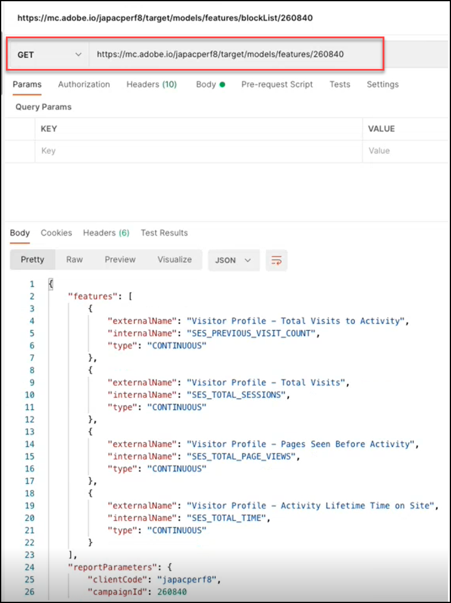
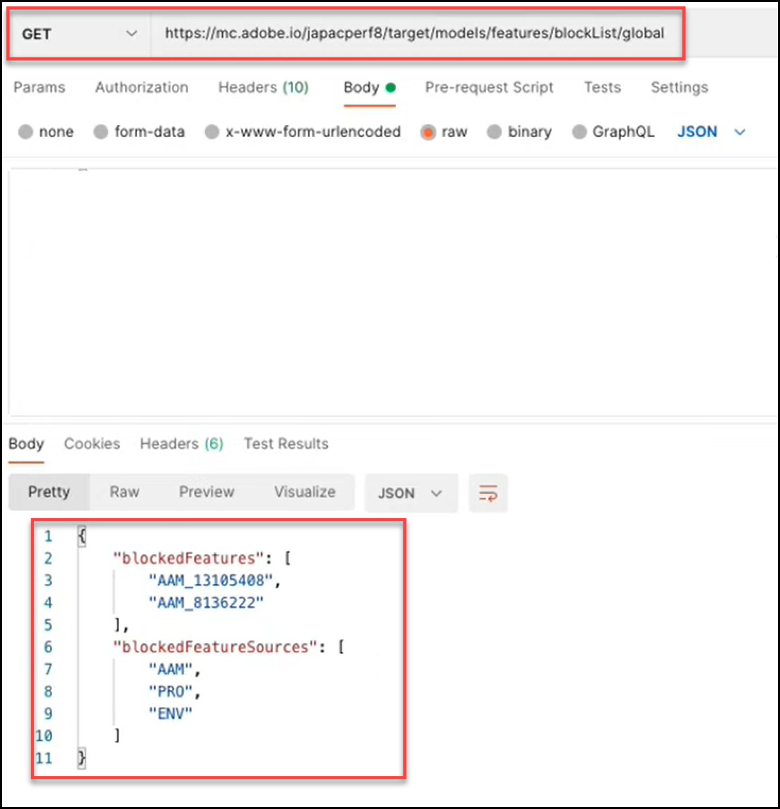

# 模型API概述

列入阻止列表模型API，也称为API，可让用户查看和管理机器学习模型中使用的功能列表，用于 [!UICONTROL Automated Personalization] (AP)和 [!DNL Auto-Target] (AT)活动。 列入阻止列表如果用户希望排除模型用于AP或AT活动的功能，可以使用模型API将该功能添加到“”中。

A **[!UICONTROL 阻止列表]** 定义将排除的功能集 [!DNL Adobe Target] 机器学习模型。 有关功能的更多信息，请参阅 [使用的数据 [!DNL Target] 机器学习算法](https://experienceleague.adobe.com/docs/target/using/activities/automated-personalization/ap-data.html).

可以按活动（活动级别）定义阻止列表，也可以为活动内的所有活动定义 [!DNL Target] 帐户（全局级别）。

<!-- To get started with the Models API in order to create and manage your blocklist, download the Postman Collection [here](https://git.corp.adobe.com/target/ml-configuration-management-service/tree/nextRelease/rest_api_library). Note this is an Adobe internal link. Need to publish this publicly if want to share with customers. -->

## 模型API规范

查看模型API规范 [此处](../administer/models-api/models-api-overview.md).

## 先决条件

要使用模型API，您必须使用 [Adobe Developer控制台](https://developer.adobe.com/console/home)，就像使用 [Target管理员API](../administer/admin-api/admin-api-overview-new.md). 有关更多信息，请参阅 [如何配置身份验证](../before-administer/configure-authentication.md).

## 模型API使用指南

如何管理阻止列表

[**第1步：**](#step1) 查看活动的功能列表

[**第2步：**](#step2) 检查活动的阻止列表

[**步骤3：**](#step3) 向活动的阻止列表添加功能

[**第4步：**](#step4) （可选）取消阻止

[**步骤5：**](#step5) 列入阻止列表 （可选）管理全局


## 步骤1：查看活动的功能列表 {#step1}

在列入阻止列表特征之前，查看当前包含在该活动模型中的特征列表。

>[!BEGINTABS]

>[!TAB 请求]

```json {line-numbers="true"}
GET https://mc.adobe.io/<tenant>/target/models/features/<campaignId>
```

>[!TAB 响应]

```json {line-numbers="true"}
{
    "features": [
        {
            "externalName": "Visitor Profile - Total Visits to Activity",
            "internalName": "SES_PREVIOUS_VISIT_COUNT",
            "type": "CONTINUOUS"
        },
        {
            "externalName": "Visitor Profile - Total Visits",
            "internalName": "SES_TOTAL_SESSIONS",
            "type": "CONTINUOUS"
        },
        {
            "externalName": "Visitor Profile - Pages Seen Before Activity",
            "internalName": "SES_PREVIOUS_VISIT_COUNT",
            "type": "CONTINUOUS"
        },
        {
            "externalName": "Visitor Profile - Activity Lifetime Time on Site",
            "internalName": "SES_TOTAL_TIME",
            "type": "CONTINUOUS"
        }
    ],
    "reportParameters": {
        "clientCode": <tenant>,
        "campaignId": <campaignId>
    }
}
```

>[!ENDTABS]

<!-- JUDY: Update codeblock above once you have the complete Response. -->

在此处显示的示例中，用户正在检查其活动ID为260840的活动在模型中使用的功能列表。



>[!NOTE]
>
>要查找您的活动ID，请导航至 [!DNL Target] UI。 单击感兴趣的活动。 活动ID将显示在生成的活动概述页面的正文中，以及此页面URL的末尾。

此 **[!UICONTROL externalname]** 是功能的用户友好名称。 创建者 [!DNL Target]，并且该值可能会随着时间的推移而改变。 用户可以在以下位置查看这些用户友好名称： [个性化见解报表](https://experienceleague.adobe.com/docs/target/using/reports/insights/personalization-insights-reports.html).

此 **[!UICONTROL internalName]** 是功能的实际标识符。 它还由创建 [!DNL Target]，但无法更改。 为了确定要阻止列表的特征，需要参照此值。

请注意，为了使功能列表填入值（即，为了使其非空），活动：

1. 必须具有状态= Live，或者之前必须已激活
1. 必须运行足够长的时间才能存在促销活动，以便模型具有要运行的数据。

## 步骤2：检查活动的阻止列表 {#step2}

接下来，查看阻止列表。 换言之，检查当前阻止将哪些功能（如果有）包含在此活动的模型中。

>[!ERROR]
>
>请注意 `/blockList/` 在请求中区分大小写。

>[!BEGINTABS]

>[!TAB 请求]

```json {line-numbers="true"}
GET https://mc.adobe.io/<tenant>/target/models/features/blockList/<campaignId>
```

>[!TAB 响应]

```json {line-numbers="true"}

```

>[!ENDTABS]

在此处显示的示例中，用户正在检查其活动ID为260840的活动所阻止的功能列表。 列入阻止列表结果为空，这意味着此活动当前没有任何功能。


>[!NOTE]
>
>第一次检查完整阻止列表时，您可能会看到类似这样的空白结果，然后再向其中添加任何功能。 但是，一旦从阻止列表列入阻止列表中添加（随后移除）特征，您可能会看到稍有不同的结果，其中返回空的特征数组。 请继续阅读，在中查看此功能的示例。 [步骤4](#step4).

## 步骤3：将功能添加到活动的阻止列表 {#step3}

列入阻止列表要向PUT添加功能，请将请求从GET更改为request，并修改请求正文以指定 `blockedFeatureSources` 或 `blockedFeatures` 根据需要。

* 请求正文需要 `blockedFeatures` 或 `blockedFeatureSources`. 两者均可包括在内。
* 填充 `blockedFeatures` 值标识自 `internalName`. 请参阅 [步骤1](#step1).
* 填充 `blockedFeatureSources` ，其值如下表所示。

请注意 `blockedFeatureSources` 指示某个功能的来源。 为了进行列入阻止列表，它们用作功能组或功能类别，使用户能够一次阻止整个功能集。 的值 `blockedFeatureSources` 匹配功能标识符的第一个字符(`blockedFeatures` 或 `internalName` 值)；因此它们也可以视为“功能前缀”。

### 表 `blockedFeatureSources` 值 {#table}

| 前缀 | 描述 |
| --- | --- |
| BOX | Mbox 参数 |
| URL | 自定义 — URL参数 |
| 环境 | 环境 |
| SES | 访客个人资料 |
| 地域 | 地理位置 |
| PRO | 自定义 — 配置文件 |
| SEG | 自定义 — 报表区段 |
| AAM | 自定义 — Experience Cloud区段 |
| MOB | 移动设备 |
| CRS | 自定义 — 客户属性 |
| UPA | 自定义 — RT-CDP配置文件属性 |
| IAC | 访客兴趣区域 |  |

>[!BEGINTABS]

>[!TAB 请求]

```json {line-numbers="true"}
PUT https://mc.adobe.io/<tenant>/target/models/features/blockList/<campaignId>

{
    "blockedFeatureSources": ["AAM"],
    "blockedFeatures": ["SES_PREVIOUS_VISIT_COUNT", "SES_TOTAL_SESSIONS"]
}
```

>[!TAB 响应]

```json {line-numbers="true"}
{
    "blockedFeatures": [
            "SES_PREVIOUS_VISIT_COUNT",
            "SES_TOTAL_SESSIONS"
        ],
    "blockedFeatureSources": [
            "AAM"
        ]
}
```

>[!ENDTABS]

在此处的示例中，用户阻止两个功能， `SES_PREVIOUS_VISIT_COUNT` 和 `SES_TOTAL_SESSIONS`，之前通过查询活动ID为260480的活动功能的完整列表来识别它，如中所述 [步骤1](#step1). 它们还会阻止来自Experience Cloud区段的所有功能，这是通过阻止前缀为“AAM”的功能来实现的，如中所述 [表](#table) 以上。


请注意，在列入阻止列表列入阻止列表特征后，建议通过执行 [步骤2](#step2) 再次(GET阻止列表)。 验证结果是否按预期显示(验证结果是否包含从最新PUT请求添加的功能)。

## 步骤4：（可选）取消阻止 {#step4}

要取消阻止所有列入阻止列表的特征，请清除以下各项的值： `blockedFeatureSources` 或 `blockedFeatures`.

>[!BEGINTABS]

>[!TAB 请求]

```json {line-numbers="true"}
PUT https://mc.adobe.io/<tenant>/target/models/features/blockList/<campaignId>

{
    "blockedFeatureSources": [],
    "blockedFeatures": []
}
```

>[!TAB 响应]

```json {line-numbers="true"}
{
    "blockedFeatures": [],
    "blockedFeatureSources": []
}
```

>[!ENDTABS]

列入阻止列表在此处的示例中，用户正在清除其Activity ID为260840的活动的。 请注意，响应会确认被阻止的功能及其源均存在空阵列 — `blockedFeatureSources` 和 `blockedFeatures`、ID名称和ID名称等。


与往常一样，修改阻止列表后，建议您执行 [步骤2](#step2) 再次(GET列入阻止列表以验证列表是否按预期包含功能)。 在此处的示例中，用户正在验证其阻止列表现在是否为空。


问题：如何删除部分（但不是全部）阻止列表？

列入阻止列表 列入阻止列表答案：要从多功能中删除离散的功能子集，用户只需发送要阻止的更新功能列表即可 [列入阻止列表请求](#step3)，而不是清除整个阻止列表并重新添加所需的功能。 换句话说，发送更新的功能列表(如中所示 [步骤3](#step3)列入阻止列表 )，确保从中排除您希望“删除”的功能。

## 步骤5：（可选）管理全局阻止列表 {#step5}

以上示例均在单个活动的上下文中。 列入阻止列表您还可以阻止整个给定客户端（租户）上所有活动的功能，而不必为每个活动单独指定。 要执行全局阻止列表，请使用 `/blockList/global` 调用，而不是 `blockList/<campaignId>`.

>[!BEGINTABS]

>[!TAB 请求]

```json {line-numbers="true"}
PUT https://mc.adobe.io/<tenant>/target/models/features/blockList/global

{
    "blockedFeatureSources": ["AAM", "PRO", "ENV"],
    "blockedFeatures": ["AAM_FEATURE_1", "AAM_FEATURE_2"]
}
```

>[!TAB 响应]

```json {line-numbers="true"}
{
    "blockedFeatures": [
        "AAM_FEATURE_1",
        "AAM_FEATURE_2"
    ],
    "blockedFeatureSources": [
        "AAM",
        "PRO",
        "ENV"
    ]
}
```

>[!ENDTABS]

在上面显示的请求示例中，用户阻止其所有活动的“AAM_FEATURE_1”和“AAM_FEATURE_2”两项功能 [!DNL Target] 帐户。 这意味着无论活动如何，“AAM_FEATURE_1”和“AAM_FEATURE_2”都不会包含在此帐户的机器学习模型中。 此外，用户还全局阻止前缀为“AAM”、“PRO”或“ENV”的所有功能。

问题：以上代码示例不是多余的吗？

回答：是。 对于以“AAM”开头的值阻止功能，同时阻止源为“AAM”的所有功能，这是多余的。 最终结果是所有源自AAM(Experience Cloud区段)的功能都将被阻止。 因此，如果目标是阻止Experience Cloud区段中的所有功能，则在上例中，无需以“AAM”开头单独指定某些功能。

列入阻止列表最后步骤：无论是在活动级别还是全局级别，都建议您在修改活动后验证URL，以确保该URL包含所需的值。 更改 `PUT` 到 `GET`.

下面显示的示例响应表明 [!DNL Target] 阻止两个单独的功能，以及源自“AAM”、“PRO”和“ENV”的所有功能。


