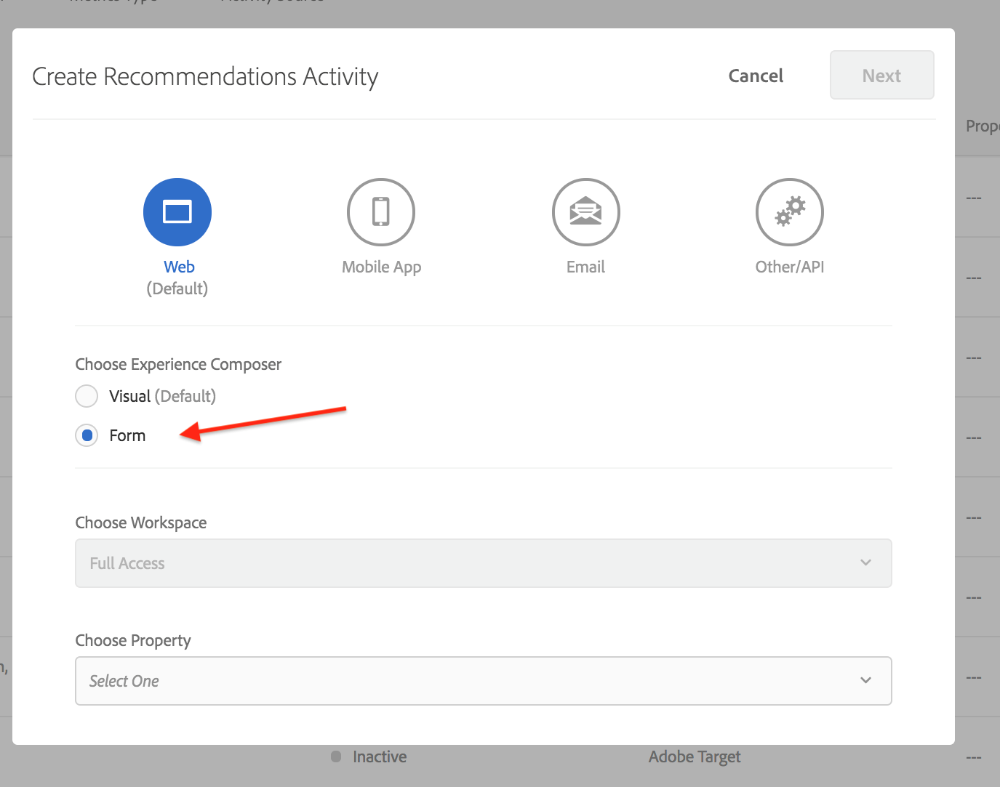

# 使用投放API获取推荐

Adobe Target和Adobe Target Recommendations API可用于提供对网页的响应，也可用于不基于HTML的体验，包括应用程序、屏幕、控制台、电子邮件、网亭和其他显示设备。 换句话说，当无法使用Target库和JavaScript时，[Target交付API](/help/dev/implement/delivery-api/overview.md)仍允许访问所有的Target功能，以提供个性化的体验。

>[!NOTE]
>
>在请求包含实际推荐（推荐产品或项目）的内容时，请使用Target交付API。

要检索推荐，请发送包含相应上下文信息的Adobe Target交付API POST调用，其中可能包括用户ID（用于用户最近查看过的项目等特定于配置文件的推荐）、相关mbox名称、mbox参数、配置文件参数或其他属性。 响应将包含JSON或HTML格式的建议entity.ids（并可能包含其他实体数据），这些数据随后可以显示在设备中。

适用于Adobe Target的[交付API](/help/dev/implement/delivery-api/overview.md)会公开标准Target请求提供的所有现有功能。

投放API：

* 使您能够以RESTful方式检索位置和受众的体验或选件。
* 无需身份验证。
* 仅限帖子。
* 不处理Cookie或重定向调用。
* 不需要或识别“用户角色”。 它只是获取内容或向Target边缘服务器报告事件。

要使用交付API来交付Target体验（包括推荐），请执行以下步骤：

1. 使用基于表单的编辑器（而非可视化体验编辑器）创建Target活动（A/B、XT、AP或推荐）。
1. 使用交付API获取对刚刚创建的Target活动生成的请求的响应。

&lt;！ — 问：为何需要同时采取这两个步骤？ 如果您为mbox定义了基于表单的推荐，那么也通过投放API步骤来检索结果有什么好处？ 为什么不能让基于表单的Rec将结果传送到目标设备……?? 答：请参阅下面的用例……这是您希望“拦截”待处理结果，以便在显示结果之前执行更多操作的情况。 与库存水平进行实时比较等。 —>

## 使用基于表单的体验编辑器创建推荐

要创建可与投放API一起使用的推荐，请使用[基于表单的编辑器](https://experienceleague.adobe.com/docs/target/using/experiences/form-experience-composer.html?lang=zh-Hans)。

1. 首先，创建并保存要在推荐中使用的基于JSON的设计。 有关示例JSON以及有关在配置基于表单的活动时如何返回JSON响应的背景信息，请参阅有关[创建推荐设计](https://experienceleague.adobe.com/docs/target/using/recommendations/recommendations-design/create-design.html?lang=zh-Hans)的文档。 在此示例中，设计名为&#x200B;*简单JSON。*
   

1. 在Target中，导航到&#x200B;**[!UICONTROL Activities]** > **[!UICONTROL Create Activity]** > **[!UICONTROL Recommendations]**，然后选择&#x200B;**[!UICONTROL Form]**。

   

1. 选择一个属性，然后单击&#x200B;**[!UICONTROL Next]**。
1. 定义您希望用户收到推荐响应的位置。 以下示例使用名为&#x200B;*api_charter*&#x200B;的位置。 选择您之前创建的基于JSON的名为&#x200B;*简单JSON.*的设计
   
1. 保存并激活推荐。 那个产生结果。 [结果准备就绪后](https://experienceleague.adobe.com/docs/target/using/recommendations/recommendations-activity/previewing-and-launching-your-recommendations-activity.html?lang=zh-Hans)，您可以使用投放API检索它们。

## 使用投放API

[投放API](/help/dev/implement/delivery-api/overview.md)的语法为：

`POST https://{{CLIENT_CODE}}.tt.omtrdc.net/rest/v1/delivery`

1. 请注意，客户端代码为必填项。 提醒一下，通过导航到&#x200B;**[!UICONTROL Recommendations]** > **[!UICONTROL Settings]**，可以在Adobe Target中找到您的客户端代码。 请注意&#x200B;**推荐API令牌**&#x200B;部分中的&#x200B;**客户端代码**&#x200B;值。
   
1. 获得客户端代码后，即可构建投放API调用。 以下示例以&#x200B;**[!UICONTROL Web Batched Mboxes Delivery API Call]**&#x200B;投放API Postman集合[中提供的](../../implement/delivery-api/overview.md#section/Getting-Started/Postman-Collection)开头，进行了相关修改。 例如：
   * 已从&#x200B;**正文**&#x200B;中移除&#x200B;**浏览器**&#x200B;和&#x200B;**地址**&#x200B;对象，因为非HTML用例不需要这些对象
   * 在此示例中，*api_charter*&#x200B;被列为位置名称
   * 指定了entity.id，因为此推荐基于内容相似度，它要求将当前项目键传递到Target。
     
请记住正确配置查询参数。 例如，请确保根据需要指定`{{CLIENT_CODE}}`。 &lt;！— Q：在更新的调用语法中，entity.id作为profileParameter列出，而不作为mboxParameter在旧版本中列出。 —> &lt;！ — 问：旧图像旧的随附文本：“请注意，此推荐基于通过mboxParameters发送的entity.id的‘内容类似’产品。” —>
     
1. 发送请求。 此操作将针对&#x200B;*api_charter*&#x200B;位置执行，该位置上运行有活动推荐，并使用您的JSON设计定义它，该设计将输出推荐实体列表。
1. 接收基于JSON设计的响应。
   
响应包括键ID以及推荐实体的实体ID。

通过这种方式将交付API与推荐结合使用，您可以在向非HTML设备上的访客显示推荐之前，执行其他步骤。 例如，您可以在显示最终结果之前，从投放API获得响应，以从其他系统(例如CMS、PIM或电子商务平台)执行额外的实体属性详细信息（库存、价格、评级等）实时查找。

使用本指南中概述的方法，您可以获得任何应用程序来利用Target的响应提供个性化推荐！

## 实施示例

以下资源提供了各种非HTML重点实施的示例。 请记住，由于涉及的系统和设备，每个实施都是唯一的。

| 资源 | 详细信息 |
| --- | --- |
| [在Experience Platform Launch中配置Target扩展并实施Target API](https://developer.adobe.com/client-sdks/documentation/adobe-target/) | 在Experience Platform Launch中配置Target扩展、将Target扩展添加到您的应用程序以及实施Target API以请求活动、预取选件和进入可视化预览模式的步骤。 |
| [Adobe Target节点客户端](https://www.npmjs.com/package/@adobe/target-nodejs-sdk) | 开源Target Node.js SDK v1.0 |
| [服务器端概述](../../implement/server-side/server-side-overview.md) | 有关Adobe Target服务器端交付API、服务器端批量交付API、Node.js SDK和Adobe Target推荐API的信息。 |
| 电子邮件中的[Adobe Campaign内容推荐](https://medium.com/adobetech/adobe-campaign-content-recommendations-in-email-b51ced771d7f) | 介绍如何在Adobe Campaign中通过Adobe Target和Adobe I/O Runtime利用电子邮件中的内容推荐的博客。 |

## 使用API管理推荐设置

大多数情况下，出于以上部分所述的原因，推荐是在Adobe Target UI中配置，然后通过Target API使用或访问。 这种UI-API协调是常见的。 但是，有时，用户可能希望通过API执行所有操作 — 包括设置和结果使用。 尽管不太常见，但用户可以完全使用API配置、执行&#x200B;*和*&#x200B;并利用推荐的结果。

在[前面的部分](manage-catalog.md)中，我们已了解如何管理Adobe Target推荐实体并在服务器端交付它们。 同样，[Adobe Developer Console](https://developer.adobe.com/console/home)允许您在不登录Adobe Target的情况下管理标准、促销活动、收藏集和设计模板。 您可以在[此处](https://developer.adobe.com/target/administer/recommendations-api/)找到所有推荐API的完整列表，但此处是供参考的摘要。

| 资源 | 详细信息 |
| --- | --- |
| [收藏集](https://developer.adobe.com/target/administer/recommendations-api/#tag/Collections) | 列出、创建、获取、编辑和删除收藏集。 |
| [标准](https://developer.adobe.com/target/administer/recommendations-api/#tag/Criteria) | 列出并获取条件。 |
| [设计](https://developer.adobe.com/target/administer/recommendations-api/#tag/Designs) | 列出、创建、获取、编辑、删除和验证设计。 |
| [个实体](https://developer.adobe.com/target/administer/recommendations-api/#tag/Entities) | 保存、删除和获取实体。 |
| [促销活动](https://developer.adobe.com/target/administer/recommendations-api/#tag/Promotions) | 列出、创建、获取、编辑和删除促销活动。 |
| [类别条件](https://developer.adobe.com/target/administer/recommendations-api/#tag/Category-Criteria) | 列出、创建、获取、编辑和删除类别标准。 |
| [自定义标准](https://developer.adobe.com/target/administer/recommendations-api/#tag/Custom-Criteria) | 列出、创建、获取、编辑和删除自定义标准。 |
| [项条件](https://developer.adobe.com/target/administer/recommendations-api/#tag/Item-Criteria) | 列出、创建、获取、编辑和删除项目标准。 |
| [人气标准](https://developer.adobe.com/target/administer/recommendations-api/#tag/Popularity-Criteria) | 列出、创建、获取、编辑和删除热门程度标准。 |
| [配置文件属性标准](https://developer.adobe.com/target/administer/recommendations-api/#tag/Profile-Attribute-Criteria) | 列出、创建、获取、编辑和删除配置文件属性标准。 |
| [最近的标准](https://developer.adobe.com/target/administer/recommendations-api/#tag/Recent-Criteria) | 列出、创建、获取、编辑和删除最近使用的标准。 |
| [序列条件](https://developer.adobe.com/target/administer/recommendations-api/#tag/Sequence-Criteria) | 列出、创建、获取、编辑和删除序列标准。 |

## 参考文档

* [Adobe Target交付API文档](/help/dev/implement/delivery-api/overview.md)
* [将“推荐”与电子邮件集成](https://experienceleague.adobe.com/docs/target/using/recommendations/recommendations-faq/integrating-recs-email.html?lang=zh-Hans)

## 摘要和审查

恭喜！通过完成本指南，您已了解如何：
* [使用推荐API管理您的目录](manage-catalog.md)
* [使用推荐API管理自定义标准](manage-custom-criteria.md)
* [将投放API与推荐配合使用](fetch-recs-server-side-delivery-api.md)
