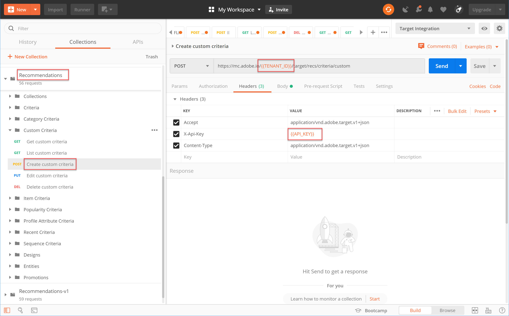
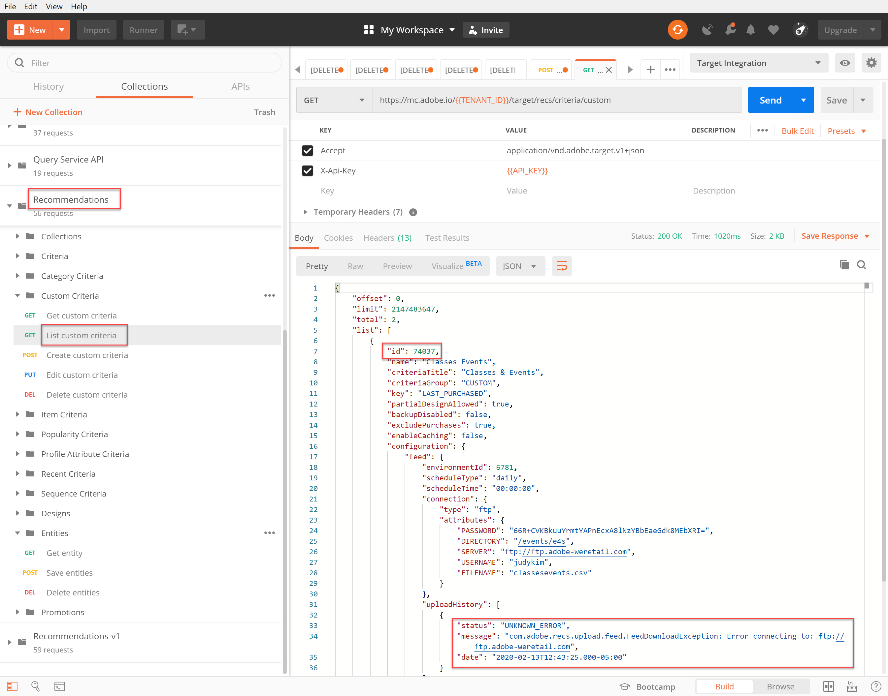

# 管理自定义标准

有时，Recommendations提供的算法无法显示您要促销的特定项目。 在这种情况下，自定义标准为您提供了一种方法，可以为给定的关键项目或类别提供一组特定的推荐项目。

要创建自定义标准，请定义并导入关键项目或类别与推荐项目之间的所需映射。 [自定义标准文档](https://experienceleague.adobe.com/docs/target/using/recommendations/criteria/recommendations-csv.html?lang=zh-Hans)中介绍了此过程。 如该文档中所述，您可以通过Target用户界面(UI)创建、编辑和删除自定义标准。 但是，Target还提供了一组自定义标准API，允许对自定义标准进行更详细的管理。

>[!WARNING]
>
>对于自定义标准，可以使用API执行给定自定义标准的所有操作（创建、编辑、删除），也可以使用UI执行所有操作（创建、编辑、删除）。 通过UI和API的组合管理自定义标准可能会导致信息冲突或意外结果。 例如，在UI中创建自定义标准，然后通过API编辑它，将不会在UI中反映您的更新，即使它将在后端更新，如通过API可见的那样。

## 创建自定义标准

要使用[创建自定义标准API](https://developer.adobe.com/target/administer/recommendations-api/#operation/createCriteriaCustom)创建自定义标准，语法为：

`POST https://mc.adobe.io/{{TENANT_ID}}/target/recs/criteria/custom`

>[!WARNING]
>
>使用创建自定义标准API创建的自定义标准（如本练习中所述）将显示在UI中，并将保留这些标准。 您将无法从UI中编辑或删除它们。 您可以通过API **编辑或删除它们**，但无论哪种方式，它们将继续显示在Target UI中。 要保留从UI编辑或删除的选项，请使用[文档](https://experienceleague.adobe.com/docs/target/using/recommendations/criteria/recommendations-csv.html?lang=zh-Hans)的UI创建自定义标准，而不是使用创建自定义标准API。

只有在阅读了上述警告并熟悉了如何创建新自定义标准且无法随后从UI中删除后，才应继续执行以下步骤。

1. 验证&#x200B;**[!UICONTROL Create custom criteria]**&#x200B;的`TENANT_ID`和`API_KEY`是否引用了之前建立的Postman环境变量。 使用下图进行比较。

   

1. 将您的&#x200B;**Body**&#x200B;添加为&#x200B;**原始** JSON，定义自定义标准CSV文件的位置。 使用[创建自定义标准API](https://developer.adobe.com/target/administer/recommendations-api/#operation/getAllCriteriaCustom)文档中提供的示例作为模板，根据需要提供您的`environmentId`和其他值。 在本例中，我们使用LAST_PURCHASED作为键。

   

1. 发送请求并观察响应，其中包含您刚刚创建的自定义标准的详细信息。

   

1. 要验证您的自定义标准是否已创建，请在Adobe Target中导航到&#x200B;**[!UICONTROL Recommendations > Criteria]**&#x200B;并按名称搜索您的标准，或者在下一个步骤中使用&#x200B;**[!UICONTROL List Custom Criteria API]**。

   

在这种情况下，我们有一个错误。 让我们通过使用&#x200B;**[!UICONTROL List Custom Criteria API]**&#x200B;更仔细地检查自定义条件来调查错误。

## 列出自定义标准

要检索所有自定义标准的列表以及每个自定义标准的详细信息，请使用[列表自定义标准API](https://developer.adobe.com/target/administer/recommendations-api/#operation/getAllCriteriaCustom)。 语法为：

`GET https://mc.adobe.io/{{TENANT_ID}}/target/recs/criteria/custom`

1. 与之前一样验证`TENANT_ID`和`API_KEY`，并发送请求。 在响应中，请注意自定义标准ID以及有关之前指出的错误消息的详细信息。
   

在这种情况下，发生错误的原因是服务器信息不正确，这意味着Target无法访问包含自定义标准定义的CSV文件。 让我们编辑自定义标准来更正此问题。

## 编辑自定义标准

要更改自定义标准定义的详细信息，请使用[编辑自定义标准API](https://developer.adobe.com/target/administer/recommendations-api/#operation/updateCriteriaCustom)。 语法为：

`POST https://mc.adobe.io/{{TENANT_ID}}/target/recs/criteria/custom/:criteriaId`

1. 与之前一样，验证`TENANT_ID`和`API_KEY`。
   

1. 指定要编辑的（单个）自定义标准的标准ID。
   

1. 在正文中，为更新的JSON提供正确的服务器信息。 （在此步骤中，指定对可以访问的服务器的FTP访问权限。）
   

1. 发送请求并记录响应。
   

让我们使用&#x200B;**[!UICONTROL Get Custom Criteria API]**&#x200B;验证更新后的自定义标准是否成功。

## 获取自定义标准

要查看特定自定义标准的自定义标准详细信息，请使用[获取自定义标准API](https://developer.adobe.com/target/administer/recommendations-api/#operation/getCriteriaCustom)。 语法为：

`GET https://mc.adobe.io/{{TENANT_ID}}/target/recs/criteria/custom/:criteriaId`

1. 指定要获取其详细信息的自定义标准的标准ID。 发送请求并查看响应。
   
1. 验证是否成功。 （在本例中，请确认没有进一步的FTP错误。）
   
1. （可选）验证更新是否在UI中准确显示。
   

## 删除自定义标准

使用前面提到的标准ID，使用[删除自定义标准API](https://developer.adobe.com/target/administer/recommendations-api/#operation/deleteCriteriaCustom)删除您的自定义标准。 语法为：

`DELETE https://mc.adobe.io/{{TENANT_ID}}/target/recs/criteria/custom/:criteriaId`

1. 指定要删除的（单个）自定义标准的标准ID。 单击 **[!UICONTROL Send]**。
   

1. 验证是否已使用获取自定义标准删除该标准。
   
在这种情况下，预期的404错误表示无法找到已删除的标准。

>[!NOTE]
>
>提醒一下，即使标准被删除，也不会从Target UI中删除，因为它是使用创建自定义标准API创建的。

恭喜！您现在可以使用Recommendations API创建、列出、编辑、删除自定义标准并获取其详细信息。 在下一部分中，您将使用Target投放API检索推荐。

&lt;！—[下一课程“使用服务器端交付API获取Recommendations”>](fetch-recs-server-side-delivery-api.md) —>
