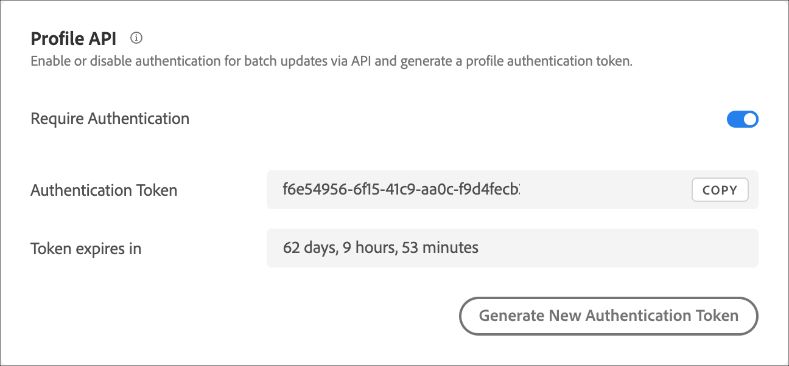

# 配置文件 API 设置

启用或禁用通过[!DNL Adobe Target] API进行批量更新的身份验证，并生成配置文件身份验证令牌。

[!DNL Adobe Target]为每个用户创建和维护配置文件。 此配置文件存储在[!DNL Target]边缘群集上，并在每次访问后实时更新。 您还可以单独或通过API批量更新用户档案。

为了提高安全性，您可以要求批量更新API调用要求在请求标头中传递有效的访问令牌。

**需要身份验证并使用[!DNL Target] UI生成访问令牌：**

1. 单击&#x200B;**[!UICONTROL Administration]** > **[!UICONTROL Implementation]**。
1. 在&#x200B;**[!UICONTROL Profile API]**&#x200B;下，将&#x200B;**[!UICONTROL Require Authentication]**&#x200B;切换开关滑动到“已启用”或“已禁用”位置。

   

1. （视情况而定）如果您已启用身份验证要求，请单击&#x200B;**[!UICONTROL Generate New Profile Authentication Token]**。

   

   令牌将根据“到期时间”框中所列的时间到期。

   您必须具有以下用户权限之一才能生成身份验证令牌：

   * 管理员角色或至少具有审批者权限

     有关Target Standard客户的详细信息，请参阅&#x200B;*用户*&#x200B;中的[指定角色和权限](https://experienceleague.adobe.com/docs/target/using/administer/manage-users/users/user-management.html?lang=zh-Hans#roles-permissions)。 有关 [!DNL Target Premium] 客户的详细信息，请参阅[配置企业权限](https://experienceleague.adobe.com/docs/target/using/administer/manage-users/enterprise/properties-overview.html?lang=zh-Hans)。

   * 工作区/产品配置文件级别的管理员角色

     工作区仅对 [!DNL Target Premium] 客户可用。有关更多信息，请参阅[配置企业权限](https://experienceleague.adobe.com/docs/target/using/administer/manage-users/enterprise/properties-overview.html?lang=zh-Hans)。

   * [!DNL Adobe Target] 产品级别的管理员权限（系统管理员权限）

您也可以通过 API 生成配置文件身份验证令牌。有关详细信息，请参阅[Adobe Target管理员和配置文件API指南](../../administer/admin-api/admin-api-overview-new.md)中的“配置文件”。

1. 复制令牌并将其包含在请求的标头中，格式为：“授权”：“持有者”。

1. 单击&#x200B;**[!UICONTROL Generate New Profile Authentication Token]**&#x200B;以根据需要重新生成令牌。

>[!WARNING]
>
>重置此令牌会导致使用当前令牌的 API 调用失败。这将需要更新使用此令牌的任何脚本或应用程序。
