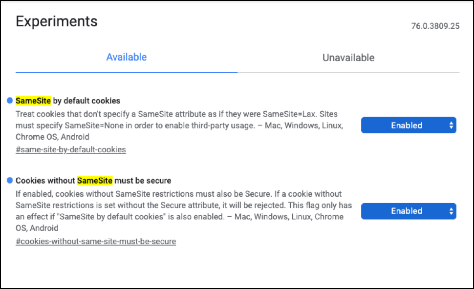

# Google Chrome SameSite Cookie 策略

Google 将从 Chrome 80 开始，默认对用户实施新的 Cookie 策略，该版本计划在 2020 年初发布。本文说明了您需要了解的有关新SameSite Cookie策略的所有信息，[!DNL Adobe Target]如何支持这些策略，以及如何使用[!DNL Target]来遵守Google Chrome的新SameSite Cookie策略。

从 Chrome 80 开始，Web 开发人员必须明确指定哪些 Cookie 可以跨网站工作。这是 Google 为改进网络上的隐私和安全而计划发布的众多公告中的第一个。

考虑到 Facebook 在隐私和安全方面一直处于风尖浪口的位置，其他各大提供商，例如 Apple 以及现在的 Google，已经借助这一机会快速打造新的身份来赢得隐私和安全之役。在本年度年初，Apple 率先宣布通过 ITP 2.1 改变了其 Cookie 策略，近期又推出了 ITP 2.2。在 ITP 2.1 中，Apple 完全阻止了第三方 Cookie，并且仅将在浏览器上创建的 Cookie 保留 7 天。在 ITP 2.2 中，Cookie 仅保留 1 天。Google的公告远不及Apple那么激进，但这是向着相同目标迈出的第一步。 有关 Apple 政策的更多信息，请参阅 [Apple 智能防跟踪 (ITP) 2.x](/help/dev/before-implement/privacy/apple-itp-2x.md)。

## 什么是 Cookie？如何使用它们？

在我们深入探讨Google对其Cookie策略所做的更改之前，我们先了解一下什么是Cookie以及如何使用它们。 简而言之，Cookie 是存储在 Web 浏览器中的小文本文件，用于记住用户的属性。

Cookie之所以非常重要，是因为它们可以增强用户在浏览Web时的体验。 例如，如果您在电子商务网站上购物，然后在购物车中添加了一些东西，但是在这次访问中并未登录或购买，则Cookie会记住您的商品并将其保留在购物车中，留待下次访问时使用。 或者，想象一下每次访问喜爱的社交媒体网站时，您都需要重新输入用户名或密码的情况。Cookie 同样解决了这个问题，因为它们存储信息，帮助网站识别您的身份。这些类型的 Cookie 称为第一方 Cookie，因为它们由您访问的网站创建和使用。

还有第三方 Cookie。为了更好地理解它们，请考虑此示例：

假设有一家名为“Friends”的社交媒体公司提供了“分享”按钮，可供其他网站实施，以便Friends用户在Friends信息源上分享网站内容。 现在，用户可以在使用“分享”按钮的新闻网站上阅读一篇新闻文章，然后单击该按钮自动将内容发布到其Friends帐户上。

要做到这一点，浏览器在加载新文章时从 `platform.friends.com` 提取 Friends 的“分享”按钮。在此流程中，浏览器附加包含用户的登录凭据的 Friends Cookie，用于向 Friends 服务器发出请求。这允许Friends代表用户在其新闻源中发布新闻文章，而无需用户登录。

实现这一功能依靠的是第三方 Cookie。在本例中，第三方Cookie保存在`platform.friends.com`的浏览器上，这样`platform.friends.com`就可以代表用户在Friends应用程序中发帖。

您可以想象，如果没有第三方 Cookie 该如何实现这种用例，用户将需要完成多个手动步骤。首先，用户需要复制新文章的链接。其次，用户必须单独登录 Friends 应用程序。然后，用户单击“发布文章”按钮。接下来，用户在文本字段中复制粘贴链接，最后再单击“发布”。如您所见，第三方 Cookie 极大地帮助改善了用户体验，因为可以大量减少手动步骤。

一般来说，第三方Cookie使得数据可以存储在用户的浏览器上而无需用户明确访问网站。

## 安全注意事项

虽然 Cookie 可以增强用户的体验并支持广告投放，但它们也会引入安全漏洞，例如跨站点请求伪造 (CSRF) 攻击。例如，如果用户登录银行网站支付信用卡账单，但在离开网站时没有注销，然后在相同会话中访问了恶意网站，这时就可能发生 CSRF 攻击。恶意网站可能包括向银行网站发出请求的代码，在页面加载时执行。由于用户仍在银行网站上通过了身份验证，会话Cookie可用于启动CSRF攻击，启动从用户银行账户的转账事件。 这是因为无论何时您访问网站，所有 Cookie 都附加到 HTTP 请求中。由于这些安全注意事项，Google 现在尝试减轻这些风险。

## [!DNL Target] 如何使用 Cookie？

说了这么多，让我们看看[!DNL Target]如何使用Cookie。 首先，要使用 [!DNL Target]，您需要在网站上安装 [!DNL Target] JavaScript 库。对于访问您网站的用户，这让您可以在其浏览器中放置一个第三方 Cookie。在用户与您的网站互动时，您可以通过JavaScript库将用户的行为和兴趣数据传递给[!DNL Target]。 [!DNL Target] JavaScript库使用第一方Cookie提取有关用户的标识信息，以映射到用户的行为和兴趣数据。 然后，[!DNL Target] 使用此数据来支持您打造个性化的行动。

Target 还会（有时）使用第三方 Cookie。如果您拥有在不同域上线的多个网站，并且希望跨这些网站跟踪用户旅程，您可以利用跨域跟踪使用第三方 Cookie。通过在 [!DNL Target] JavaScript 库中启用跨域跟踪，您的帐户将开始使用第三方 Cookie。当用户从一个域跳转到另一个域时，浏览器与Target的后端服务器通信，在此过程中，将创建第三方Cookie并放置在用户的浏览器中。 通过在用户浏览器中活动的第三方Cookie，[!DNL Target]可以为单个用户跨不同域提供一致的体验。

## Google的新Cookie方法

为了在跨网站发送 Cookie 时提供安全保障以保护用户，Google 计划添加对名为 SameSite 的 IETF 标准的支持，该标准要求 Web 开发人员在 Set-Cookie 标头中，使用 SameSite 属性组件管理 Cookie。

可以将三个不同的值传递到 SameSite 属性：Strict、Lax 或 None。

| 值 | 描述 |
| --- | --- |
| Strict | 只有在访问最初设置的域时，才可访问具有此设置的 Cookie。换言之，Strict 会完全阻止跨站点使用 Cookie。此选项非常适合需要高安全性的应用程序，例如银行。 |
| Lax | 仅相同网站请求或使用非幂等 HTTP 请求的顶级导航上会发送具有此设置的 Cookie，例如 `HTTP GET`。因此，在 Cookie 由第三方使用时会使用此选项，但具有额外的安全优势，可以保护用户免受 CSRF 攻击的伤害。 |
| 无 | 具有此设置的 Cookie 与目前的 Cookie 工作方式相同。 |

请记住上述内容，Chrome 80 为用户引入了两种独立的设置：“默认为 Cookie 设置 SameSite”以及“不具有 SameSite 的 Cookie 必须是安全的”。这些设置在 Chrome 80 中默认启用。

* 默认为Cookie设置&#x200B;**SameSite**：设置后，所有未指定SameSite属性的Cookie将自动强制使用`SameSite = Lax`。
* **不具有 SameSite 的 Cookie 必须是安全的**：在设置时，没有 SameSite 属性或者使用 `SameSite = None` 的 Cookie 必须是安全的。在此上下文中，安全是指所有浏览器请求都必须遵循 HTTPS 协议。不符合此要求的 Cookie 将被拒绝。所有网站应使用 HTTPS 来满足此要求。

## [!DNL Target]遵循Google的安全最佳实践

对于Adobe，我们始终希望支持业界最新的安全和隐私最佳实践。 我们非常高兴地宣布，[!DNL Target] 支持 Google 引入的新安全和隐私设置。

对于“默认为 Cookie 设置 SameSite”设置，[!DNL Target] 将继续提供个性化功能，没有任何影响，也无需您的干预。[!DNL Target] 会使用第一方 Cookie，并在 Google Chrome 应用标记 `SameSite = Lax` 时继续正常运行。

对于“不具有SameSite的Cookie必须是安全的”选项，如果您没有在Target中选择使用跨域跟踪功能，则[!DNL Target]中的第一方Cookie将继续正常使用。

但是，当您选择使用跨域跟踪来跨多个域利用 [!DNL Target] 时，Chrome 要求为第三方 Cookie 使用 `SameSite = None` 和 Secure 标记。这意味着必须确保网站使用 HTTPS 协议。[!DNL Target] 中的客户端库将使用 HTTPS 协议并附加 `SameSite = None` 和 Secure 标记到 [!DNL Target] 中的第三方 Cookie，以确保继续提供所有活动。

## 您需要执行哪些操作？

如需了解让 [!DNL Target] 可继续用于 Google Chrome 80 以上的用户所需完成的操作，请参考下表，其中您将看到以下列：

* **Target JavaScript 库**：网站上使用 at.js 1.*x* 或 at.js 2.*x* 时。
* **默认为 Cookie 设置 SameSite = 已启用**：如果用户启用了“默认为 Cookie 设置 SameSite”，它对您有何影响以及您需要做什么来让 [!DNL Target] 继续正常使用。
* **不具有 SameSite 的 Cookie 必须是安全的 = 已启用**：如果用户启用了“不具有 SameSite 的 Cookie 必须是安全的”，它对您有何影响以及您需要做什么来让 [!DNL Target] 继续正常使用。

| Target JavaScript 库 | 默认为 Cookie 设置 SameSite = 已启用 | 不具有 SameSite 的 Cookie 必须是安全的 = 已启用 |
| --- | --- | --- |
| at.js 1.*x*&#x200B;与第一方Cookie。 | 无影响。 | 如果您没有使用跨域跟踪，则没有影响。 |
| at.js 1.*x*&#x200B;启用了跨域跟踪。 | 无影响。 | 您必须为网站启用 HTTPS 协议。 Target使用第三方Cookie来跟踪用户，Google要求第三方Cookie具有`SameSite = None`和Secure标志。 Secure 标记要求网站必须使用 HTTPS 协议。 |
| at.js 2.*x* | 无影响。 | 无影响。 |

## [!DNL Target] 需要做什么？

那么，在我们的平台上需要做什么来帮助您遵守新的 Google Chrome 80+ SameSite Cookie 策略？

| Target JavaScript 库 | 默认为 Cookie 设置 SameSite = 已启用 | 不具有 SameSite 的 Cookie 必须是安全的 = 已启用 |
| --- | --- | --- |
| at.js 1.*x*&#x200B;与第一方Cookie。 | 无影响。 | 如果您没有使用跨域跟踪，则没有影响。 |
| at.js 1.*x*&#x200B;启用了跨域跟踪。 | 无影响。 | at.js 1.*x*&#x200B;启用了跨域跟踪。 |
| at.js 2.*x* | 无影响。 | 无影响。 |

## 如果您转为使用HTTPS协议会有什么影响？

唯一会影响您的使用案例是当您在 [!DNL Target] 中通过 at.js 1.*x* 使用跨域跟踪功能时。如果不转为 HTTPS（Google 要求转为 HTTPS），您会看到跨域的独特访客高峰，因为 Google 将丢弃我们使用的第三方 Cookie。由于第三方 Cookie 将被丢弃，在用户从一个域导航到另一个域时，[!DNL Target] 无法为该用户提供一致的个性化体验。第三方 Cookie 主要用于标识在您拥有的域之间导航的单个用户。

## 结论

当整个行业都在努力为消费者创建更加安全的Web时，Adobe也不遗余力地帮助我们的客户以确保最终用户安全和隐私的方式向其提供个性化体验。 您所要做的就是遵循上述最佳实践，并利用[!DNL Target]来遵循Google Chrome的新SameSite Cookie政策。
