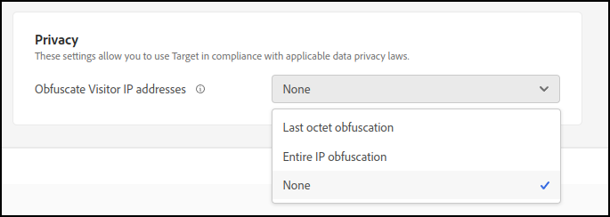

# 隐私

[!DNL Adobe Target] 启用了一些流程和设置，使您能够在遵守适用数据隐私法律的情况下使用 [!DNL Target]

## IP地址和个人身份信息(PII)的收集

网站访客的 IP 地址会传输到 Adobe 数据处理中心 (DPC)。根据访客的网络配置，IP地址不一定代表访客计算机的IP地址。 例如，IP 地址可能为网络地址转换 (NAT) 防火墙、HTTP 代理或互联网网关的外部 IP 地址。

>[!IMPORTANT]
>
>[!DNL Target] 不存储用户的任何IP地址或任何个人身份信息(PII)。 IP地址仅由使用 [!DNL Target] 会话期间（内存中，从不保留）。

## 替换 IP 地址的最后一个八位字节

Adobe开发了“通过设计保护隐私”设置，用户可以启用该设置以进行Adobe [!DNL Target]. 启用后，Adobe [!DNL Target] 在收集IP地址时，立即模糊处理IP地址的最后八位字节（最后一部分）。 此匿名化在 IP 地址的任意处理之前执行，包括在可选的 IP 地址地理位置查找之前。

当启用此功能时，会对 IP 地址进行充分地匿名化处理，以便它不能再被识别为个人信息。因此， [!DNL Target] 可以在不允许收集个人信息的国家/地区遵守数据隐私法使用。 获取城市级别信息很有可能会受到 IP 地址模糊处理的影响。获得地区和国家级别信息应该只会受到轻微影响。

以下设置位于 [!DNL Target] UI，导航到 **[!UICONTROL 管理]** > **[!UICONTROL 实现]**：

* [!UICONTROL 最后一个八位字节模糊处理]： [!DNL Target] 隐藏IP地址的最后一个八位字节。
* [!UICONTROL 整个IP模糊处理]： [!DNL Target] 隐藏整个IP地址。
* [!UICONTROL 无]： [!DNL Target] 不会隐藏IP地址的任何部分。

  

[!DNL Target] 接收完整IP地址并根据指定对其进行模糊处理（如果设置为“最后八位字节”或“整个IP”）。 [!DNL Target] 然后仅在当前会话期间将模糊处理的IP地址保存在内存中。

## 地域划分

如果启用替换IP地址的最后八位字节，则可以使用中的报告分析IP地址的其余值 [!DNL Target]. 如果IP地址的最后一个八位字节未被模糊处理，则可以在中分析完整的IP地址 [!DNL Target]. 您可以使用地域划分功能来按地理区域在地图上标出访客位置。地域划分数据只精确到城市级别或邮政编码级别，而不能精确到个人级别。

如果对 IP 地址进行了完全模糊处理，则无法使用地域划分和地域定位。

## 选择退出链接

您可以向网站添加选择退订链接，使访客可以选择退订所有计数和内容发送服务。

1. 请为您的网站添加以下链接：

   `<a href="https://clientcode.tt.omtrdc.net/optout"> Your Opt Out Language Here</a>`

1. （视情况而定）如果您在使用CNAME，则链接应包含“client=`clientcode` 参数，例如：
   `https://my.cname.domain/optout?client=clientcode`。

1. 使用您的客户端代码替换 `clientcode`，然后添加要链接到选择退出 URL 的文本或图像。

点击该链接的任何访客都不会包含在通过浏览会话调用的任何 mbox 请求中，直到他们删除 Cookie 或两年后（以时间在先者为准）为止。这通过在 `disableClient` 域中为访客设置称为 `clientcode.tt.omtrdc.net` 的 Cookie 实现。

即使您使用第一方 Cookie 实施，提供的选择退订也将通过第三方 Cookie 进行设置。如果客户端仅使用第一方Cookie， [!DNL Target] 检查是否设置了选择退出Cookie。

## 隐私和数据保护法规

请参阅 [隐私和数据保护法规](/help/dev/before-implement/privacy/cmp-privacy-and-general-data-protection-regulation.md) 有关欧盟《通用数据保护条例》(GDPR)、《加州消费者隐私法案》(CCPA)和其他国际隐私要求的信息，以及这些法规对您的组织和 [!DNL Target].

## 功能使用数据集合

单独的功能使用情况数据会被收集用于内部Adobe，以确定 [!DNL Target] 功能正在按预期执行，或者用于识别利用率不足的功能。 各个延迟测量值会被收集用于帮助解决性能问题。不收集个人数据。

您可在客户端初始化选项中，通过将 `telemetryEnabled` 设置为 false 来选择在 SDK 中禁用报表使用情况数据。有关更多信息，请参阅 [targetGlobalSettings 中的 telemetryEnabled](/help/dev/implement/client-side/atjs/atjs-functions/targetglobalsettings.md#telemetryenabled)。
