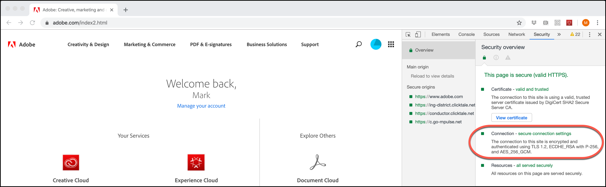

# TLS（传输层安全性）加密更改

此信息介绍了对[!DNL Adobe]和[!DNL Adobe Target]如何使用TLS（传输层安全性）来保持最高安全标准和提升客户数据安全性的更改。

传输层安全性 (TLS) 是当前使用的部署最广泛的安全协议，可用于 Web 浏览器和其他需要通过网络安全交换数据的应用程序。Adobe制定了安全合规标准，该标准要求结束旧协议的生命周期，并且强制使用TLS 1.2，以便使用最新且最安全的版本。

>[!WARNING]
>
>自2020年3月1日起，[!DNL Target]不再支持对可视化体验编辑器(VEC)、增强型体验编辑器(EEC)、活动交付、API等的TLS 1.1加密。 请升级到TLS 1.2以避免任何问题。

我们希望这不会对客户数据或报表产生重大影响。

## 启用增强型体验编辑器 (EEC) 的可视化体验编辑器 (VEC)

自2020年3月1日起，TLS 1.2是默认设置，将不再支持TLS 1.1。

Adobe 会分阶段地将客户移到 TLS 1.2。针对域已经符合 1.2 的客户，我们会将其移到 TLS 1.2，而不需要您做出任何更改。大多数客户域已支持TLS 1.2；但是，如果您的域不支持TLS 1.2，我们会像现在一样将这些域保留在TLS 1.1上（直到2020年3月）。

在此迁移阶段，您应该不会遇到任何问题。如果VEC已停止加载之前运行的站点，请[打开客户关怀票证](https://experienceleague.adobe.com/docs/target/using/cmp-resources-and-contact-information.html?lang=zh-Hans&#reference_ACA3391A00EF467B87930A450050077C)，将此迁移作为可能的原因。

但是，如果您是使用TSL 1.1但不支持TLS 1.2的客户之一，则您应该规划域/基础架构到TLS 1.2的迁移。我们将继续支持TLS 1.1协议，直到2020年3月1日。 从2020年3月1日开始，[!DNL Target]将不再支持通过增强型体验编辑器功能用于VEC的TLS 1.1协议。

尽管我们强烈建议大家今后使用 TLS 1.2，但如果您是新客户且确实“不”**&#x200B;支持 TLS 1.2，请联系客户关怀团队，告知他们您需要对增强型体验编辑器使用 TLS 1.1。但是，请计划迁移到TLS 1.2，因为在2020年3月1日之后将不再支持您。

## 活动交付

从2020年3月1日开始，[!DNL Target]服务器将不再支持TLS 1.1。在执行此更改后，[!DNL Target]服务器将不再接受来自使用不支持TLS 1.2（或更高版本）的旧设备或Web浏览器的访客的请求。 因此，仅支持 TLS 1.1（或默认支持 TLS 1.1）的旧设备和浏览器将不会收到来自 Adobe Target 的活动内容。网站的默认内容将会呈现出来。

一些将受到影响的旧设备和浏览器包括：

* Google Chrome(适用于Android的Chrome)版本29及更早版本
* Opera浏览器(Opera Mobile)版本12.17及更早版本
* Mozilla Firefox (Firefox for Mobile)版本26及更早版本
* Android 4.3 及更早版本
* Windows 7 及更早版本上的 Internet Explorer 8-10
* Windows Phone 8.0 上的 Internet Explorer 10
* Safari 6.0.4/OS X 10.8.4 及更早版本

在计划进行此更改时，请考虑以下事项（请注意，2020年3月1日的截止日期会影响所有这些项目）：

* 您必须确保默认网站已按照可用于兼容设备和浏览器的方法准备就绪。
* 请注意，您的[!DNL Target]报表中的访客数可能会出现访客数小幅下降的情况。
* 您可能需要更改专门为定位不支持TLS 1.2的旧设备或浏览器而创建的受众。交付到这些设备和浏览器将不再有效。

有关支持的浏览器及其版本的更多详细信息，请参阅[支持的浏览器](supported-browsers.md)。

## [!DNL Adobe Target] API

从2020年3月1日开始，[!DNL Target] API将不再支持TLS 1.1加密。 访问该 API 的客户应当确认他们不会受到影响。

* 在默认设置下使用Java 7的API客户端将需要做出修改才能支持TLS 1.2。有关详细信息，请参阅Java网站上的“[更改客户端端点的默认TLS协议版本：将TLS 1.0更改为TLS 1.2](https://www.java.com/en/configure_crypto.html)”。
* 使用 Java 8 的 API 客户端应当不会受到影响，因为其默认设置为 TLS 1.2。
* 使用其他框架的 API 客户端将需要联系各自的供应商来获取有关 TLS 1.2 支持的详细信息。

## 访问Experience Cloud解决方案界面

由于[!DNL Target] Standard/Premium界面已要求使用[新版Web浏览器](supported-browsers.md)，因此我们预计不会出现任何问题。 如果您无法连接 Target，则应将您的浏览器升级到最新版本。

## 如何检查浏览器使用的TLS版本

要使用Google Chrome检查您网站上的TLS版本，请执行以下操作：

1. 在Chrome中打开受影响的网站。
1. 从Chrome菜单（三个垂直省略号）中，单击更多工具>开发人员工具。

   

1. 打开“安全”选项卡，然后检查“连接”下的TLS版本信息：

   

>[!NOTE]
>
>这些说明在发布时为最新版本，可能会发生变化。 如果上述说明发生变化，快速搜索互联网应该会有所帮助。 其他浏览器具有类似的步骤。

## 支持1.2以下的TLS版本的浏览器的预期行为

本节介绍仅在使用了at.js实施的情况下，支持低于1.2的TLS版本的浏览器会发生什么情况。 为了进行比较，本节还介绍了支持TLS 1.2的浏览器的适用情况。

### 中心端点

| [!DNL Target] JavaScript实施 | 详细信息 |
|--- |--- |
| at.js | 启用TLS 1.0或TLS 1.1时：<ul><li>使用浏览器开发工具，在“网络”选项卡上，您会看到“200 OK”。这意味着请求已成功。</li><li>用户会看到“无法安全连接到该页面”的信息。这则信息说明，这种情况可能是由于网站使用过时的或不安全的 TLS 安全设置引起的。</li><li>没有显示控制台错误。</li></ul>已启用 TLS 1.2：<ul><li>下载 at.js 文件。</li></ul> |

### Edge端点

| [!DNL Target] JavaScript实施 | 详细信息 |
|--- |--- |
| Adobe Experience Platform Web SDK | 启用TLS 1.0或TLS 1.1时：<ul><li>使用浏览器开发工具，在“网络”选项卡上，您会看到“200 OK”。这意味着请求已成功。</li><li>用户会看到“无法安全连接到该页面”的信息。这则信息说明，这种情况可能是由于网站使用过时的或不安全的 TLS 安全设置引起的。</li><li>没有显示控制台错误。</li><li>提供了默认内容。</li></ul>已启用 TLS 1.2：<ul><li>提供了选件内容。</li></ul> |
| at.js | 启用TLS 1.0或TLS 1.1时：<ul><li>使用浏览器开发工具，在“网络”选项卡上，您会看到“200 OK”。这意味着请求已成功。</li><li>用户会看到“无法安全连接到该页面”的信息。这则信息说明，这种情况可能是由于网站使用过时的或不安全的 TLS 安全设置引起的。</li><li>没有显示控制台错误。</li><li>提供了默认内容。</li></ul>已启用 TLS 1.2：<ul><li>提供了选件内容。</li></ul> |

### 以浏览器版本受众为目标的活动（Internet Explorer版本6、7或8）

受众停止工作。

| [!DNL Target] JavaScript实施 | 详细信息 |
|--- |--- |
| Adobe Experience Platform Web SDK | 早于版本10的Internet Explorer版本不支持Platform SDK。 |
| at.js | 版本低于 10 的 Internet Explorer 版本不支持 at.js。 |
