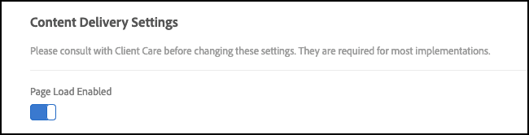

# [!UICONTROL targetGlobalSettings()]

您可以使用`[!UICONTROL targetGlobalSettings()]`覆盖at.js库中的设置，而不是在[!DNL Target] UI中或通过使用REST API来配置它们。

## 设置

您可以覆盖以下设置：

### aepSandboxId

* **类型**：字符串
* **默认值**： null
* **描述**：可选参数，用于发送[!DNL Adobe Experience Platform]沙盒ID以与[!DNL Target]共享在非默认沙盒中创建的[!DNL Adobe Experience Platform]目标。 如果`aepSandboxId`为非null，则必须同时提供`aepSandboxName`。

### aepSandboxName

* **类型**：字符串
* **默认值**： null
* **描述**：可选参数，用于发送[!DNL Adobe Experience Platform]沙盒名称以与[!DNL Target]共享在非默认沙盒中创建的[!DNL Adobe Experience Platform]目标。 如果`aepSandboxName`为非null，则必须同时提供`aepSandboxId`。

### artifectlocation

* **类型**：字符串
* **默认值**：无
* **描述**： [设备上决策规则项目](../../../server-side/sdk-guides/on-device-decisioning/rule-artifact-overview.md)的完全限定URL

### bodyHiddenStyle

* **类型**：字符串
* **默认值**：正文{不透明度： 0 }
* **描述**：仅在`globalMboxAutocreate === true`时使用，以尽量减少出现闪烁的情况。

  有关详细信息，请参阅[at.js如何管理闪烁](/help/dev/implement/client-side/atjs/how-atjs-works/manage-flicker-with-atjs.md)。

### bodyHidingEnabled

* **类型**：布尔型
* **默认值**： true
* **描述**：当使用`target-global-mbox`传递在可视化体验编辑器中创建的选件（也称为可视化选件）时，用于控制闪烁。

### clientCode

* **类型**：字符串
* **默认值**：通过UI设置的值。
* **描述**：表示客户端代码。

### cookieDomain

* **类型**：字符串
* **默认值**：如果可能，请设置为顶级域。
* **描述**：表示保存Cookie时使用的域。

### crossDomain

* **类型**：字符串
* **默认值**：通过UI设置的值。
* **描述**：指示是否启用跨域跟踪。 允许的值取决于您的at.js版本。 对于at.js v1.*x*，通过选择`enabled` （浏览器同时设置第一方Cookie和第三方Cookie），指定跨域功能是`disabled` (浏览器仅在您的域中设置Cookie（第一方Cookie）)、`x only` （浏览器仅在[!DNL Target]的域中设置Cookie）还是同时设置这两者。 对于at.js v2.10及更高版本，请指定跨域功能是`enabled` （浏览器同时设置第一方Cookie和第三方Cookie）还是`disabled` （浏览器不设置第三方Cookie）。

### cspScriptNonce

* **类型**：请参阅下面的[内容安全策略](#content-security-policy)。
* **默认值**：请参阅下面的[内容安全策略](#content-security-policy)。
* **描述**：请参阅下面的[内容安全策略](#content-security-policy)。

### cspStyleNonce

* **类型**：请参阅下面的[内容安全策略](#content-security-policy)。
* **默认值**：请参阅下面的[内容安全策略](#content-security-policy)。
* **描述**：请参阅下面的[内容安全策略](#content-security-policy)。

### dataProviders

* **类型**：请参阅下面的[数据提供程序](#data-providers)。
* **默认值**：请参阅下面的[数据提供程序](#data-providers)。
* **描述**：请参阅下面的[数据提供程序](#data-providers)。

### 决策方法

* **类型**：字符串
* **默认值**：服务器端
* **其他值**：设备端，混合
* **描述**：请参阅下面的决策方法。

  **决策方法**

  通过设备上决策，[!DNL Target]引入了一个名为“决策方法”的新设置，该设置指示at.js如何交付您的体验。 `decisioningMethod`具有三个值：仅服务器端、仅设备上和混合。 在`targetGlobalSettings()`中设置`decisioningMethod`时，它将充当所有[!DNL Target]决策的默认决策方法。

  **仅服务器端**：

  仅服务器端是默认的决策方法，当在Web资产上实施和部署at.js 2.5及更高版本时，此方法为现成可用的。

  仅将服务器端用作默认配置意味着在[!DNL Target]边缘网络上做出所有决策，其中涉及阻止服务器调用。 此方法可能会引入增量延迟，但它还提供了显着的优势，例如让您能够应用[!DNL Target]的机器学习功能，包括[Recommendations](https://experienceleague.adobe.com/docs/target/using/recommendations/recommendations.html)、[Automated Personalization](https://experienceleague.adobe.com/docs/target/using/activities/automated-personalization/automated-personalization.html) (AP)和[自动定位](https://experienceleague.adobe.com/docs/target/using/activities/auto-target/auto-target-to-optimize.html)活动。

  此外，通过使用[!DNL Target]的用户配置文件（跨会话和渠道保留）增强您的个性化体验，可为您的业务带来强大的成果。

  最后，服务器端仅允许您使用Adobe Experience Cloud并微调可通过Audience Manager和Adobe Analytics区段定位的受众。

  **仅限设备上**：

  “仅限设备端”是必须在at.js 2.5及更高版本中设置的决策方法，而“设备端”决策只能在整个网页中使用。

  设备上决策能够以惊人的速度提供您的体验和个性化活动，因为决策是由缓存的规则工件做出的，该工件包含您所有符合设备上决策资格的活动。

  要详细了解哪些活动符合设备上决策的条件，请参阅受支持的功能部分。

  仅当所有需要[!DNL Target]决策的页面的性能都非常关键时，才应使用此决策方法。 此外，请记住，选择此决策方法时，将不会交付或执行您不符合设备上决策资格的[!DNL Target]活动。 at.js库2.5及更高版本配置为仅查找缓存的规则工件以做出决策。

  **混合**：

  混合决策方法必须在at.js 2.5及更高版本中设置，前提是必须执行设备上决策以及需要对[!DNL Adobe Target] Edge网络进行网络调用的活动。

  当您同时管理设备上决策活动和服务器端活动时，考虑如何在您的页面上部署和预配[!DNL Target]时，可能会有点复杂和繁琐。 使用混合决策方法，[!DNL Target]知道何时必须对[!DNL Adobe Target] Edge网络进行服务器调用以执行需要服务器端执行的活动，以及何时仅执行设备上决策。

  JSON规则工件包含元数据，用于通知at.js mbox是正在运行的服务器端活动还是设备上决策活动。 此决策方法可确保通过设备上决策快速完成您想要交付的活动，并且对于需要更强大的ML驱动个性化的活动，这些活动将通过[!DNL Adobe Target] Edge网络完成。

### defaultContentHiddenStyle

* **类型**：字符串
* **默认值**：可见性：隐藏
* **描述**：仅用于封装使用类名为“mboxDefault”且通过`mboxCreate()`、`mboxUpdate()`或`mboxDefine()`执行的DIV以隐藏默认内容的mbox。

### defaultContentVisibleStyle

* **类型**：字符串
* **默认值**：可见性：可见
* **描述**：仅用于封装使用类名为“mboxDefault”且通过`mboxCreate()`、`mboxUpdate()`或`mboxDefine()`执行的DIV的mbox以显示应用的选件（如果有）或默认内容。

### deviceIdLifetime

* **类型**：数字
* **默认值**： 63244800000毫秒= 2年
* **描述**：在Cookie中保留的时间`deviceId`。

>[!NOTE]
>
>deviceIdLifetime设置可在at.js版本2.3.1或更高版本中覆盖。

### 已启用

* **类型**：布尔型
* **默认值**： true
* **描述**：启用时，将自动执行检索体验的[!DNL Target]请求和渲染体验的DOM操作。 此外，可通过`getOffer(s)` / `applyOffer(s)`手动执行[!DNL Target]调用。

  禁用后，不会自动或手动执行[!DNL Target]请求。

### globalMboxAutoCreate

* **类型**：数字
* **默认值**：通过UI设置的值。
* **描述**：指示是否应触发全局mbox请求。

### imsOrgId

* **类型**：字符串
* **默认值**： true
* **描述**：表示IMS组织ID。

### optinEnabled

* **类型**：布尔型
* **默认值**： false
* **描述**： [!DNL Target]通过Adobe Experience Platform提供选择加入功能支持，以协助支持您的同意管理策略。 选择加入功能让客户可自行决定如何以及何时触发 [!DNL Target] 标记。还有一个选项，即通过Adobe Experience Platform预批准[!DNL Target]标记。 要启用在[!DNL Target] at.js库中使用选择加入的功能，请添加`optinEnabled=true`设置。 在Adobe Experience Platform中，您必须从扩展安装视图的GDPR选择加入下拉列表中选择“启用”。 有关更多详细信息，请参阅[Adobe Experience Platform文档](/help/dev/implement/client-side/atjs/how-to-deployatjs/implement-target-using-adobe-launch.md)。 有关此设置与隐私和数据保护法规(包括欧盟的《通用数据保护条例》(GDPR)和《加州消费者隐私法案》(CCPA))相关的更多信息，请参阅[隐私和数据保护法规](/help/dev/before-implement/privacy/cmp-privacy-and-general-data-protection-regulation.md)。

### optoutEnabled

* **类型**：布尔型
* **默认值**： false
* **描述**：指示[!DNL Target]是否应调用访客API `isOptedOut()`函数。 这是启动设备图形的一部分。

### overrideMboxEdgeServer

* **类型**：布尔型
* **默认值**： true （从at.js版本1.6.2开始为true）
* **描述**：指示我们是应使用`<clientCode>.tt.omtrdc.net`域还是`mboxedge<clusterNumber>.tt.omtrdc.net`域。

  如果此值为true，则会将`mboxedge<clusterNumber>.tt.omtrdc.net`域保存到Cookie中。 使用at.js 1.8.2和at.js 2.3.1之前的at.js版本时，当前不使用[CNAME](/help/dev/before-implement/implement-cname-support-in-target.md)。如果您遇到此问题，请考虑将[at.js](/help/dev/implement/client-side/atjs/target-atjs-versions.md)更新到支持的较新版本。

### overrideMboxEdgeServerTimeout

* **类型**：数字
* **默认值**： 1860000 => 31分钟
* **描述**：指示包含`mboxedge<clusterNumber>.tt.omtrdc.net`值的Cookie生命周期。

### pageloadenabled

* **类型**：布尔型
* **默认值**： true
* **描述**：启用时，自动检索页面加载时必须返回的体验。

### pollingInterval

* **类型**：数字
* **默认值**： 300000 （以毫秒为单位的五分钟）
* **描述**： at.js获取新版本的设备上决策构件并更新缓存的间隔。 300000是`pollingInterval`允许的最小值。

### secureOnly

* **类型**：布尔型
* **默认值**： false
* **描述**：指示at.js是应仅使用HTTPS，还是可以根据页面协议在HTTP和HTTPS之间进行切换。 当设置为true时，secureOnly还会将Secure和SameSite属性设置为mbox Cookie。

### selectorsPollingTimeout

* **类型**：数字
* **默认值**： 5000毫秒= 5秒
* **描述**：在at.js 0.9.6中，[!DNL Target]引入了这个新设置，它可通过`targetGlobalSettings`覆盖。

  `selectorsPollingTimeout`设置表示客户端愿意等待多长时间，让选择器标识的所有元素都显示在页面上。

  通过可视化体验编辑器 (VEC) 创建的活动具有包含选择器的选件。

### serverDomain

* **类型**：字符串
* **默认值**：通过UI设置的值。
* **描述**：表示[!DNL Target]边缘服务器。

### serverState

* **类型**：请参阅下面的[混合个性化](#hybrid-personalization)。
* **默认值**：请参阅下面的[混合个性化](#hybrid-personalization)。
* **描述**：请参阅下面的[混合个性化](#hybrid-personalization)。

### telemetryEnable

* **类型**：布尔型
* **默认值**： true
* **描述**：启用时，Adobe收集SDK功能使用情况和性能遥测数据。 不收集个人数据。

### timeout

* **类型**：数字
* **默认值**：通过UI设置的值。
* **描述**：表示[!DNL Target]边缘请求超时。

### viewsenabled {#viewsenabled}

* **类型**：布尔型
* **默认值**： true
* **描述**：启用后，页面加载时将自动检索视图。 调用`triggerView`时，浏览器中会显示适用的视图。 如果禁用此选项，则在页面加载时不会检索视图，`triggerView`将不执行任何操作。 at.js 2.*x*。

### visitorApiTimeout

* **类型**：数字
* **默认值**： 2000毫秒= 2秒
* **描述**：表示访客API请求超时。

## 使用情况

此函数可在at.js加载之前或在&#x200B;**管理** > **实现** > **编辑at.js设置** > **代码设置** > **库标头**&#x200B;中定义。

“库标头”字段允许您输入自由格式的 JavaScript。自定义代码应与以下示例类似：

```javascript {line-numbers="true"}
window.targetGlobalSettings = {
   timeout: 200, // using custom timeout
   visitorApiTimeout: 500, // using custom API timeout
   enabled: document.location.href.indexOf('https://www.adobe.com') >= 0 // enabled ONLY on adobe.com
};
```

## 数据提供程序 {#data-providers}

此设置允许客户从第三方数据提供商（如Demandbase、BlueKai和自定义服务）收集数据，并将这些数据作为全局mbox请求中的mbox参数传递给[!DNL Target]。 支持通过异步和同步请求从多个提供程序收集数据。使用这种方法可以轻松管理默认页面内容的闪烁，同时包含每个提供程序的独立超时时间以限制对页面性能的影响

>[!NOTE]
>
>数据提供程序需要使用at.js 1.3或更高版本。

以下视频包含更多信息：

| 视频 | 描述 |
|--- |--- |
| [在 Adobe Target 中使用数据提供程序](https://experienceleague.adobe.com/docs/target-learn/tutorials/integrations/use-data-providers-to-integrate-third-party-data.html) | 数据提供程序是一项功能，允许您轻松地将数据从第三方传递到 Target。第三方可以是气象服务、DMP，甚至是您自己的 Web 服务。然后，您可以使用这些数据来构建受众、定位内容并丰富访客配置文件。 |
| [在 Adobe Target 中实施数据提供程序](https://experienceleague.adobe.com/docs/target-learn/tutorials/integrations/implement-data-providers-to-integrate-third-party-data.html) | 有关如何使用Adobe[!DNL Target]的dataProviders功能从第三方数据提供程序检索数据并将其传递到[!DNL Target]请求的实现详细信息和示例。 |

`window.targetGlobalSettings.dataProviders` 设置是一个数据提供程序数组。

每个数据提供程序具有以下结构：

| 键 | 类型 | 描述 |
|--- |--- |--- |
| name | 字符串 | 提供程序的名称。 |
| version | 字符串 | 提供程序版本。此键值将用于提供程序的版本演变。 |
| timeout | 数值 | 如果这是网络请求，则表示提供程序超时。此键值是可选的。 |
| provider | 函数 | 包含提供程序数据提取逻辑的函数。<p>该函数有一个必需的参数： `callback`。 callback 参数是一个函数，只有在成功获取数据或发生错误时才应调用该函数。<p>callback 应有两个参数：<ul><li>error：指示是否发生错误。如果一切正常，则应将此参数设置为空。</li><li>params： JSON对象，表示将在[!DNL Target]请求中发送的参数。</li></ul> |

以下示例显示数据提供程序使用同步执行的位置：

```javascript {line-numbers="true"}
var syncDataProvider = {
  name: "simpleDataProvider",
  version: "1.0.0",
  provider: function(callback) {
    callback(null, {t1: 1});
  }
};

window.targetGlobalSettings = {
  dataProviders: [
    syncDataProvider
  ]
};
```

在at.js处理`window.targetGlobalSettings.dataProviders`之后，[!DNL Target]请求将包含一个新参数： `t1=1`。

如果您要添加到[!DNL Target]请求的参数是从第三方服务（如Bluekai、Demandbase等）获取的，则参考以下示例：

```javascript {line-numbers="true"}
var blueKaiDataProvider = {
   name: "blueKai",
   version: "1.0.0",
   provider: function(callback) {
      // simulating network request
     setTimeout(function() {
       callback(null, {t1: 1, t2: 2, t3: 3});
     }, 1000);
   }
}

window.targetGlobalSettings = {
   dataProviders: [
      blueKaiDataProvider
   ]
};
```

在at.js处理`window.targetGlobalSettings.dataProviders`之后，[!DNL Target]请求将包含其他参数： `t1=1`、`t2=2`和`t3=3`。

以下示例使用数据提供程序收集天气API数据，并将其作为参数在[!DNL Target]请求中发送。 [!DNL Target]请求将具有其他参数，如`country`和`weatherCondition`。

```javascript {line-numbers="true"}
var weatherProvider = {
      name: "weather-api",
      version: "1.0.0",
      timeout: 2000,
      provider: function(callback) {
        var API_KEY = "caa84fc6f5dc77b6372d2570458b8699";
        var lat = 44.426767399999996;
        var lon = 26.1025384;
        var url = "//api.openweathermap.org/data/2.5/weather?";
        var data = {
          lat: lat,
          lon: lon,
          appId: API_KEY
        }

        $.ajax({
          type: "GET",
                url: url,
          dataType: "json",
          data: data,
          success: function(data) {
            console.log("Weather data", data);
            callback(null, {
              country: data.sys.country,
              weatherCondition: data.weather[0].main
            });
          },
          error: function(err) {
            console.log("Error", err);
            callback(err);
          }
        });
      }
    };

    window.targetGlobalSettings = {
      dataProviders: [weatherProvider]
    };
```

使用 `dataProviders` 设置时请考虑以下事项：

* 如果数据提供程序异步添加到 `window.targetGlobalSettings.dataProviders`，则将并行执行。访客 API 请求将与添加到 `window.targetGlobalSettings.dataProviders` 的函数并行执行，以将等待时间最小化。
* at.js 不会尝试缓存数据。如果数据提供程序仅提取一次数据，则应确保数据已缓存，并且在调用提供程序函数时为第二次调用提供缓存的数据。

## 内容安全策略

at.js 2.3.0+支持在应用传送的[!DNL Target]选件时，在附加到页面DOM的SCRIPT和STYLE标记上设置内容安全策略nonce。

应相应地在`targetGlobalSettings.cspScriptNonce`和`targetGlobalSettings.cspStyleNonce`中设置SCRIPT和STYLE nonce，然后再加载at.js 2.3.0+。 请参阅以下示例：

```javascript {line-numbers="true"}
...
<head>
 <script nonce="<script_nonce_value>">
window.targetGlobalSettings = {
  cspScriptNonce: "<csp_script_nonce_value>",
  cspStyleNonce: "<csp_style_nonce_value>"
};
 </script>
 <script nonce="<script_nonce_value>" src="at.js"></script>
...
</head>
...
```

在指定`cspScriptNonce`和`cspStyleNonce`设置后，at.js 2.3.0+在应用[!DNL Target]选件时附加到DOM的所有SCRIPT和STYLE标记上将这两个设置设置为Nonce属性。

## 混合个性化

`serverState`是at.js 2.2和更高版本中提供的设置，当实现[!DNL Target]的混合集成时，可使用该设置优化页面性能。 混合集成意味着您同时在客户端使用at.js 2.2和更高版本，在服务器端使用交付API或[!DNL Target] SDK来交付体验。 `serverState` 让 at.js 2.2 和更高版本可直接从在服务器端获取并作为所提供的页面的一部分返回客户端的内容应用体验。

### 先决条件

您必须具有[!DNL Target]的混合集成。

* **服务器端**：您必须使用[交付API](/help/dev/implement/delivery-api/overview.md)或[Target SDK](/help/dev/implement/server-side/sdk-guides/getting-started/getting-started.md)。
* **客户端**：您必须使用[at.js 2.2或更高版本](/help/dev/implement/client-side/atjs/target-atjs-versions.md)。

### 代码示例

要更好地了解其工作方式，请查看以下您在服务器上具有的代码示例。 该代码假定您使用的是[Target Node.js SDK](https://github.com/adobe/target-nodejs-sdk)。

```javascript {line-numbers="true"}
// First, we fetch the offers via Target Node.js SDK API, as usual
const targetResponse = await targetClient.getOffers(options);
// A successfull response will contain Target Delivery API request and response objects, which we need to set as serverState
const serverState = {
  request: targetResponse.request,
  response: targetResponse.response
};
// Finally, we should set window.targetGlobalSettings.serverState in the returned page, by replacing it in a page template, for example
const PAGE_TEMPLATE = `
<!doctype html>
<html>
<head>
  ...
  <script>
    window.targetGlobalSettings = {
      overrideMboxEdgeServer: true,
      serverState: ${JSON.stringify(serverState, null, " ")}
    };
  </script>
  <script src="at.js"></script>
</head>
...
</html>
`;
// Return PAGE_TEMPLATE to the client ...
```

视图预取的示例`serverState`对象JSON如下所示：

```javascript {line-numbers="true"}
{
 "request": {
  "requestId": "076ace1cd3624048bae1ced1f9e0c536",
  "id": {
   "tntId": "08210e2d751a44779b8313e2d2692b96.21_27"
  },
  "context": {
   "channel": "web",
   "timeOffsetInMinutes": 0
  },
  "experienceCloud": {
   "analytics": {
    "logging": "server_side",
    "supplementalDataId": "7D3AA246CC99FD7F-1B3DD2E75595498E"
   }
  },
  "prefetch": {
   "views": [
    {
     "address": {
      "url": "my.testsite.com/"
     }
    }
   ]
  }
 },
 "response": {
  "status": 200,
  "requestId": "076ace1cd3624048bae1ced1f9e0c536",
  "id": {
   "tntId": "08210e2d751a44779b8313e2d2692b96.21_27"
  },
  "client": "testclient",
  "edgeHost": "mboxedge21.tt.omtrdc.net",
  "prefetch": {
   "views": [
    {
     "name": "home",
     "key": "home",
     "options": [
      {
       "type": "actions",
       "content": [
        {
         "type": "setHtml",
         "selector": "#app > DIV.app-container:eq(0) > DIV.page-container:eq(0) > DIV:nth-of-type(2) > SECTION.section:eq(0) > DIV.container:eq(1) > DIV.heading:eq(0) > H1.title:eq(0)",
         "cssSelector": "#app > DIV:nth-of-type(1) > DIV:nth-of-type(1) > DIV:nth-of-type(2) > SECTION:nth-of-type(1) > DIV:nth-of-type(2) > DIV:nth-of-type(1) > H1:nth-of-type(1)",
         "content": "<span style=\"color:#FF0000;\">Latest</span> Products for 2020"
        }
       ],
       "eventToken": "t0FRvoWosOqHmYL5G18QCZNWHtnQtQrJfmRrQugEa2qCnQ9Y9OaLL2gsdrWQTvE54PwSz67rmXWmSnkXpSSS2Q==",
       "responseTokens": {
        "profile.memberlevel": "0",
        "geo.city": "dublin",
        "activity.id": "302740",
        "experience.name": "Experience B",
        "geo.country": "ireland"
       }
      }
     ],
     "state": "J+W1Fq18hxliDDJonTPfV0S+mzxapAO3d14M43EsM9f12A6QaqL+E3XKkRFlmq9U"
    }
   ]
  }
 }
}
```

将页面加载到浏览器中后，at.js会立即应用来自`serverState`的所有[!DNL Target]选件，而不会触发[!DNL Target]边缘的任何网络调用。 此外，at.js仅预隐藏内容获取服务器端中提供了[!DNL Target]选件的DOM元素，从而积极地影响页面加载性能和最终用户体验。

### 重要说明

使用`serverState`时请考虑以下事项：

* 目前，at.js v2.2仅支持通过serverState为以下对象交付体验：

   * VEC创建的活动，在页面加载时执行。
   * 预获取的视图。

     如果SPA在at.js API中使用[!DNL Target]视图和`triggerView()`，at.js v2.2会缓存服务器端预取的所有视图的内容，并在通过`triggerView()`触发每个视图后立即应用这些内容，而不会触发对[!DNL Target]的任何其他内容提取调用。

   * **注意**： `serverState`当前不支持在服务器端检索的mbox。

* 应用`serverState`选件时，at.js会考虑`pageLoadEnabled`和`viewsEnabled`设置，例如，如果`pageLoadEnabled`设置为false，则不会应用页面加载选件。

  要打开这些设置，请在&#x200B;**管理>实施>编辑>启用页面加载**&#x200B;中启用切换开关。

  

* 如果您使用`serverState`并在返回的内容中使用`<script>`标记，请确保您的HTML内容使用`<\/script>`而不是`</script>`。 如果您使用`</script>`，浏览器会将`</script>`解释为内联SCRIPT上的结尾，并且可能会中断HTML页。

### 其他资源

要了解`serverState`的工作方式，请查看以下资源：

* [示例代码](https://github.com/Adobe-Marketing-Cloud/target-node-client-samples/tree/master/advanced-atjs-integration-serverstate)。
* [单页应用程序(SPA)示例应用程序，带有`serverState`](https://github.com/Adobe-Marketing-Cloud/target-node-client-samples/tree/master/react-shopping-cart-demo)。
