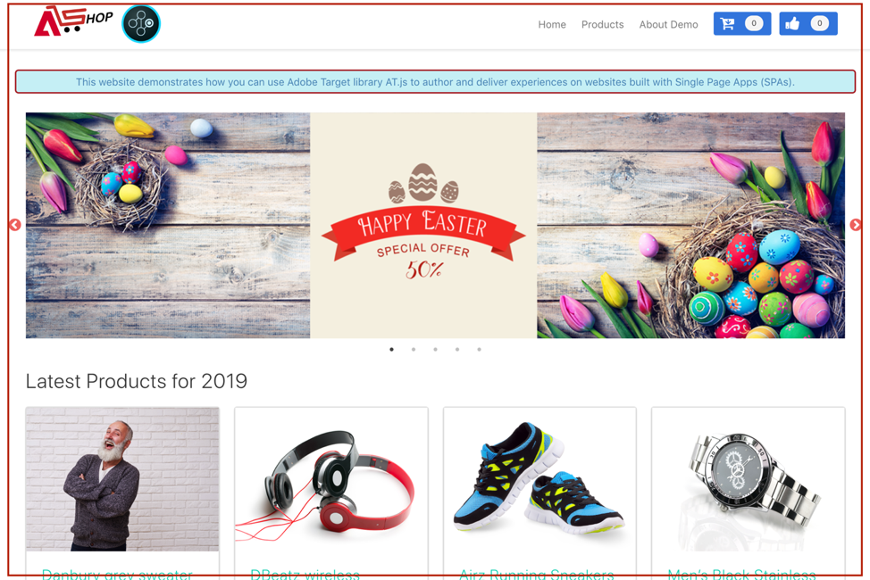
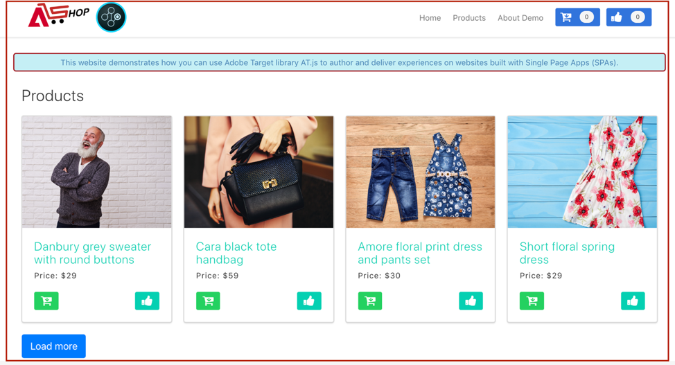

# 单页应用程序实施

传统网站使用的是“页面到页面”导航模型，也称为多页应用程序，其中网站设计与 URL 紧密耦合，并且从一个网页转换到另一个网页时，需要页面加载。而现代 Web 应用程序（例如单页应用程序 (SPA)）采用的模型可以提高使用浏览器 UI 渲染的速度，这种渲染通常与页面重新加载无关。这些体验通常通过客户交互触发，例如滚动、点击和光标移动。随着现代 Web 范例的不断发展，传统的通用事件（例如页面加载）与部署个性化和实验不再具有相关性。


at.js 2.x 提供了丰富的功能，使您的企业能够在下一代客户端技术上实现个性化。此版本着重改进了 at.js，以便与 SPA 进行和谐的交互。

以下是使用 at.js 2.x 的一些好处，这些好处在以前的版本中未提供：

* 能够在页面加载时缓存所有选件，将多次服务器调用减少至一次服务器调用。
* 由于选件是通过缓存立即显示的，不存在传统服务器调用引入的时间延迟，因此极大地提升了最终用户在您网站上的体验。
* 通过简单的单行代码和一次性开发人员设置，您的营销人员能够通过 VEC 在 SPA 上创建和运行 A/B 和体验定位 (XT) 活动。

## [!DNL Adobe Target] 视图和单页应用程序

此 [!DNL Adobe Target] SPA的VEC利用了称为“视图”的新概念，即视觉元素的逻辑组合，这些元素共同构成了SPA体验。 因此，SPA 可以被认为是通过基于用户交互的视图（而不是 URL）进行的转换。“视图”通常可显示整个站点或某个站点中分组的可视化元素。

为进一步说明视图的概念，让我们浏览一下这个在React中实施的假定的在线电子商务网站，并探索一些视图示例。 单击下面的链接可在新浏览器选项卡中打开此站点。

**链接： [Home站点](https://target.enablementadobe.com/react/demo/#/)**



导航到主页时，我们可以立即看到展示复活节促销活动的主页横幅，以及网站上销售的最新产品。在这种情况下，可以将“视图”定义为整个 home 站点。请注意，这很容易做到，因为我们将在“实施”中对此进行详细介绍 [!DNL Adobe Target] 查看以下部分。

**链接： [产品站点](https://target.enablementadobe.com/react/demo/#/products)**



当我们对企业销售的产品产生浓厚的兴趣时，我们将决定单击“Products”（产品）链接。与主页网站类似，可将整个产品站点定义为一个“视图”。我们可以将此视图命名为“products”（产品），就像 `https://target.enablementadobe.com/react/demo/#/products)` 中的路径名称一样。


在本节的开始位置，我们将“视图”定义为整个站点，甚至是站点上的一组可视化元素。如上所示，可以将站点上显示的四个产品划归一组并将它们视为一个视图。如果想要命名此视图，则可以将其命名为“products”（产品）。


我们决定单击“Load More”（了解更多）按钮，以浏览站点上的更多产品。在这种情况下，网站 URL 不会发生更改。但是，这里的视图只能呈现上面显示的第二行产品。此视图名称可称为“PRODUCTS-PAGE-2”。

**链接： [结帐](https://target.enablementadobe.com/react/demo/#/checkout)**


因为喜欢网站上显示的一些产品，因此我们决定购买几个产品。现在，在结帐站点上，我们可以选择正常递送或快递。由于视图可以是网站上的任意一组可视化元素，因此我们可以将其命名为“View Delivery Preferences”（查看递送首选项）。

此外，视图的概念可以进一步扩展。如果营销人员想要根据所选择的递送首选项来对网站上的内容进行个性化，则可以为每个递送首选项创建一个视图。在这种情况下，当我们选择“Normal Delivery”（普通递送）时，可以将视图命名为“Normal Delivery”（普通递送）。如果选择了“Express Delivery”（快递），则可以将视图命名为“Express Delivery”（快递）。

现在，营销人员可能想要运行 A/B 测试，以查看与将两个交付选项的按钮颜色保持为蓝色相比，在选择“Express Delivery”（快递）后将按钮颜色从蓝色更改为红色是否可以提高转化率。

## 实施 [!DNL Adobe Target] 视图

既然我们已经介绍了 [!DNL Adobe Target] 视图是，我们可以在以下位置利用这个概念： [!DNL Target] 使营销人员能够通过VEC在SPA上运行A/B和XT测试。 这将需要一次性开发人员设置。下面我们将完成这些步骤以进行此设置。

1. 安装 at.js 2。*x*。

   首先，我们需要安装at.js 2.*x*.此版本的at.js在开发时考虑了SPA。 at.js的早期版本不支持 [!DNL Adobe Target] 视图和SPA的VEC。

   下载at.js 2.*x* 通过 [!DNL Adobe Target] UI位于 **[!UICONTROL 管理]** > **[!UICONTROL 实现]**. at.js 2.*x* 也可以通过中的标记进行部署 [!DNL Adobe Experience Platform].

1. 实施at.js 2.*x* 函数， `[triggerView()](/help/dev/implement/client-side/atjs/atjs-functions/adobe-target-triggerview-atjs-2.md)` 在您的网站上。

   在定义要运行A/B或XT测试的SPA视图之后，实施at.js 2.*x* `triggerView()` 函数中带有作为参数传入的视图。 这允许营销人员使用 VEC 来针对所定义的那些视图设计和运行 A/B 和 XT 测试。如果没有为这些视图定义 `triggerView()` 函数，则 VEC 将不会检测到视图，因此营销人员将无法使用 VEC 来设计和运行 A/B 和 XT 测试。

   >[!NOTE]
   >
   >要获得at.js中的视图支持， [viewsenabled](/help/dev/implement/client-side/atjs/atjs-functions/targetglobalsettings.md#viewsenbabled) 必须设置为true，否则将禁用所有视图功能。

   **`adobe.target.triggerView(viewName, options)`**

   | 参数 | 类型 | 必需？ | 验证 | 描述 |
   | --- | --- | --- | --- | --- |
   | viewName | 字符串 | 是 | 1. 无尾随空格。<br />2. 不能为空。<br />3. 所有页面的视图名称应该都是唯一的。<br />4. **警告**：视图名称不应以 `/` 开头或结尾。这是因为客户通常会从 URL 路径中提取视图名称。对于我们来说，“home”和“`/home`”是不同的。<br />5. **警告**：不应使用 `{page: true}` 选项连续多次触发同一视图。 | 将任何名称作为要显示视图的字符串类型传递。此视图名称显示在 VEC 的&#x200B;**[!UICONTROL 修改]**&#x200B;面板中，供营销人员创建操作并运行其 A/B 和 XT 活动。 |
   | options | 对象 | 否 |  |  |
   | options > page | 布尔值 | 否 |  | **TRUE**：page 的默认值为 true。当 `page=true` 时，将向 Edge 服务器发送增加展示次数计数的通知。<br />**FALSE**：当 `page=false` 时，将不会发送增加展示次数计数的通知。当您只想在具有选件的页面上重新渲染组件时，才应该使用此选项。 |

   现在，我们来查看一些有关如何调用的示例用例 `triggerView()` 在React中针对我们假定的电子商务SPA执行的操作：

   **链接： [Home站点](https://target.enablementadobe.com/react/demo/#/)**

   

   作为营销人员，如果我们想要在整个主页网站上运行 A/B 测试，那么可能需要将视图命名为“home”。

```
 function targetView() {
   var viewName = window.location.hash; // or use window.location.pathName if router works on path and not hash

   viewName = viewName || 'home'; // view name cannot be empty

   // Sanitize viewName to get rid of any trailing symbols derived from URL
   if (viewName.startsWith('#') || viewName.startsWith('/')) {
     viewName = viewName.substr(1);
   }

   // Validate if the Target Libraries are available on your website
   if (typeof adobe != 'undefined' && adobe.target && typeof adobe.target.triggerView === 'function') {
     adobe.target.triggerView(viewName);
   }
 }

 // react router v4
 const history = syncHistoryWithStore(createBrowserHistory(), store);
 history.listen(targetView);

 // react router v3
 <Router history={hashHistory} onUpdate={targetView} >
```

**链接： [产品站点](https://target.enablementadobe.com/react/demo/#/products)**

现在，让我们来看一个比较复杂的示例。 假设我们是营销人员，想要在用户单击“Load More”（加载更多）按钮后将“Price”（价格）标签颜色更改为红色，以对第二行的产品进行个性化。


```
 function targetView(viewName) {
   // Validate if the Target Libraries are available on your website
   if (typeof adobe != 'undefined' && adobe.target && typeof adobe.target.triggerView === 'function') {
     adobe.target.triggerView(viewName);
   }
 }

 class Products extends Component {
   render() {
     return (
       <button type="button" onClick={this.handleLoadMoreClicked}>Load more</button>
     );
   }

   handleLoadMoreClicked() {
     var page = this.state.page + 1; // assuming page number is derived from component's state
     this.setState({page: page});
     targetView('PRODUCTS-PAGE-' + page);
   }
 }
```

**链接： [结帐](https://target.enablementadobe.com/react/demo/#/checkout)**


如果营销人员想要根据所选择的递送首选项来对网站上的内容进行个性化，则可以为每个递送首选项创建一个视图。在这种情况下，当我们选择“Normal Delivery”（普通递送）时，可以将视图命名为“Normal Delivery”（普通递送）。如果选择了“Express Delivery”（快递），则可以将视图命名为“Express Delivery”（快递）。

现在，营销人员可能想要运行 A/B 测试，以查看与将两个交付选项的按钮颜色保持为蓝色相比，在选择“Express Delivery”（快递）后将按钮颜色从蓝色更改为红色是否可以提高转化率。

```
 function targetView(viewName) {
   // Validate if the Target Libraries are available on your website
   if (typeof adobe != 'undefined' && adobe.target && typeof adobe.target.triggerView === 'function') {
     adobe.target.triggerView(viewName);
   }
 }

 class Checkout extends Component {
   render() {
     return (
       <div onChange={this.onDeliveryPreferenceChanged}>
         <label>
           <input type="radio" id="normal" name="deliveryPreference" value={"Normal Delivery"} defaultChecked={true}/>
           <span> Normal Delivery (7-10 business days)</span>
         </label>

         <label>
           <input type="radio" id="express" name="deliveryPreference" value={"Express Delivery"}/>
           <span> Express Delivery* (2-3 business days)</span>
         </label>
       </div>
     );
   }
   onDeliveryPreferenceChanged(evt) {
     var selectedPreferenceValue = evt.target.value;
     targetView(selectedPreferenceValue);
   }
 }
```

## at.js 2.x 系统图

下图可帮助您了解含有视图的 at.js 2.x 工作流程以及其如何增强 SPA 集成。要更好地了解 at.js 2.x 中使用的概念，请参阅[单页应用程序实施](/help/dev/implement/client-side/atjs/how-to-deployatjs/target-atjs-single-page-application.md)。


| 步骤 | 详细信息 |
| --- | --- |
| 1 | 如果用户通过了身份验证，则调用会返回Experience CloudID；另一调用会同步客户ID。 |
| 2 | at.js 库会同步加载，并隐藏文档正文。<br />也可以选择预先隐藏页面上实施的代码段，以异步方式加载 at.js。 |
| 3 | 将会发出页面加载请求，其中包括已配置的所有参数（例如，MCID、SDID 和客户 ID）。 |
| 4 | 配置文件脚本在执行后进入配置文件存储区。存储区向受众库请求符合条件的受众（例如从 Adobe Analytics、Audience Management 等共享的受众）。<br />客户属性会以批量过程发送到配置文件存储区。 |
| 5 | 根据 URL 请求参数和配置文件数据，[!DNL Target] 可决定将哪些活动和体验返回给查看当前页面和未来视图的访客。 |
| 6 | 目标内容会发送回页面，其中可能包含其他个性化的配置文件值。<br />当前页面上的目标内容会在默认内容不发生闪烁的情况下尽快显示。<br />视图中作为 SPA 用户操作结果显示的目标内容会缓存在浏览器中，因此当通过 `triggerView()` 触发视图时，可以立即应用它而无需额外的服务器调用。 |
| 7 | Analytics 数据会发送到数据收集服务器。 |
| 8 | 目标数据与 [!DNL Analytics] 数据通过SDID并处理到 [!DNL Analytics] 报告存储。<br />之后，便可以在以下两个位置查看Analytics数据 [!DNL Analytics] 和 [!DNL Target] via [!DNL Analytics] 对象 [!DNL Target] (A4T)报表。 |

现在，无论在 SPA 上的什么位置实施 `triggerView()`，都会从缓存中检索查看次数和操作，并在没有服务器调用的情况下显示给用户。`triggerView()` 还会向 [!DNL Target] 后端发出通知请求，以增加和记录展示次数计数。


| 步骤 | 详细信息 |
| --- | --- |
| 1 | 在 SPA 中调用 `triggerView()` 以渲染视图并应用操作来修改可视化元素。 |
| 2 | 从缓存中读取视图的目标内容。 |
| 3 | 目标内容会在默认内容不发生闪烁的情况下尽快显示。 |
| 4 | 通知请求将发送到 [!DNL Target] 配置文件存储区，以计算活动中的访客和递增量度。 |
| 5 | Analytics 数据会发送到数据收集服务器。 |
| 6 | Target 数据会通过 SDID 匹配到 [!DNL Analytics] 数据，并且会进行相应处理以保存到 [!DNL Analytics] 报表存储中。[!DNL Analytics] 然后，便可以在以下两个位置查看数据 [!DNL Analytics] 和 [!DNL Target] 通过A4T报表。 |

## 单页应用程序可视化体验编辑器

完成安装 at.js 2.x 并将 `triggerView()` 添加到站点后，便可使用 VEC 来运行 A/B 和 XT 活动。有关更多信息，请参阅[单页应用程序 (SPA) 可视化体验编辑器](https://experienceleague.adobe.com/docs/target/using/experiences/spa-visual-experience-composer.html)。

>[!NOTE]
>
>SPA VEC 其实与在常规网页上使用的 VEC 相同，但当您打开实施了 `triggerView()` 的单页应用程序时，还可以使用一些其他功能。

## 使用 TriggerView 确保 A4T 与 at.js 2.x 和 SPA 一起正常工作

要确保 [ for ](https://experienceleague.adobe.com/docs/target/using/integrate/a4t/a4t.html) (A4T) 与 at.js 2.x 一起正常工作，请务必在 Target 请求和 Analytics 请求中发送相同的 SDID。[!DNL Target][!DNL Analytics]

与 SPA 相关的最佳实践：

* 使用自定义事件来通知应用程序中发生了一些有趣事件
* 在视图开始渲染之前触发自定义事件
* 在视图完成渲染时触发自定义事件

at.js 2.x 添加了一个新的 API [triggerView()](/help/dev/implement/client-side/atjs/atjs-functions/adobe-target-triggerview-atjs-2.md) 函数。您应该使用 `triggerView()` 来通知 at.js 视图将开始渲染。

要了解如何组合自定义事件、at.js 2.x 和 Analytics，请参阅一个示例。此示例假设 HTML 页面包含访客 API，其后依次是 at.js 2.x 和 AppMeasurement。

假设存在以下自定义事件：

* `at-view-start` - 当视图开始渲染时
* `at-view-end` - 当视图完成渲染时

要确保结合使用 A4T 与 at.js 2.x，

视图开始处理程序应当如下：

```jsx {line-numbers="true"}
document.addEventListener("at-view-start", function(e) {
  var visitor = Visitor.getInstance("<your Adobe Org ID>");
  
  visitor.resetState();
  adobe.target.triggerView("<view name>");
});
```

视图结束处理程序应当如下：

```jsx {line-numbers="true"}
document.addEventListener("at-view-end", function(e) {
  // s - is the AppMeasurement tracker object
  s.t();
});
```

>[!NOTE]
>
>您必须触发 `at-view-start` 和 `at-view-end` 事件。这些事件并不是 at.js 自定义事件的一部分。

尽管这些示例使用的是JavaScript代码，但如果您正在使用标签管理器(例如 [Adobe Experience Platform](/help/dev/implement/client-side/atjs/how-to-deployatjs/implement-target-using-adobe-launch.md).

如果遵循上述步骤，则应该针对 SPA 提供一个强大的 A4T 解决方案。

## 实施最佳实践

at.js 2.x API允许您自定义您的 [!DNL Target] 在许多方面实施，但在这一过程中遵循正确的操作顺序很重要。

以下信息描述了在浏览器中首次加载单页应用程序时必须遵循的操作的顺序，以及之后发生的任何视图更改。

### 初始页面加载的操作顺序 {#order}

| 步骤 | 操作 | 详细信息 |
| --- | --- | --- |
| 1 | 加载VisitorAPI JS | 此库负责为访客分配ECID。 此ID稍后由网页上的其他Adobe解决方案使用。 |
| 2 | 加载at.js 2.x | at.js 2.x可加载您用于实施的所有必要API [!DNL Target] 请求和视图。 |
| 3 | 执行 [!DNL Target] 请求 | 如果您拥有数据层，我们建议您加载发送到所需的关键数据 [!DNL Target] 执行之前 [!DNL Target] 请求。 这允许您使用 `targetPageParams` 以包含要用于定位的任何数据。<P>时间 `pageLoadEnabled` 和 `viewsEnabled` 在中设置为true [targetGlobalSettings](/help/dev/implement/client-side/atjs/atjs-functions/targetglobalsettings.md)， at.js自动请求所有VEC [!DNL Target] 第2步中的选件。<P>请注意 `getOffers` 也可用于在页面加载后获取VEC选件。 为此，请确保请求包含 `execute>pageLoad` 和 `prefetch>views` 在API调用中。 |
| 4 | 调用 `triggerView()` | 因为 [!DNL Target] 您在步骤3中启动的请求可能会返回“页面加载执行”和“视图”的体验，请确保 `triggerView()` 在 [!DNL Target] 请求将返回，并完成将选件应用到缓存。 每个视图必须只执行此步骤一次。 |
| 5 | 调用 [!DNL Analytics] 页面查看信标 | 此信标会将与步骤3和4关联的SDID发送到 [!DNL Analytics] 用于数据拼接。 |
| 6 | 致电附加 `triggerView({"page": false})` | 这是适用于SPA框架的可选步骤，该步骤可能会在不更改视图的情况下重新呈现页面上的某些组件。 在此类情况下，请务必调用此API以确保 [!DNL Target] 在SPA框架重新渲染组件后，将重新应用体验。 您可以根据需要多次执行此步骤，以确保 [!DNL Target] 体验会保留在SPA视图中。 |

### SPA视图更改的操作顺序（无全页重新加载）

| 步骤 | 操作 | 详细信息 |
| --- | --- | --- |
| 1 | 调用 `visitor.resetState()` | 此API可确保在新视图加载时为其重新生成SDID。 |
| 2 | 通过调用 `getOffers()` API | 如果此视图更改有可能使当前访客符合更多条件，则可以选择执行此步骤 [!DNL Target] 活动，或取消其参与活动的资格。 此时，您还可以选择将其他数据发送至 [!DNL Target] 以进一步启用定位功能。 |
| 3 | 调用 `triggerView()` | 如果您已执行步骤2，则必须等待 [!DNL Target] 在执行此步骤之前，请请求并应用选件到缓存。 每个视图必须只执行此步骤一次。 |
| 4 | 调用 `triggerView()` | 如果尚未执行步骤2，则可以在完成步骤1后立即执行此步骤。 如果已执行了Step 2和Step 3，则应跳过此步骤。 每个视图必须只执行此步骤一次。 |
| 5 | 调用 [!DNL Analytics] 页面查看信标 | 此信标会将与步骤2、3和4关联的SDID发送到 [!DNL Analytics] 用于数据拼接。 |
| 6 | 致电附加 `triggerView({"page": false})` | 这是适用于SPA框架的可选步骤，该步骤可能会在不更改视图的情况下重新呈现页面上的某些组件。 在此类情况下，请务必调用此API以确保 [!DNL Target] 在SPA框架重新渲染组件后，将重新应用体验。 您可以根据需要多次执行此步骤，以确保 [!DNL Target] 体验会保留在SPA视图中。 |

## 培训视频

以下视频包含更多信息：

### 了解 at.js 2.x 的工作原理

>[!VIDEO](https://video.tv.adobe.com/v/26250/?quality=12)

有关更多信息，请参阅[了解 at.js 2.x 的工作方式](https://experienceleague.adobe.com/docs/target-learn/tutorials/implementation/understanding-how-atjs-20-works.html)。

### 在 SPA 中实施 at.js 2.x

>[!VIDEO](https://video.tv.adobe.com/v/26248/?quality=12)

请参阅 [在单页应用程序(SPA)中实施Adobe Target的at.js 2.x](https://experienceleague.adobe.com/docs/target-learn/tutorials/experiences/use-the-visual-experience-composer-for-single-page-applications.html) 以了解更多信息。

### 在中使用SPA VEC [!DNL Adobe Target]

>[!VIDEO](https://video.tv.adobe.com/v/26249/?quality=12)

请参阅 [在Adobe Target中使用单页应用程序的可视化体验编辑器(SPA VEC)](https://experienceleague.adobe.com/docs/target-learn/tutorials/experiences/use-the-visual-experience-composer-for-single-page-applications.html) 以了解更多信息。
