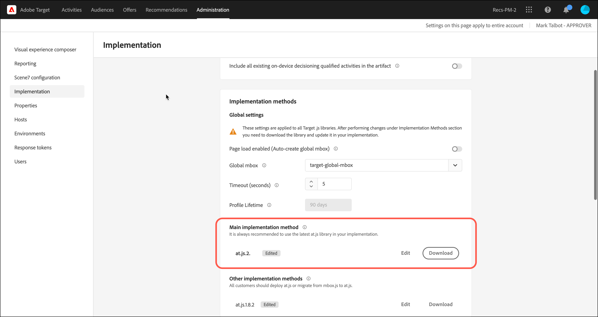
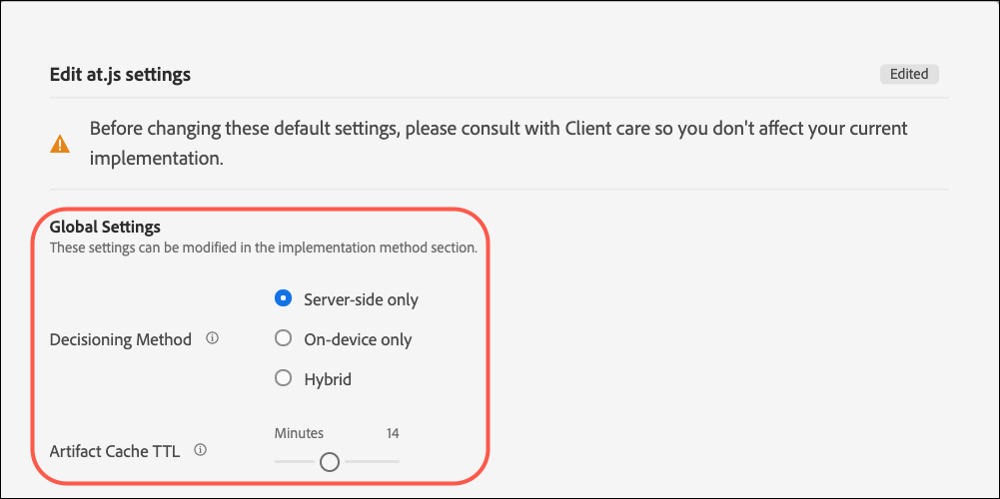
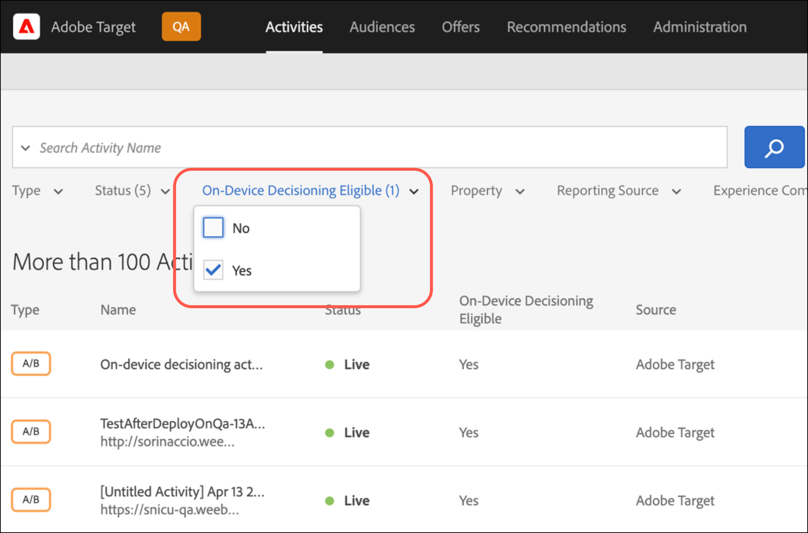

# 针对at.js的[!UICONTROL 设备上决策]

从版本2.5.0开始，at.js提供[!UICONTROL 设备上决策]。 [!UICONTROL 设备上决策]允许您在浏览器上缓存[A/B测试](https://experienceleague.adobe.com/docs/target/using/activities/abtest/test-ab.html)和[体验定位](https://experienceleague.adobe.com/docs/target/using/activities/experience-targeting/experience-target.html) (XT)活动，以执行内存中决策，而无需向[!DNL Adobe Target] Edge Network发送阻止网络请求。

>[!NOTE]
>
>[!UICONTROL 设备上决策]可用于客户端和服务器端实施。 本文介绍了客户端的[!UICONTROL 设备上决策]。 有关服务器端的[!UICONTROL 设备上决策]的信息，请参阅服务器端实施文档[此处](../../../server-side/sdk-guides/on-device-decisioning/overview.md)。

[!DNL Target]还可以通过实时服务器调用，灵活地从您的实验和机器学习驱动的（ML驱动的）个性化活动中提供最相关和最新的体验。 换句话说，当性能最重要时，您可以选择使用[!UICONTROL 设备上决策]。 但是，当需要最相关、最新且ML驱动的体验时，可以改为进行服务器调用。

## [!UICONTROL 设备上决策]有哪些好处？

[!UICONTROL 设备上决策]的好处包括：

* **提供超快的决策和体验。** 在内存中和浏览器上执行分段和决策，以避免阻止网络请求。
* **增强应用程序性能。** 在不影响最终用户体验的情况下运行实验并向客户和用户提供个性化。
* **提高Google网站质量分数。** 由于决策在内存中进行，因此可提高您在线业务的Google网站质量分数，使其更易于消费者发现。
* **从实时分析中学习。** 通过[Analytics for Target](https://experienceleague.adobe.com/docs/target/using/integrate/a4t/a4t.html) (A4T)报表实时了解您的活动表现。 A4T允许您在关键时刻调整策略。

## 受支持的功能

[!DNL Adobe Target] JS SDK允许客户灵活选择数据的性能和新鲜度以供决策。 换言之，如果通过机器学习提供最相关且最引人入胜的个性化内容对您来说最重要，则应进行实时服务器调用。 但是，当性能更加关键时，应该做出设备上决策和内存决策。 要使[!UICONTROL 设备上决策]正常工作，请参阅支持的功能列表：

* 活动类型
* 受众定位
* 分配方法

有关详细信息，请参阅[!UICONTROL 设备上决策][&#128279;](/help/dev/implement/client-side/atjs/on-device-decisioning/supported-features.md)的支持的功能。

## [!UICONTROL 设备上决策]如何工作？

在启用了[!UICONTROL 设备上决策]的情况下部署和初始化at.js时，将从距离访客最近的Akamai CDN下载并缓存访客浏览器本地的[规则工件](/help/dev/implement/client-side/atjs/on-device-decisioning/rule-artifact.md)，其中包括用于A/B和XT活动、受众及资产的[!UICONTROL 设备上决策]。 当从at.js发出检索体验的请求时，将根据在缓存的规则工件中编码的元数据，在内存中做出有关返回哪个体验的决策。

## 决策方法

通过[!UICONTROL 设备上决策]，[!DNL Target]引入了一个名为“决策方法”的新设置。 决策方法设置指示at.js如何交付您的体验。 决策方法具有三个值：

* 仅服务器端
* 仅限设备端
* 混合

### 仅服务器端

仅服务器端是在您的Web资产上实施和部署at.js 2.5.0及更高版本时开箱即用的默认决策方法。

仅将服务器端用作默认配置意味着在[!DNL Target]边缘网络上做出所有决策，其中涉及阻止服务器调用。 此方法可能会引入增量延迟，但它也提供了显着的优势，例如允许您应用[!DNL Target]的机器学习功能，包括[推荐](https://experienceleague.adobe.com/docs/target/using/recommendations/recommendations.html)、[Automated Personalization](https://experienceleague.adobe.com/docs/target/using/activities/automated-personalization/automated-personalization.html) (AP)和[自动定位](https://experienceleague.adobe.com/docs/target/using/activities/auto-target/auto-target-to-optimize.html)活动。

此外，通过使用[!DNL Target]的用户配置文件（跨会话和渠道保留）增强您的个性化体验，可为您的业务带来强大的成果。

最后，服务器端仅允许您使用Adobe Experience Cloud并微调可通过Audience Manager和Adobe Analytics区段定位的受众。

下图说明了您的访客、浏览器、at.js 2.5.0+和[!DNL Adobe Target] Edge网络之间的交互情况。 此流程图会捕获新访客和回访访客。

（单击图像可展开至全宽。）

{zoomable="yes"}

以下列表对应于图中的数字：

| 步骤 | 描述 |
| --- | --- |
| 1 | Experience Cloud访客ID是从[Adobe Experience Cloud Identity Service](https://experienceleague.adobe.com/docs/id-service/using/home.html？)中检索的。 |
| 2 | at.js库同步加载并隐藏文档正文。<br />   也可以选择在页面上实施预先隐藏的代码片段，以异步方式加载at.js库。 |
| 3 | at.js库会隐藏正文以防止闪烁。 |
| 4 | 将会发出页面加载请求，其中包括已配置的所有参数，例如（ECID、客户ID、自定义参数、用户配置文件等）。 |
| 5 | 配置文件脚本在执行后进入配置文件存储区。<br />配置文件存储区从受众库请求符合条件的受众（例如，从Adobe Analytics、Adobe Audience Manager等共享的受众）。<br />客户属性会以批量过程发送到配置文件存储区。 |
| 6 | 配置文件存储区用于受众资格和分段以筛选活动。 |
| 7 | 在从实时[!DNL Target]活动中确定体验后，将选择生成的内容。 |
| 8 | at.js库会隐藏页面上与必须呈现的体验关联的相应元素。 |
| 9 | at.js库会显示主体，以便可以加载页面的其余部分以供访客查看。 |
| 10 | at.js库操作DOM以呈现来自[!DNL Target] Edge Network的体验。 |
| 11 | 体验会呈现给访客。 |
| 12 | 加载整个网页。 |
| 13 | Analytics 数据会发送到数据收集服务器。 |
| 14 | 目标数据会通过SDID匹配到Analytics数据，并且会进行相应处理以保存到Analytics报表存储中。 然后，便可以在Analytics和[!DNL Target]中通过[!UICONTROL Analytics for Target] (A4T)报表查看Analytics数据。 |

### 仅限设备端

“仅限设备上”是必须在at.js 2.5.0及更高版本中设置的决策方法，而[!UICONTROL 设备上决策]只能在您的网页中使用。

[!UICONTROL 设备上决策]能够以惊人的速度提供您的体验和个性化活动，因为决策来自缓存的规则构件，该构件包含您所有符合[!UICONTROL 设备上决策]条件的活动。

要了解哪些活动符合[!UICONTROL 设备上决策]的条件，请参阅[!UICONTROL 设备上决策][&#128279;](/help/dev/implement/client-side/atjs/on-device-decisioning/supported-features.md)中的支持的功能。

仅当在所有需要Target决策的页面上的性能都非常关键时，才应使用此决策方法。 此外，请记住，选择此决策方法时，您不符合[!UICONTROL 设备上决策]条件的[!DNL Target]活动将不会交付或执行。 at.js库2.5.0及更高版本配置为仅查找缓存的规则工件以做出决策。

下图说明了您的访客、浏览器、at.js 2.5.0+和Akamai CDN之间的交互。 Akamai CDN将在访客首次访问时缓存规则构件。 对于新访客进行的首次页面访问，必须从Akamai CDN下载JSON规则构件，才能在访客的浏览器中缓存到本地。 下载JSON规则工件后，将立即做出决策，而无需阻止网络调用。 以下流程图可捕获新访客。

（单击图像可展开至全宽。）

{zoomable="yes"}

以下列表对应于图中的数字：

>[!NOTE]
>
>[!DNL Adobe Target]管理员服务器确定您所有符合[!UICONTROL 设备上决策]条件的活动的资格，生成JSON规则工件并将其传播到Akamai CDN。 系统持续监控您的活动是否有更新，以输出新的JSON规则工件并传播到Akamai CDN。

| 步骤 | 描述 |
| --- | --- |
| 1 | Experience Cloud访客ID是从[Adobe Experience Cloud Identity Service](https://experienceleague.adobe.com/docs/id-service/using/home.html)中检索的。 |
| 2 | at.js 库会同步加载，并隐藏文档正文。<br />也可以使用页面上实施的可选预隐藏代码片段异步加载at.js库。 |
| 3 | at.js库会隐藏正文以防止闪烁。 |
| 4 | at.js库会发出请求，请求从距离访客最近的Akamai CDN检索JSON规则构件。 |
| 5 | Akamai CDN使用JSON规则工件进行响应。 |
| 6 | JSON规则工件会缓存在访客浏览器的本地。 |
| 7 | at.js库解释JSON规则构件并执行决策以检索体验并隐藏测试的元素。 |
| 8 | at.js库会显示主体，以便可以加载页面的其余部分以供访客查看。 |
| 9 | at.js库会操作DOM以呈现缓存的JSON规则工件中的体验。 |
| 10 | 体验会呈现给访客。 |
| 11 | 加载整个网页。 |
| 12 | Analytics 数据会发送到数据收集服务器。 目标数据会通过SDID匹配到Analytics数据，并且会进行相应处理以保存到Analytics报表存储中。 然后，便可以在Analytics和[!DNL Target]中通过[!UICONTROL Analytics for Target] (A4T)报表查看Analytics数据。 |

下图说明了访客、浏览器at.js 2.5.0及更高版本与缓存的JSON规则工件之间的交互，这些工件用于访客的后续页面点击或回访。 由于JSON规则工件已缓存并在浏览器中可用，因此会立即做出决策，而无需阻止网络调用。 此流程图会捕获后续页面导航或回访访客。

（单击图像可展开至全宽。）

{zoomable="yes"}

以下列表对应于图中的数字：

>[!NOTE]
>
>[!DNL Adobe Target]管理员服务器确定您所有符合[!UICONTROL 设备上决策]条件的活动的资格，生成JSON规则工件并将其传播到Akamai CDN。 系统持续监控您的活动是否有更新，以输出新的JSON规则工件并传播到Akamai CDN。

| 步骤 | 描述 |
| --- | --- |
| 1 | Experience Cloud访客ID是从[Adobe Experience Cloud Identity Service](https://experienceleague.adobe.com/docs/id-service/using/home.html)中检索的。 |
| 2 | at.js 库会同步加载，并隐藏文档正文。<br />也可以使用页面上实施的可选预隐藏代码片段异步加载at.js库。 |
| 3 | at.js库会隐藏正文以防止闪烁。 |
| 4 | at.js库解释JSON规则工件并在内存中执行决策以检索体验。 |
| 5 | 已测试的元素被隐藏。 |
| 6 | at.js库会显示主体，以便可以加载页面的其余部分以供访客查看。 |
| 7 | at.js库会操作DOM以呈现缓存的JSON规则工件中的体验。 |
| 8 | 体验会呈现给访客。 |
| 9 | 加载整个网页。 |
| 10 | Analytics 数据会发送到数据收集服务器。 目标数据会通过SDID匹配到Analytics数据，并且会进行相应处理以保存到Analytics报表存储中。 然后，便可以在Analytics和[!DNL Target]中通过[!UICONTROL Analytics for Target] (A4T)报表查看Analytics数据。 |

### 混合

混合决策方法必须在at.js 2.5.0及更高版本中设置，以便同时执行[!UICONTROL 设备上决策]和需要对[!DNL Adobe Target] Edge网络进行网络调用的活动。

当您同时管理[!UICONTROL 设备上决策]活动和服务器端活动时，考虑如何在您的页面上部署和预配[!DNL Target]时，可能会比较复杂和繁琐。 使用混合决策方法，[!DNL Target]知道何时必须对[!DNL Adobe Target] Edge网络进行服务器调用以执行需要服务器端执行的活动，以及何时仅执行设备上决策。

JSON规则工件包含元数据，用于通知at.js mbox是正在运行的服务器端活动还是[!UICONTROL 设备上决策]活动。 此决策方法可确保通过[!UICONTROL 设备上决策]快速完成您想要交付的活动，对于需要更强大的ML驱动型个性化的活动，这些活动将通过[!DNL Adobe Target] Edge网络完成。

下图说明了访客与浏览器、at.js 2.5.0及更高版本、Akamai CDN和[!DNL Adobe Target]Edge Network之间的交互，其中新访客是首次访问您的页面。 此图的要点是，在通过[!DNL Adobe Target] Edge网络做出决策时，将异步下载JSON规则构件。

此方法可确保包含许多活动的工件大小不会对决策的延迟产生负面影响。 同步下载JSON规则工件并在此后进行决策也会对延迟产生不利影响，并且可能不一致。 因此，混合决策方法是一种最佳实践建议，始终为新访客决策进行服务器端调用，并且并行缓存JSON规则构件。 对于任何后续页面访问和回访，将通过JSON规则工件从缓存和内存中做出决策。

（单击图像可展开至全宽。）

首次访客的混合流程图{zoomable="yes"}

以下列表对应于图中的数字：

>[!NOTE]
>
>[!DNL Adobe Target]管理员服务器确定您所有符合[!UICONTROL 设备上决策]条件的活动的资格，生成JSON规则工件并将其传播到Akamai CDN。 系统持续监控您的活动是否有更新，以输出新的JSON规则工件并传播到Akamai CDN。

| 步骤 | 描述 |
| --- | --- |
| 1 | Experience Cloud访客ID是从[Adobe Experience Cloud Identity Service](https://experienceleague.adobe.com/docs/id-service/using/home.html)中检索的。 |
| 2 | at.js 库会同步加载，并隐藏文档正文。<br />也可以使用页面上实施的可选预隐藏代码片段异步加载at.js库。 |
| 3 | at.js库会隐藏正文以防止闪烁。 |
| 4 | 向[!DNL Adobe Target] Edge Network发出页面加载请求，其中包括已配置的所有参数，例如（ECID、客户ID、自定义参数、用户配置文件等）。 |
| 5 | 同时，at.js会发出请求，请求从最接近访客的Akamai CDN检索JSON规则构件。 |
| 6 | ([!DNL Adobe Target] Edge Network)配置文件脚本在执行后进入配置文件存储区。 配置文件存储区从受众库请求符合条件的受众（例如，从Adobe Analytics、Adobe Audience Manager等共享的受众）。 |
| 7 | Akamai CDN使用JSON规则工件进行响应。 |
| 8 | 配置文件存储区用于受众资格和分段以筛选活动。 |
| 9 | 在从实时[!DNL Target]活动中确定体验后，将选择生成的内容。 |
| 10 | at.js库会隐藏页面上与必须呈现的体验关联的相应元素。 |
| 11 | at.js库会显示主体，以便可以加载页面的其余部分以供访客查看。 |
| 12 | at.js库操作DOM以呈现来自[!DNL Target] Edge Network的体验。 |
| 13 | 体验会呈现给访客。 |
| 14 | 加载整个网页。 |
| 15 | Analytics 数据会发送到数据收集服务器。 目标数据会通过SDID匹配到Analytics数据，并且会进行相应处理以保存到Analytics报表存储中。 然后，便可以在Analytics和[!DNL Target]中通过[!UICONTROL Analytics for Target] (A4T)报表查看Analytics数据。 |

下图说明了访客、浏览器、at.js 2.5.0及更高版本和缓存的JSON规则工件之间的交互，这些工件用于后续页面导航或回访。 在此图表中，仅重点介绍为后续页面导航或回访作出设备上决策的用例。 请记住，根据某些页面中活跃的活动，可以进行服务器端调用以执行服务器端决策。

（单击图像可展开至全宽。）

{zoomable="yes"}

以下列表对应于图中的数字：

>[!NOTE]
>
>[!DNL Adobe Target]管理员服务器确定您所有符合[!UICONTROL 设备上决策]条件的活动的资格，生成JSON规则工件并将其传播到Akamai CDN。 系统持续监控您的活动是否有更新，以输出新的JSON规则工件并传播到Akamai CDN。

| 步骤 | 描述 |
| --- | --- |
| 1 | Experience Cloud访客ID是从[Adobe Experience Cloud Identity Service](https://experienceleague.adobe.com/docs/id-service/using/home.html)中检索的。 |
| 2 | at.js 库会同步加载，并隐藏文档正文。<br />也可以使用页面上实施的可选预隐藏代码片段异步加载at.js库。 |
| 3 | at.js库会隐藏正文以防止闪烁。 |
| 4 | 系统会提出检索体验的请求。 |
| 5 | at.js库确认JSON规则工件已缓存，并在内存中执行决策以检索体验。 |
| 6 | 已测试的元素被隐藏。 |
| 7 | at.js库会显示主体，以便可以加载页面的其余部分以供访客查看。 |
| 8 | at.js库会操作DOM以呈现缓存的JSON规则工件中的体验。 |
| 9 | 体验会呈现给访客。 |
| 10 | 加载整个网页。 |
| 11 | Analytics 数据会发送到数据收集服务器。 目标数据会通过SDID匹配到Analytics数据，并且会进行相应处理以保存到Analytics报表存储中。 然后，便可以在Analytics和[!DNL Target]中通过[!UICONTROL Analytics for Target] (A4T)报表查看Analytics数据。 |

## 如何启用[!UICONTROL 设备上决策]？

[!UICONTROL 设备上决策]适用于使用At.js 2.5.0及更高版本的所有[!DNL Target]客户。

要启用[!UICONTROL 设备上决策]，请执行以下操作：

>[!NOTE]
>
>您必须具有管理员或审批者[用户角色](https://experienceleague.adobe.com/docs/target/using/administer/manage-users/user-management.html)才能启用或禁用“设备端决策”切换开关。

1. 单击&#x200B;**[!UICONTROL 管理]** > **[!UICONTROL 实施]** > **[!UICONTROL 帐户详细信息]**。
1. 在&#x200B;**[!UICONTROL 帐户详细信息]**&#x200B;下，将&#x200B;**[!UICONTROL 设备上决策]**&#x200B;切换开关滑动到“开”位置。

   ![[!UICONTROL 设备上决策]切换](assets/on-device-decisioning-toggle.png)

   如果启用了[!UICONTROL 设备上决策]，则会显示“将所有现有的[!UICONTROL 设备上决策]符合条件的活动包含在项目中”选项。
1. （视情况而定）如果您希望所有符合[!UICONTROL 设备上决策]条件的实时[!DNL Target]活动自动包含在项目中，请将切换开关滑动到“开”位置。

   将此切换保留为关闭表示您必须重新创建和激活任何[!UICONTROL 设备上决策]活动，才能将其包含在生成的规则工件中。 换言之，在打开设备上决策切换开关之前处于实时状态的任何活动均不包含在规则工件中。

启用“设备端决策”切换后，[!DNL Target]开始为您的客户端生成和传播[规则工件](/help/dev/implement/client-side/atjs/on-device-decisioning/rule-artifact.md)。

>[!WARNING]
>
>在初始化[!DNL Adobe Target] SDK以使用[!UICONTROL 设备上决策]之前，请确保启用此切换功能。 规则工件首先需要生成并传播到Akamai CDN，以便[!UICONTROL 设备上决策]正常工作。 第一个规则工件生成并传播到Akamai CDN可能需要五到十分钟。

## 如何配置at.js 2.5.0及更高版本以使用[!UICONTROL 设备上决策]？

1. 单击&#x200B;**[!UICONTROL 管理]** > **[!UICONTROL 实施]** > **[!UICONTROL 帐户详细信息]**。
1. 在&#x200B;**[!UICONTROL 实施方法]** > **[!UICONTROL 主要实施方法]**&#x200B;下，单击您的at.js版本（必须是at.js 2.5.0或更高版本）旁边的&#x200B;**[!UICONTROL 编辑]**。

   

   >[!WARNING]
   >
   >在更改这些默认设置之前，请咨询客户关怀团队，以避免影响您当前的实施。

1. 选择所需的决策方法：

   * 仅服务器端
   * 仅限设备端
   * 混合

   

### 全局设置

您可以为所有[!DNL Target]决策配置默认决策方法。 各种决策方法是仅服务器端、仅设备上和混合。 在[!DNL Target] UI中选择的决策方法在`decisioningMethod`字段下的`window.targetGlobalSettings`中配置。 在[targetGlobalSettings()](/help/dev/implement/client-side/atjs/atjs-functions/targetglobalsettings.md#decisioningmethod)中了解有关`decisioningMethod`的更多信息。

```javascript {line-numbers="true"}
<head> 
    <script type="text/javascript">

        window.targetGlobalSettings = { 
            clientCode: "yourClientCodeHere", 
            imsOrgId: "imsOrgId@AdobeOrg", 
            decisioningMethod: "on-device"

        }; 
    </script>

    <script type="text/javascript" src="at.js"></script> 
</head>
```

### 自定义设置

如果您在`window.targetGlobalSettings`中设置了`decisioningMethod`，但想要根据用例覆盖每个[!DNL Adobe Target]决策的`decisioningMethod`，则可以通过在At.js2.5.0+的[getOffers()](/help/dev/implement/client-side/atjs/atjs-functions/adobe-target-getoffers-atjs-2.md)调用中指定`decisioningMethod`来执行此过程。

```javascript {line-numbers="true"}
adobe.target.getOffers({ 

  decisioningMethod:"on-device", 
  request: { 
    execute: { 
      mboxes: [ 
        { 
          index: 0, 
          name: "homepage" 
        } 
      ] 
    } 
 } 
});
```

>[!NOTE]
>
>要在getOffers()调用中将“设备上”或“混合”用作决策方法，请确保全局设置将`decisioningMethod`设置为“设备上”或“混合”。 at.js库2.5.0及更高版本必须知道是否在页面上加载后立即下载和缓存JSON规则构件。 如果将全局设置的决策方法设置为“服务器端”，并且将“设备上”或“混合”决策方法传递到getOffers()调用中，则at.js 2.5.0及更高版本将不会缓存JSON规则工件以执行您的设备上决策。

### 工件缓存TTL

Target将您符合[!UICONTROL 设备上决策]条件的活动表示为包含元数据、规则和条件的项目。 此工件将缓存在Akamai CDN上。 在用户首次访问期间，用户的浏览器将下载并缓存表示您的[!UICONTROL 设备上决策]活动的工件。

在后续访问您的网站时，浏览器会自动检查它是否必须下载新版本的工件。 这项检查会增加延迟。 工件缓存TTL定义自上次成功下载以来，您不希望浏览器检查更新的工件的分钟数。 时间范围越长，性能越好。 时间范围越短，数据新鲜度越好，但代价是增加了延迟。

## 我如何知道某个活动具有[!UICONTROL 设备上决策]的资格？

创建符合[!UICONTROL 设备上决策]条件的活动后，活动的“概述”页面中将显示一个标记为“符合设备上决策”条件的标签。

活动概述页面上的

此标签并不意味着将始终通过[!UICONTROL 设备上决策]交付活动。 仅当at.js 2.5.0及更高版本配置为使用[!UICONTROL 设备上决策]时，此活动才会在设备上执行。 如果at.js 2.5.0及更高版本未配置为使用设备端，则此活动仍将通过从at.js发出的服务器调用进行交付。

您可以通过“符合设备上决策”筛选条件，筛选符合“活动”页面上[!UICONTROL 设备上决策]资格的所有活动。



>[!NOTE]
>
>创建并激活符合[!UICONTROL 设备上决策]条件的活动后，可能需要五到十分钟，该活动才会包含在生成并传播到Akamai CDN存在点的规则工件中。

## 确保通过At.js 2.5.0交付我的[!UICONTROL 设备上决策]活动的步骤摘要+?

1. 访问[!DNL Adobe Target] UI并导航到&#x200B;**[!UICONTROL 管理]** > **[!UICONTROL 实施]** > **[!UICONTROL 帐户详细信息]**&#x200B;以启用&#x200B;**[!UICONTROL 设备上决策]**&#x200B;切换开关。
1. 启用&#x200B;**[!UICONTROL “在工件中包含所有现有的[!UICONTROL 设备上决策]限定活动”]**&#x200B;切换开关。

   首个JSON规则工件生成操作最多可能需要10分钟。

1. 创建并激活[!UICONTROL 设备上决策][&#128279;](/help/dev/implement/client-side/atjs/on-device-decisioning/supported-features.md)支持的活动类型，并验证它是否符合[!UICONTROL 设备上决策]的条件。
1. 通过at.js设置UI将&#x200B;**[!UICONTROL 决策方法]**&#x200B;设置为&#x200B;**[!UICONTROL “混合”]**&#x200B;或&#x200B;**[!UICONTROL “仅限设备端”]**。
1. 下载At.js 2.5.0及更高版本并将其部署到您的页面。


