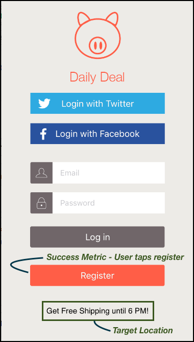

# [!DNL Target]在移动设备应用程序中的工作方式

[!DNL Adobe Mobile SDK]联系[!DNL Target]服务器以获取内容以及其他数据点，以便向用户显示正确的体验。

>[!IMPORTANT]
>
>对[!DNL Adobe Mobile]版本4.*x* SDK的支持已于2021年8月31日终止，不再建议向[!DNL Adobe Target]移动用户提供。
>
>适用于移动设备应用程序的[Adobe Experience Platform SDK](https://developer.adobe.com/client-sdks/documentation/){target=_blank}是推荐的解决方案，旨在为移动设备应用程序中的[!DNL Adobe Experience Cloud]解决方案和服务提供支持。

## [!DNL Target]位置和成功量度

*Target 位置*&#x200B;也称为 mbox。 将会启用应用程序中的标识位置，以用于测试或个性化（例如，主页屏幕上的欢迎消息）。 这些位置是在测试创建过程中标识的。

*[成功量度](https://experienceleague.adobe.com/docs/target/using/activities/success-metrics/success-metrics.html)*&#x200B;是用户执行的用于标识特定活动是否成功的操作（例如注册、购买、订票等）。

* **[!DNL Target]位置：**&#x200B;在注册按钮下面显示的内容。

  在下午 6 点之前此特定用户可享受免运费优惠。 此位置可在多个[!DNL Target]活动中重复使用，以运行A/B测试和个性化。

* **成功量度：**&#x200B;用户点按注册按钮时执行的操作。

**了解[!DNL Target]在SDK中的工作方式**

