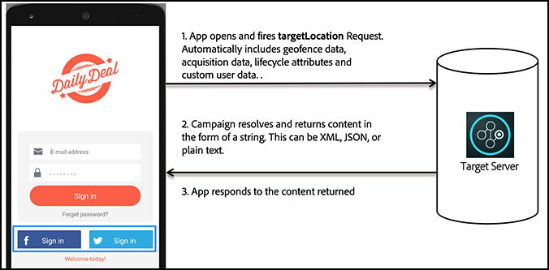

# 如何 [!DNL Target] 在移动设备应用程序中工作

此 [!DNL Adobe Mobile SDK] 联系 [!DNL Target] 服务器获取内容以及其他数据点，以便向用户显示正确的体验。

>[!IMPORTANT]
>
>支持 [!DNL Adobe Mobile] 版本4。*x* SDK已于2021年8月31日结束，不再建议用于 [!DNL Adobe Target] 移动用户。
>
>此 [适用于移动应用程序的Adobe Experience Platform SDK](https://developer.adobe.com/client-sdks/documentation/){target=_blank} 是推荐的电源解决方案 [!DNL Adobe Experience Cloud] 解决方案和服务。

## [!DNL Target] 位置和成功量度

*Target 位置*&#x200B;也称为 mbox。将会启用应用程序中的标识位置，以用于测试或个性化（例如，主页屏幕上的欢迎消息）。这些位置是在测试创建过程中标识的。

*成功量度*&#x200B;是指用户执行的用于标识特定活动是否成功的操作（例如注册、购买、订票等等）。

* **[!DNL Target]位置：** 注册按钮下方显示的内容。

  在下午 6 点之前此特定用户可享受免运费优惠。此位置可在多个位置重复使用 [!DNL Target] 用于运行A/B测试和个性化的活动。

* **成功量度：** 用户点按注册按钮时执行的操作。

**了解如何 [!DNL Target] 在SDK中工作**

