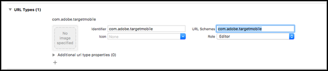
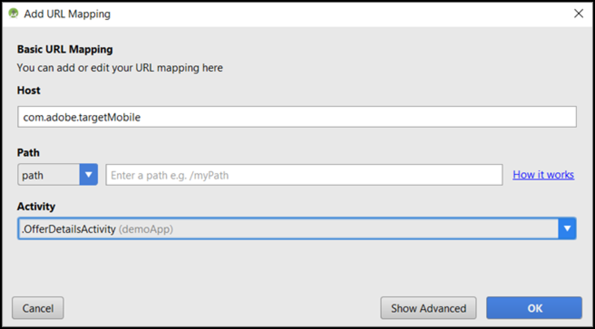
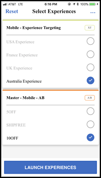

# [!DNL Target] 移动设备预览

使用移动预览链接可对移动设备应用程序活动轻松执行端到端 QA，并且无需任何特殊的测试设备即可在您的设备上感受到不同的体验。

>[!NOTE]
>
>移动设备预览功能要求您下载并安装相应的 Adobe Mobile SDK 4.14（或更高）版本。

## 概述

通过移动设备预览功能，您可以在启动移动设备应用程序活动之前，对其进行全面测试。

## 先决条件

1. **使用受支持的 SDK 版本：**&#x200B;移动设备预览功能要求您在相应的应用程序中下载并安装适当的 Adobe Mobile SDK 4.14（或更高）版本。

   有关下载适当 SDK 的说明，请参阅：

   * **iOS：** [开始之前](https://experienceleague.adobe.com/docs/mobile-services/ios/getting-started-ios/requirements.html) 在 *Mobile Services iOS帮助*.
   * **Android：** [开始之前](https://experienceleague.adobe.com/docs/mobile-services/android/getting-started-android/requirements.html) 在 *Mobile Services Android帮助*.

1. **设置 URL 方案：**&#x200B;预览链接需使用 URL 方案来打开应用程序。您必须为预览指定一个唯一的 URL 方案。

   下图显示了 iOS 上的一个示例：

   

   下图显示了 Android 上的一个示例：

   

1. **跟踪 Adobe 深层链接**

   **iOS：**&#x200B;在应用程序代理中，如果要求代理使用上一步中指定的 URL 方案打开资源，请调用 `[ADBMobile trackAdobeDeepLink:url`。

   下面是一个代码片段示例：

   ```javascript {line-numbers="true"}
   - (BOOL) application:(UIApplication *)app openURL:(NSURL *)url 
                options:(NSDictionary<NSString *,id> *)options { 
   
       if ([[url scheme] isEqualToString:@"com.adobe.targetmobile"]) { 
           [ADBMobile trackAdobeDeepLink:url]; 
           return YES; 
       } 
       return NO; 
   } 
   ```

   **Android：**&#x200B;在应用程序中，如果要求调用方使用上一步中指定的 URL 方案打开资源，请调用 `Config.trackAdobeDeepLink(URL);`。

   ```javascript {line-numbers="true"}
    private Boolean shouldOpenDeeplinkUrl() { 
        Intent appLinkIntent = getIntent(); 
        String appLinkAction = appLinkIntent.getAction(); 
        Uri appLinkData = appLinkIntent.getData; 
        if (appLinkData.toString().startsWith("com.adobe.targetmobile")) { 
            Config.trackAdobeDeepLink(appLinkData); 
            return true; 
        } 
        return false; 
     }
   ```

   要使移动设备预览功能在Android中正常工作，如果使用的是AdobeMobile SDK版本5，则还必须在AndroidManifest.xml中添加以下代码片段：

   ```javascript {line-numbers="true"}
   <activity android:name="com.adobe.marketing.mobile.FullscreenMessageActivity" />
   ```

   如果您使用的是版本4AdobeMobile SDK，请使用以下代码片段：

   ```javascript {line-numbers="true"}
   <activity android:name="com.adobe.mobile.MessageFullScreenActivity" />
   ```

## 生成预览链接

1. 在 [!DNL Target] 在UI中，单击 **[!UICONTROL 更多选项]** 图标（三个垂直省略号），然后选择 **[!UICONTROL 创建移动设备预览]**.

   

1. 选择要预览的活动，然后单击 **[!UICONTROL 生成移动设备预览链接]**.

   >[!NOTE]
   >
   >只能选择基于表单的 AB 活动和 XT 活动。

   

1. 指定应用程序的 URL 方案。

   这需要与您的 iOS 或 Android 应用程序中存在的方案相同。如有需要，请分别对 iOS 和 Android 重复此过程。

   

1. 单击&#x200B;**[!UICONTROL 生成移动设备预览链接]**，然后复制该链接。

   

## 在设备上预览

在安装了您的应用程序的设备上，使用移动设备浏览器打开链接。此应用程序可以是您从 Apple App Store 或 Google Play 商店下载的生产应用程序。此应用程序不必是某个特殊版本。如果您有一个有效的预览链接，您便能够在设备上查看体验。

1. 在移动设备浏览器中打开链接。

   共享您在上一步中复制的来自的链接 [!DNL Target] 以方便的方式访问移动设备的UI，例如使用文本、电子邮件或Slack。

   |||

   您的应用程序随即会打开，并启动 [!DNL Target] 移动设备预览模式。

1. 选择要查看的体验组合，然后单击&#x200B;**[!UICONTROL 启动体验]**。

   ||||
||||

## 限制

* 单击“**[!UICONTROL 启动体验]**”按钮后，必须重新加载视图，才能显示新内容。最简单的方式是先切换到另一个屏幕，然后再返回到您期待发生更改的屏幕。
* 低于 API-19 (KitKat) 的 Android 版本不支持移动设备预览功能。
