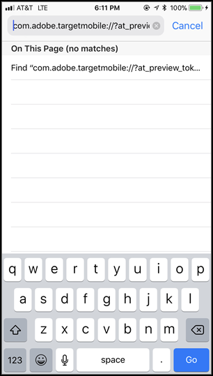
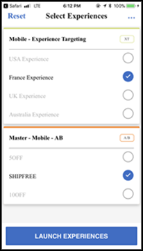

# [!DNL Target] 移动设备预览

使用移动设备预览链接可对移动设备应用程序活动轻松执行端到端QA，并且无需任何特殊的测试设备即可在使用您的设备的不同体验中注册。

通过移动设备预览功能，您可以在启动移动设备应用程序活动之前，对其进行全面测试。

## 先决条件

1. **使用支持的SDK版本：** 移动设备预览功能要求您下载并安装相应版本的 [!DNL Adobe Mobile SDK] 在相应的应用程序中。

   有关下载适当SDK的说明，请参阅 [当前SDK版本](https://developer.adobe.com/client-sdks/documentation/current-sdk-versions/){target=_blank} 在 *[!DNL Adobe Experience Platform Mobile SDK]* 文档。

1. **设置 URL 方案：**&#x200B;预览链接需使用 URL 方案来打开应用程序。为预览指定唯一的URL方案。

   有关更多信息，请参阅 [可视化预览](https://developer.adobe.com/client-sdks/documentation/adobe-target/#visual-preview){target=_blank} 在 *在数据连接UI中配置Target扩展* 在 *[!DNL Mobile SDK]* 文档。

   以下链接包含更多信息：

   * **iOs**：有关为iOS设置URL方案的更多信息，请参阅 [为您的应用程序定义自定义URL方案](https://developer.apple.com/documentation/xcode/defining-a-custom-url-scheme-for-your-app){target=_blank} 在 *Apple开发人员* 网站。
   * **Android**：有关为Android设置URL方案的更多信息，请参阅 [创建指向应用程序内容的深层链接](https://developer.android.com/training/app-links/deep-linking){target=_blank} 在 *Android开发人员* 网站。

1. **设置 `collectLaunchInfo` API（仅限i0S）**

   有关更多信息，请参阅 [可视化预览](https://developer.adobe.com/client-sdks/documentation/adobe-target/#visual-preview){target=_blank} 在 *在数据连接UI中配置Target扩展* 在 *[!DNL Mobile SDK]* 文档。

## 生成预览链接

1. 在 [!DNL Target] 在UI中，单击 **[!UICONTROL 更多选项]** 图标（垂直省略号），然后选择 **[!UICONTROL 创建移动设备预览链接]**.

   

1. 选择要预览的活动，然后单击 **[!UICONTROL 生成移动设备预览链接]**.

   >[!NOTE]
   >
   >您只能选择基于表单的 [!UICONTROL A/B测试] 和 [!UICONTROL 体验定位] (XT)活动。

   

1. 指定应用程序的 URL 方案。

   这些URL方案必须与iOS或Android应用程序中提供的方案相同。 如有必要，请分别对iOS和Android重复此过程。

   

1. 单击&#x200B;**[!UICONTROL 生成移动设备预览链接]**，然后复制该链接。

   

## 在设备上预览

在安装了您的应用程序的设备上，使用移动设备浏览器打开链接。此应用程序可以是您从下载的生产应用程序。 [!DNL Apple App Store] 或 [!DNL Google Play Store]. 该应用程序不需要是一个特殊的内部版本。 如果您有一个活动的预览链接，则可以查看设备上的体验。

1. 在移动设备浏览器中打开链接。

   共享您在上一部分中复制的来自的链接 [!DNL Target] 以方便的方式访问移动设备的UI，例如使用文本、电子邮件或 [!DNL Slack].

   |||

   您的应用程序随即会打开，并启动 [!DNL Target] [!UICONTROL 移动设备预览模式].

1. 选择要查看的体验组合，然后单击&#x200B;**[!UICONTROL 启动体验]**。

   ||||
||||

## 限制

* 单击“**[!UICONTROL 启动体验]**”按钮后，必须重新加载视图，才能显示新内容。最简单的方式是先切换到另一个屏幕，然后再返回到您期待发生更改的屏幕。
* 低于 API-19 (KitKat) 的 Android 版本不支持移动设备预览功能。
