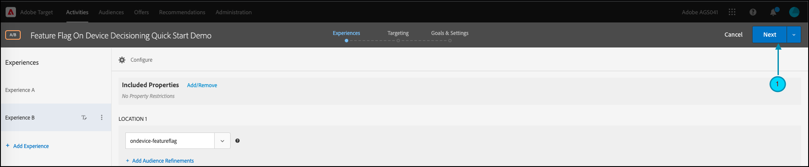

# [!DNL Target] SDK快速入门

为了启动并运行，我们鼓励您以您选择的语言创建您的第一个[设备上决策](../on-device-decisioning/overview.md)功能标记活动：

* Node.js
* Java
* .NET
* Python

## 步骤摘要

1. 为您的组织启用设备上决策
1. 安装SDK
1. 初始化SDK
1. 在[!DNL Adobe Target] [!UICONTROL A/B Test]活动中设置功能标记
1. 在应用程序中实施和渲染功能
1. 对应用程序中的事件实施跟踪
1. 激活您的[!UICONTROL A/B Test]活动

## 1.为您的组织启用设备上决策

启用设备上决策可确保在几乎零延迟的情况下执行[!UICONTROL A/B Test]活动。 要启用此功能，请导航到&#x200B;**[!UICONTROL Administration]** > **[!UICONTROL Implementation]** > **[!UICONTROL Account details]**&#x200B;并启用&#x200B;**[!UICONTROL On-Device Decisioning]**&#x200B;切换开关。


>[!NOTE]
>
>您必须具有&#x200B;**[!UICONTROL Admin]**&#x200B;或&#x200B;**[!UICONTROL Approver]** [用户角色](https://experienceleague.adobe.com/docs/target/using/administer/manage-users/user-management.html)才能启用或禁用&#x200B;**[!UICONTROL On-Device Decisioning]**&#x200B;切换。

启用&#x200B;**[!UICONTROL On-Device Decisioning]**&#x200B;切换后，[!DNL Adobe Target]开始为您的客户端生成[规则工件](../on-device-decisioning/rule-artifact-overview.md)。

## 2.安装SDK

对于Node.js、Java和Python，请在终端的项目目录中运行以下命令。 对于.NET，通过[从NuGet](https://www.nuget.org/packages/Adobe.Target.Client)安装将其添加为依赖项。

>[!BEGINTABS]

>[!TAB Node.js (NPM)]

```js {line-numbers="true"}
npm i @adobe/target-nodejs-sdk -P
```

>[!TAB Java (Maven)]

```javascript {line-numbers="true"}
<dependency>
   <groupId>com.adobe.target</groupId>
   <artifactId>java-sdk</artifactId>
   <version>2.0</version>
</dependency>
```

>[!TAB .NET (Bash)]

```bash {line-numbers="true"}
dotnet add package Adobe.Target.Client
```

>[!TAB Python (pip)]

```python {line-numbers="true"}
pip install target-python-sdk
```

>[!ENDTABS]

## 3.初始化SDK

规则工件将在SDK初始化步骤中下载。 您可以自定义初始化步骤以确定如何下载和使用工件。

>[!BEGINTABS]

>[!TAB Node.js]

```js {line-numbers="true"}
const TargetClient = require("@adobe/target-nodejs-sdk");

const CONFIG = {
   client: "<your target client code>",
   organizationId: "your EC org id",
   decisioningMethod: "on-device",
   events: {
      clientReady: targetClientReady
      }
};

const tClient = TargetClient.create(CONFIG);

function targetClientReady() {
   //Adobe Target SDK has now downloaded the JSON artifact locally, which contains the activity details.
   //We will see how to use the artifact here very soon.
}
```

>[!TAB Java (Maven)]

```javascript {line-numbers="true"}
ClientConfig config = ClientConfig.builder()
   .client("testClient")
   .organizationId("ABCDEF012345677890ABCDEF0@AdobeOrg")
   .build();
TargetClient targetClient = TargetClient.create(config);
```

>[!TAB .NET (C#)]

```csharp {line-numbers="true"}
var targetClientConfig = new TargetClientConfig.Builder("testClient", "ABCDEF012345677890ABCDEF0@AdobeOrg")
   .Build();
this.targetClient.Initialize(targetClientConfig);
```

>[!TAB Python]

```python {line-numbers="true"}
from target_python_sdk import TargetClient

def target_client_ready():
   # Adobe Target SDK has now downloaded the JSON artifact locally, which contains the activity details.
   # We will see how to use the artifact here very soon.

CONFIG = {
   "client": "<your target client code>",
   "organization_id": "your EC org id",
   "decisioning_method": "on-device",
   "events": {
      "client_ready": target_client_ready
   }
}

target_client = TargetClient.create(CONFIG)
```

>[!ENDTABS]

## 4.在[!DNL Adobe Target] [!UICONTROL A/B Test]活动中设置功能标记

1. 在[!DNL Target]中，导航到&#x200B;**[!UICONTROL Activities]**&#x200B;页面，然后选择&#x200B;**[!UICONTROL Create Activity]** > **[!UICONTROL A/B test]**。

   

1. 在&#x200B;**[!UICONTROL Create A/B Test Activity]**&#x200B;模式中，保持默认Web选项处于选中状态(1)，选择&#x200B;**[!UICONTROL Form]**&#x200B;作为体验编辑器(2)，选择带有&#x200B;**[!UICONTROL No Property Restrictions]**(3)的&#x200B;**[!UICONTROL Default Workspace]**，然后单击&#x200B;**[!UICONTROL Next]** (4)。

   

1. 在活动创建的&#x200B;**[!UICONTROL Experiences]**&#x200B;步骤中，提供活动的名称(1)并单击&#x200B;**[!UICONTROL Add Experience]** (2)以添加第二个体验，即体验B。 输入您选择的位置名称(3)。 例如，`ondevice-featureflag`或`homepage-addtocart-featureflag`是指示功能标志测试目标的位置名称。  在下面显示的示例中，`ondevice-featureflag`是为体验B定义的位置。或者，您可以添加受众细化(4)以限制活动的资格。

   

1. 在同一页面的&#x200B;**[!UICONTROL CONTENT]**&#x200B;部分中，从下拉列表(1)中选择&#x200B;**[!UICONTROL Create JSON Offer]**，如图所示。

   

1. 在出现的&#x200B;**[!UICONTROL JSON Data]**&#x200B;文本框中，使用有效的JSON对象(2)为每个体验(1)键入功能标志变量。

   输入体验A的功能标志变量。

   

   **（以上体验A的示例JSON）**

   ```json {line-numbers="true"}
   {
      "enabled" : true,
      "flag" : "expA"
   }
   ```

   输入体验B的功能标志变量。

   

   **（以上体验B的示例JSON）**

   ```json {line-numbers="true"}
   {
      "enabled" : true,
      "flag" : "expB"
   }
   ```

1. 单击&#x200B;**[!UICONTROL Next]** (1)以进入活动创建的&#x200B;**[!UICONTROL Targeting]**&#x200B;步骤。

   

1. 为了简单起见，在下面显示的&#x200B;**[!UICONTROL Targeting]**&#x200B;步骤示例中，“受众定位”(2)保留在“所有访客”的默认集中。 这意味着该活动未定位。 但是，请注意Adobe建议您始终将目标定位到生产活动的受众。 单击&#x200B;**[!UICONTROL Next]** (3)以进入活动创建的&#x200B;**[!UICONTROL Goals & Settings]**&#x200B;步骤。

   

1. 在&#x200B;**[!UICONTROL Goals & Settings]**&#x200B;步骤中，将&#x200B;**[!UICONTROL Reporting Source]**&#x200B;设置为&#x200B;**[!UICONTROL Adobe Target]** (1)。 将&#x200B;**[!UICONTROL Goal Metric]**&#x200B;定义为&#x200B;**[!UICONTROL Conversion]**，根据您网站的转化量度指定详细信息(2)。 单击&#x200B;**[!UICONTROL Save & Close]** (3)以保存活动。

   

## 5.在应用程序中实施并渲染功能

在[!DNL Target]中设置功能标志变量后，请修改应用程序代码以使用它们。 例如，在应用程序中获取功能标志后，您可以使用该标志启用功能并呈现访客符合条件的体验。

>[!BEGINTABS]

>[!TAB Node.js]

```js {line-numbers="true"}
//... Code removed for brevity
​
let featureFlags = {};
​
function targetClientReady() {
   tClient.getAttributes(["ondevice-featureflag"]).then(function(response) {
      const featureFlags = response.asObject("ondevice-featureflag");
      if(featureFlags.enabled && featureFlags.flag !== "expA") { //Assuming "expA" is control
         console.log("Render alternate experience" + featureFlags.flag);
      }
      else {
         console.log("Render default experience");
      }
   });
}
```

>[!TAB Java (Maven)]

```javascript {line-numbers="true"}
MboxRequest mbox = new MboxRequest().name("ondevice-featureflag").index(0);
TargetDeliveryRequest request = TargetDeliveryRequest.builder()
   .context(new Context().channel(ChannelType.WEB))
   .execute(new ExecuteRequest().mboxes(Arrays.asList(mbox)))
   .build();
Attributes attributes = targetClient.getAttributes(request, "ondevice-featureflag");
String flag = attributes.getString("ondevice-featureflag", "flag");
```

>[!TAB .NET (C#)]

```csharp {line-numbers="true"}
var mbox = new MboxRequest(index: 0, name: "ondevice-featureflag");
var deliveryRequest = new TargetDeliveryRequest.Builder()
   .SetContext(new Context(ChannelType.Web))
   .SetExecute(new ExecuteRequest(mboxes: new List<MboxRequest> { mbox }))
   .Build();
var attributes = targetClient.GetAttributes(request, "ondevice-featureflag");
var flag = attributes.GetString("ondevice-featureflag", "flag");
```

>[!TAB Python]

```python {line-numbers="true"}
# ... Code removed for brevity

feature_flags = {}

def target_client_ready():
   attribute_provider = target_client.get_attributes(["ondevice-featureflag"])
   feature_flags = attribute_provider.as_object(mbox_name="ondevice-featureflag")
   if feature_flags.get("enabled") and feature_flags.get("flag") != "expA": # Assuming "expA" is control
      print("Render alternate experience {}".format(feature_flags.get("flag")))
   else:
      print("Render default experience")
```

>[!ENDTABS]

## 6.对应用程序中的事件实施其他跟踪

或者，您也可以使用sendNotification()函数发送用于跟踪转换的其他事件。

>[!BEGINTABS]

>[!TAB Node.js]

```js {line-numbers="true"}
//... Code removed for brevity
​
//When a conversion happens
TargetClient.sendNotifications({
   targetCookie,
   "request" : {
      "notifications" : [
      {
         type: "display",
         timestamp : Date.now(),
         id: "conversion",
         mbox : {
            name : "orderConfirm"
         },
         order : {
            id: "BR9389",
            total : 98.93,
            purchasedProductIds : ["J9393", "3DJJ3"]
         }
      }
      ]
   }
})
```

>[!TAB Java (Maven)]

```javascript {line-numbers="true"}
Notification notification = new Notification();
notification.setId("conversion");
notification.setImpressionId(UUID.randomUUID().toString());
notification.setType(MetricType.DISPLAY);
notification.setTimestamp(System.currentTimeMillis());
Order order = new Order("BR9389");
order.total(98.93);
order.purchasedProductIds(["J9393", "3DJJ3"]);
notification.setOrder(order);

TargetDeliveryRequest notificationRequest =
   TargetDeliveryRequest.builder()
      .context(new Context().channel(ChannelType.WEB))
      .notifications(Collections.singletonList(notification))
      .build();

NotificationDeliveryService notificationDeliveryService = new NotificationDeliveryService();
notificationDeliveryService.sendNotification(notificationRequest);
```

>[!TAB .NET (C#)]

```csharp {line-numbers="true"}
var order = new Order
{
   Id = "BR9389",
   Total = 98.93M,
   PurchasedProductIds = new List<string> { "J9393", "3DJJ3" },
};
​
var notification = new Notification
{
   Id = "conversion",
   ImpressionId = Guid.NewGuid().ToString(),
   Type = MetricType.Display,
   Timestamp = DateTimeOffset.UtcNow.ToUnixTimeMilliseconds(),
   Order = order,
};
​
var notificationRequest = new TargetDeliveryRequest.Builder()
   .SetContext(new Context(ChannelType.Web))
   .SetNotifications(new List<Notification> {notification})
   .Build();
​
targetClient.SendNotifications(notificationRequest);
```

>[!TAB Python]

```python {line-numbers="true"}
# ... Code removed for brevity

# When a conversion happens
notification_mbox = NotificationMbox(name="orderConfirm")
order = Order(id="BR9389, total=98.93, purchased_product_ids=["J9393", "3DJJ3"])
notification = Notification(
   id="conversion",
   type=MetricType.DISPLAY,
   timestamp=1621530726000,  # Epoch time in milliseconds
   mbox=notification_mbox,
   order=order
)
notification_request = DeliveryRequest(notifications=[notification])


target_client.send_notifications({
   "target_cookie": target_cookie,
   "request" : notification_request
})
```

>[!ENDTABS]

## 7.激活您的[!UICONTROL A/B Test]活动

1. 单击&#x200B;**[!UICONTROL Activate]** (1)以激活您的[!UICONTROL A/B Test]活动。

   >[!NOTE]
   >
   >您必须具有&#x200B;**[!UICONTROL Approver]**&#x200B;或&#x200B;**[!UICONTROL Publisher]** [用户角色](https://experienceleague.adobe.com/docs/target/using/administer/manage-users/user-management.html)才能执行此步骤。

   
