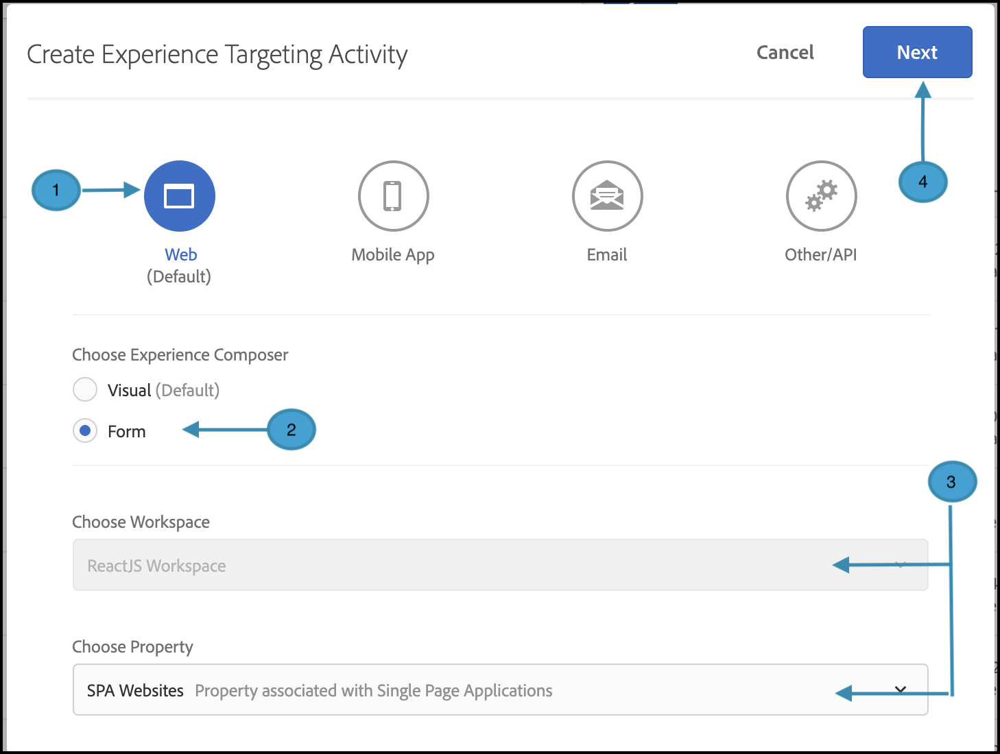

# 提供个性化

## 步骤摘要

1. 为您的组织启用[!UICONTROL on-device decisioning]
1. 创建[!UICONTROL Experience Targeting] (XT)活动
1. 按受众定义个性化体验
1. 验证每个受众的个性化体验
1. 设置报表
1. 添加用于跟踪KPI的量度
1. 在应用程序中实施个性化优惠
1. 实施代码以跟踪转化事件
1. 激活您的[!UICONTROL Experience Targeting] (XT)个性化活动

假设您是一家旅游公司。 您需要提供特定旅行套餐25%的个性化优惠。 为了让选件能够引起用户的共鸣，您决定显示目标城市的里程碑。 您还希望确保以近乎零延迟的方式执行个性化选件交付，以免影响用户体验和扭曲结果。

## 1.为您的组织启用[!UICONTROL on-device decisioning]

1. 启用设备上决策可确保在几乎零延迟的情况下执行A/B活动。 要启用此功能，请在[!DNL Adobe Target]中导航到&#x200B;**[!UICONTROL Administration]** > **[!UICONTROL Implementation]** > **[!UICONTROL Account details]**，并启用&#x200B;**[!UICONTROL On-Device Decisioning]**&#x200B;切换开关。

   

   >[!NOTE]
   >
   >您必须具有管理员或审批者[用户角色](https://experienceleague.adobe.com/docs/target/using/administer/manage-users/user-management.html)才能启用或禁用[!UICONTROL On-Device Decisioning]切换开关。

   启用&#x200B;**[!UICONTROL On-Device Decisioning]**&#x200B;切换后，[!DNL Adobe Target]开始为您的客户端生成&#x200B;*规则工件*。

## 2.创建[!UICONTROL Experience Targeting] (XT)活动

1. 在[!DNL Adobe Target]中，导航到&#x200B;**[!UICONTROL Activities]**&#x200B;页面，然后选择&#x200B;**[!UICONTROL Create Activity]** > **[!UICONTROL Experience Targeting]**。

   

1. 在&#x200B;**[!UICONTROL Create Experience Targeting Activity]**&#x200B;模式中，保留默认的&#x200B;**[!UICONTROL Web]**&#x200B;选项(1)，选择&#x200B;**[!UICONTROL Form]**&#x200B;作为体验编辑器(2)，选择工作区和属性(3)，然后单击&#x200B;**[!UICONTROL Next]** (4)。

   

## 3.为每个受众定义个性化体验

1. 在活动创建的&#x200B;**[!UICONTROL Experiences]**&#x200B;步骤中，单击&#x200B;**[!UICONTROL Change Audience]**&#x200B;以创建那些希望前往加利福尼亚州旧金山的访客的受众。

   

1. 在&#x200B;**[!UICONTROL Create Audience]**&#x200B;模式中，定义`destinationCity = San Francisco`的自定义规则。 这定义了要前往旧金山的用户组。

   

1. 仍在&#x200B;**[!UICONTROL Experiences]**&#x200B;步骤中，输入您的应用程序中要呈现有关Golden Gate Bridge的特殊选件的位置(1)的名称，但仅限于前往旧金山的客户。 在此处的示例中，主页是为HTML选件(2)选择的位置，该选件在&#x200B;**[!UICONTROL Content]**&#x200B;区域中定义。

   

1. 通过单击&#x200B;**[!UICONTROL Add Experience Targeting]**&#x200B;添加其他定向受众。 这次，通过定义`destinationCity = New York`的受众规则来定位希望前往纽约的受众。 在应用程序中定义您要提供有关帝国大厦的特殊优惠的位置。 在此处的示例中，`homepage`是为HTML选件(2)选择的位置，该选件在&#x200B;**[!UICONTROL Content]**&#x200B;区域中定义。

   

## 4.验证每个受众的个性化体验

在&#x200B;**[!UICONTROL Targeting]**&#x200B;步骤中，验证您已为每个受众配置了所需的个性化体验。


## 5.设置报表

在&#x200B;**[!UICONTROL Goals & Settings]**&#x200B;步骤中，选择&#x200B;**[!UICONTROL Adobe Target]**&#x200B;作为&#x200B;**[!UICONTROL Reporting Source]**&#x200B;以在[!DNL Adobe Target] UI中查看活动结果，或选择&#x200B;**[!UICONTROL Adobe Analytics]**&#x200B;以在Adobe Analytics UI中查看这些结果。


## 6.添加用于跟踪KPI的量度

选择一个&#x200B;**[!UICONTROL Goal Metric]**&#x200B;来衡量活动是否成功。 在本例中，成功的转化取决于用户是否点击了个性化目标选件。

## 7.在应用程序中实施个性化优惠

>[!BEGINTABS]

>[!TAB Node.js]

```js {line-numbers="true"}
const TargetClient = require("@adobe/target-nodejs-sdk");

const CONFIG = {
  client: "acmeclient",
  organizationId: "1234567890@AdobeOrg"
};

const targetClient = TargetClient.create(CONFIG);

targetClient.getOffers({
  request: {      
    execute: {
      pageLoad: {
        parameters: {
          destinationCity: "San Francisco"
        }
      }
    }       
  }
})
.then(console.log)
.catch(console.error);
```

>[!TAB Java]

```java {line-numbers="true"}
ClientConfig config = ClientConfig.builder()
  .client("acmeclient")
  .organizationId("1234567890@AdobeOrg")
  .build();
TargetClient targetClient = TargetClient.create(config);

Context context = new Context().channel(ChannelType.WEB);

ExecuteRequest executeRequest = new ExecuteRequest();

RequestDetails pageLoad = new RequestDetails();
pageLoad.setParameters(
    new HashMap<String, String>() {
      {
        put("destinationCity", "San Francisco");
      }
    });

executeRequest.setPageLoad(pageLoad);

TargetDeliveryRequest request = TargetDeliveryRequest.builder()
  .context(context)
  .execute(executeRequest)
  .build();

TargetDeliveryResponse offers = targetClient.getOffers(request);
```

>[!ENDTABS]

## 8.实施代码以跟踪转化事件

>[!BEGINTABS]

>[!TAB Node.js]

```js {line-numbers="true"}
//... Code removed for brevity

//When a conversion happens
TargetClient.sendNotifications({
    targetCookie,
    "request" : {
      "notifications" : [
        {
          type: "click",
          timestamp : Date.now(),
          id: "conversion",
          mbox : {
            name : "destinationOffer"
          }
        }
      ]
    }
})
```

>[!TAB Java]

```java {line-numbers="true"
ClientConfig config = ClientConfig.builder()
  .client("acmeclient")
  .organizationId("1234567890@AdobeOrg")
  .build();
TargetClient targetClient = TargetClient.create(config);

Context context = new Context().channel(ChannelType.WEB);

ExecuteRequest executeRequest = new ExecuteRequest();

RequestDetails pageLoad = new RequestDetails();
pageLoad.setParameters(
    new HashMap<String, String>() {
      {
        put("destinationCity", "San Francisco");
      }
    });

executeRequest.setPageLoad(pageLoad);
NotificationDeliveryService notificationDeliveryService = new NotificationDeliveryService();

Notification notification = new Notification();
notification.setId("conversion");
notification.setImpressionId(UUID.randomUUID().toString());
notification.setType(MetricType.CLICK);
notification.setTimestamp(System.currentTimeMillis());
notification.setTokens(
    Collections.singletonList(
        "IbG2Jz2xmHaqX7Ml/YRxRGqipfsIHvVzTQxHolz2IpSCnQ9Y9OaLL2gsdrWQTvE54PwSz67rmXWmSnkXpSSS2Q=="));

TargetDeliveryRequest targetDeliveryRequest =
    TargetDeliveryRequest.builder()
        .context(context)
        .execute(executeRequest)
        .notifications(Collections.singletonList(notification))
        .build();

TargetDeliveryResponse offers = targetClient.getOffers(request);
notificationDeliveryService.sendNotification(request);
```

>[!ENDTABS]

## 9.激活您的体验定位(XT)活动


