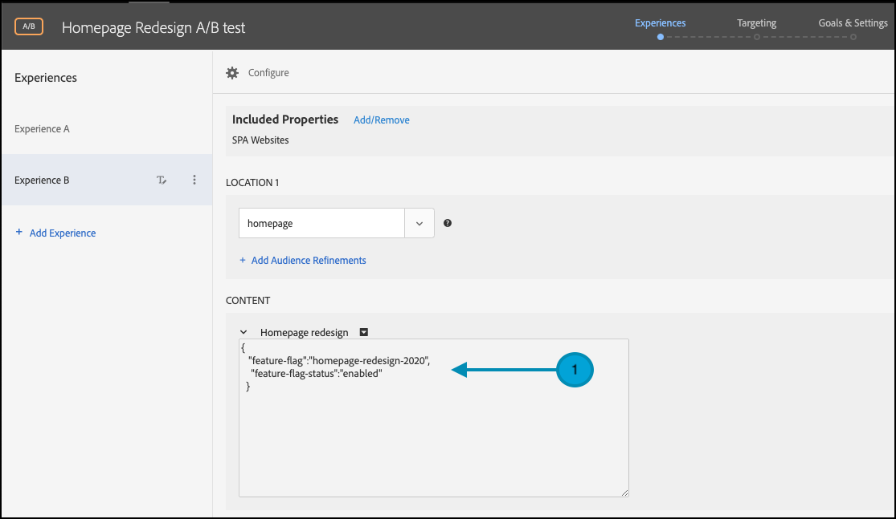
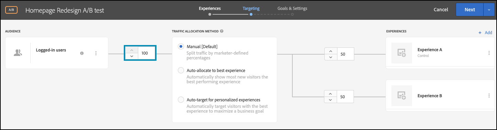

# 使用功能标志执行A/B测试

## 步骤摘要

1. 启用 [!UICONTROL 设备上决策] （贵组织）
1. 创建 [!UICONTROL A/B测试] 活动
1. 定义A和B
1. 添加受众
1. 设置流量分配
1. 将流量分配设置为变量
1. 设置报表
1. 添加用于跟踪KPI的量度
1. 实施代码以使用功能标记执行A/B测试
1. 使用功能标记激活A/B测试

>[!NOTE]
>
>假设您想确定您的主页的秋季主题重新设计能否被用户接受。 您决定通过在中运行A/B试验来测试它 [!DNL Adobe Target]. 此外，您还需要确保交付试验时性能良好，以免负面或缓慢的用户体验扭曲结果。

## 1.启用 [!UICONTROL 设备上决策] （贵组织）

启用设备上决策可确保在几乎零延迟的情况下执行A/B活动。 要启用此功能，请导航到 **[!UICONTROL 管理]** > **[!UICONTROL 实现]** > **[!UICONTROL 帐户详细信息]** 在 [!DNL Adobe Target]，并启用 **[!UICONTROL 设备上决策]** 切换。

&lt;! — 插入image-odd4.png —>


>[!NOTE]
>
>您必须具有管理员或审批者 [用户角色](https://experienceleague.adobe.com/docs/target/using/administer/manage-users/user-management.html) 启用或禁用“设备端决策”切换开关。

启用 **[!UICONTROL 设备上决策]** 切换， [!DNL Adobe Target] 开始为您的客户端生成规则工件。

## 2.创建一个 [!UICONTROL A/B测试] 活动

在 [!DNL Adobe Target]，导航到 **[!UICONTROL 活动]** 页面，然后选择 **[!UICONTROL 创建活动]** > **[!UICONTROL A/B测试]**.


在 **[!UICONTROL 创建A/B测试活动]** 模式，保留默认值 **[!UICONTROL Web]** 已选择选项(1)，选择 **[!UICONTROL 表单]** 作为体验编辑器(2)，选择 **[!UICONTROL 默认工作区]** 不包含 **[!UICONTROL 属性限制]** (3)，然后单击 **[!UICONTROL 下一个]** （四）。


## 3.定义A和B

1. 在 **[!UICONTROL 体验]** 创建活动的步骤，为您的活动提供一个名称(1)并添加第二个体验，即体验B，方法是单击 **[!UICONTROL 添加体验]** (2)按钮。 输入应用程序中要执行A/B测试的位置(3)的名称。 在下面显示的示例中，主页是为体验A定义的位置（也是为体验B定义的位置）。

   体验A定义控制，这是当前的主页设计。

   

   体验B定义了挑战者，即重新设计的主页。 单击以更改默认内容(1)。

   

1. 在体验B中，单击以更改内容 **[!UICONTROL 默认内容]** 通过选择 **[!UICONTROL 创建JSON选件]** 如下所示(1)。

   

1. 使用将用作标志的属性来定义JSON，以使您的业务逻辑能够呈现重新设计的主页，而不是生产环境中的当前主页。


   >[!NOTE]
   >
   >时间 [!DNL Adobe Target] 存储一个用户以查看体验B（重新设计的主页），将返回具有示例中定义的属性的JSON。 在您的代码中，您将需要检查属性值以确定是否执行业务逻辑以呈现重新设计的主页。 您可以定义此JSON响应中的名称、值和属性数。

   

## 4.添加受众

假设您要首先针对忠诚客户测试重新设计，可以根据他们是否已登录来识别这些客户。

1. 在 **[!UICONTROL 定位]** 步骤，单击以替换 **[!UICONTROL 所有访客]** 受众，如下所示。

   

1. 在 **[!UICONTROL 创建受众]** 模式窗口，定义一个自定义规则，其中 `logged-in = true`. 这会定义已登录的用户组。 在活动中使用此受众。

   

## 5.设置流量分配

定义登录用户的百分比，您要针对该百分比来测试新主页重新设计。 换言之，您希望将此测试转出到用户中的哪个百分比？ 在本例中，要将此测试部署到所有登录用户，请将流量分配保持在100%。



## 6.将流量分配设置为变体

定义您的登录用户中将会看到主页当前设计或全新重新设计的百分比。 在此示例中，将流量分配保持为体验A和B之间的50/50比例。


## 7.设置报表

在 **[!UICONTROL 目标和设置]** 步骤，选择 **[!UICONTROL Adobe Target]** 作为 **[!UICONTROL 报表源]** 在中查看活动结果 [!DNL Adobe Target] UI，或选择 **[!UICONTROL Adobe Analytics]** 以在Adobe Analytics UI中查看它们。


## 8.添加用于跟踪KPI的量度

选择 **[!UICONTROL 目标量度]** 以测量A/B测试。 在本例中，成功的转化取决于用户是否到达页面底部，指示参与度。 因此， **[!UICONTROL 转化]** 基于用户是否查看了名为bottom-of-the-page的位置来确定。

## 9.实施代码以在应用程序中执行带有功能标记的A/B测试

>[!BEGINTABS]

>[!TAB Node.js]

```js {line-numbers="true"}
const TargetClient = require("@adobe/target-nodejs-sdk");
const options = {
  client: "testClient",
  organizationId: "ABCDEF012345677890ABCDEF0@AdobeOrg",
  decisioningMethod: "on-device",
  events: {
    clientReady: targetClientReady
  }
};
const targetClient = TargetClient.create(options);

function targetClientReady() {
  return targetClient.getAttributes(["homepage"]).then(function(attributes) {
    const flag = attributes.getValue("homepage", "feature-flag");
    // ...
  });
}
```

>[!TAB Java]

```java {line-numbers="true"}
import com.adobe.target.edge.client.ClientConfig;
import com.adobe.target.edge.client.TargetClient;
import com.adobe.target.delivery.v1.model.ChannelType;
import com.adobe.target.delivery.v1.model.Context;
import com.adobe.target.delivery.v1.model.ExecuteRequest;
import com.adobe.target.delivery.v1.model.MboxRequest;
import com.adobe.target.edge.client.entities.TargetDeliveryRequest;
import com.adobe.target.edge.client.model.TargetDeliveryResponse;

ClientConfig config = ClientConfig.builder()
    .client("testClient")
    .organizationId("ABCDEF012345677890ABCDEF0@AdobeOrg")
    .build();
TargetClient targetClient = TargetClient.create(config);
MboxRequest mbox = new MboxRequest().name("homepage").index(0);
TargetDeliveryRequest request = TargetDeliveryRequest.builder()
    .context(new Context().channel(ChannelType.WEB))
    .execute(new ExecuteRequest().mboxes(Arrays.asList(mbox)))
    .build();
Attributes attributes = targetClient.getAttributes(request, "homepage");
String flag = attributes.getString("homepage", "feature-flag");
```

>[!ENDTABS]

## 10.使用功能标记激活A/B测试


