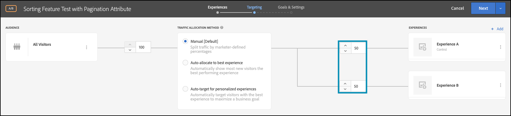

# 使用属性执行功能测试

## 步骤摘要

1. 启用 [!UICONTROL 设备上决策] （贵组织）
1. 创建 [!UICONTROL A/B测试] 活动
1. 定义A和B
1. 添加受众
1. 设置流量分配
1. 将流量分配设置为变量
1. 设置报表
1. 添加用于跟踪KPI的量度
1. 实施代码以使用属性执行功能测试
1. 实施代码以跟踪转化事件
1. 使用属性激活功能测试

>[!NOTE]
>
>假设您是一家零售电子商务公司。 当客户浏览您的产品目录并进行排序时，您希望提高转化率。 您有一个假设，即某些排序算法和分页策略产生比其他算法更好的结果。 为了测试此理论，您决定运行一个功能测试，该测试涉及使用最终用户不同的排序选项重新设计排序小组件。 您希望确保此功能测试在近乎零延迟的情况下执行，以便它不会对用户体验产生负面影响并扭曲结果。

## 1.启用 [!UICONTROL 设备上决策] （贵组织）

启用设备上决策可确保在几乎零延迟的情况下执行A/B活动。 要启用此功能，请导航到 **[!UICONTROL 管理]** > **[!UICONTROL 实现]** > **[!UICONTROL 帐户详细信息]** 在 [!DNL Adobe Target]，并启用 **[!UICONTROL 设备上决策]** 切换。


>[!NOTE]
>
>您必须具有管理员或审批者 [用户角色](https://experienceleague.adobe.com/docs/target/using/administer/manage-users/user-management.html) 启用或禁用 **[!UICONTROL 设备上决策]** 切换。

启用 **[!UICONTROL 设备上决策]** 切换， [!DNL Adobe Target] 开始生成 *规则对象* 你的委托人。

## 2.创建一个 [!UICONTROL A/B测试] 活动

1. 在 [!DNL Adobe Target]，导航到 **[!UICONTROL 活动]** 页面，然后选择 **[!UICONTROL 创建活动]** > **[!UICONTROL A/B测试]**.

   

1. 在 **[!UICONTROL 创建A/B测试活动]** 模式，保留默认值 **[!UICONTROL Web]** 已选择选项(1)，选择 **[!UICONTROL 表单]** 作为体验编辑器(2)，选择 **[!UICONTROL 默认工作区]** 替换为 **[!UICONTROL 无属性限制]** (3)，然后单击 **[!UICONTROL 下一个]** （四）。

   

## 3.定义A和B

1. 在 **[!UICONTROL 体验]** 创建活动的步骤，为您的活动提供一个名称(1)并添加第二个体验，即体验B，方法是单击 **[!UICONTROL 添加体验]** (2)按钮。 输入应用程序内要使用属性执行功能测试的位置(3)的名称。 在以下示例中， `product-results-page` 是为体验A定义的位置。（也是为体验B定义的位置。）

   

   **[!UICONTROL 体验A]** 将包含指示您的业务逻辑执行以下操作的JSON：

   * 通过启动排序算法功能 `test_sorting` 功能标志
   * 执行中定义的推荐排序算法 `sorting_algorithm _**_attribute`
   * 按照中定义的页面分页策略所定义，每页返回50个产品。 `pagination_limit`

1. 在体验A中，单击以更改内容 **[!UICONTROL 默认内容]** 到JSON，方法是选择 **[!UICONTROL 创建JSON选件]** 如下所示(1)。

   

1. 使用以下方式定义JSON `test_sorting`， `sorting_algorithm`、和 `pagination_limit` 用于启动推荐的排序算法（分页限制为50个产品）的标记和属性。

   >[!NOTE]
   >
   >时间 [!DNL Adobe Target] 存储用户以查看体验A，将返回具有示例中定义的属性的JSON。 在您的代码中，您将需要检查功能标志的值 `test_sorting` 以查看是否应打开排序功能。 如果是这样，您将使用 `sorting_algorithm` 属性，以在产品列表视图中显示推荐的产品。 您的应用程序可显示的产品限制将为50，因为这是 `pagination_limit` 属性。

   

   **[!UICONTROL 体验B]** 将定义向您的业务逻辑发出信号的JSON，以执行以下操作：

   * 通过test_sorting功能标志启动排序算法功能
   * 执行 `best_sellers` 排序算法定义于 `sorting_algorithm _**_attribute`
   * 按照中定义的页面分页策略所定义，每页返回50个产品。 `pagination_limit`

   >[!NOTE]
   >
   >时间 [!DNL Adobe Target] 存储一个用户以查看体验B，将返回具有示例中定义的属性的JSON。 在您的代码中，您将需要检查功能标志的值 `test_sorting` 以查看是否应打开排序功能。 如果是这样的话，您将使用 `best_sellers` 的值 `sorting_algorithm` 属性，在产品列表视图中显示最畅销的产品。 您的应用程序可显示的产品限制将为50，因为这是 `pagination_limit` 属性。

   

## 4.添加受众

在 **[!UICONTROL 定位]** 步骤，保留 **[!UICONTROL 所有访客]** 受众。 这使您能够了解排序功能的影响，以及哪个算法和项目数最能影响结果。


## 5.设置流量分配

定义访客所占的百分比，您要根据此百分比来测试排序算法和分页策略。 换言之，您希望将此测试转出到用户中的哪个百分比？ 在本例中，要将此测试部署到所有登录用户，请将流量分配保持在100%。


## 6.将流量分配设置为变体

定义将看到推荐的与最畅销商品排序算法的访客百分比，每个页面最多可查看50个产品。 在此示例中，将流量分配保持为体验A和B之间的50/50比例。



## 7.设置报表

在 **[!UICONTROL 目标和设置]** 步骤，选择 **[!UICONTROL Adobe Target]** 作为 **[!UICONTROL 报表源]** 要查看A/B测试结果，请执行以下操作： [!DNL Adobe Target] UI，或选择 **[!UICONTROL Adobe Analytics]** 以在Adobe Analytics UI中查看它们。


## 8.添加用于跟踪KPI的量度

选择 **[!UICONTROL 目标量度]** 以测量具有属性的特征测试。 在本例中，成功取决于用户是否购买产品，具体取决于显示它们的排序算法和分页策略。

## 9.在应用程序中实施具有属性的功能测试

>[!BEGINTABS]

>[!TAB Node.js]

```js {line-numbers="true"}
const TargetClient = require("@adobe/target-nodejs-sdk");
const options = {
  client: "testClient",
  organizationId: "ABCDEF012345677890ABCDEF0@AdobeOrg",
  decisioningMethod: "on-device",
  events: {
    clientReady: targetClientReady
  }
};
const targetClient = TargetClient.create(options);

function targetClientReady() {
  return targetClient.getAttributes(["product-results-page"]).then(function(attributes) {
    const test_sorting = attributes.getValue("product-results-page", "test-sorting");
    const sorting_algorithm = attributes.getValue("product-results-page", "sorting_algorithm");
    const pagination_limit = attributes.getValue("product-results-page", "pagination_limit");
  });
}
```

>[!TAB Java]

```java {line-numbers="true"}
import com.adobe.target.edge.client.ClientConfig;
import com.adobe.target.edge.client.TargetClient;
import com.adobe.target.delivery.v1.model.ChannelType;
import com.adobe.target.delivery.v1.model.Context;
import com.adobe.target.delivery.v1.model.ExecuteRequest;
import com.adobe.target.delivery.v1.model.MboxRequest;
import com.adobe.target.edge.client.entities.TargetDeliveryRequest;
import com.adobe.target.edge.client.model.TargetDeliveryResponse;

ClientConfig config = ClientConfig.builder()
    .client("testClient")
    .organizationId("ABCDEF012345677890ABCDEF0@AdobeOrg")
    .build();
TargetClient targetClient = TargetClient.create(config);
MboxRequest mbox = new MboxRequest().name("product-results-page").index(0);
TargetDeliveryRequest request = TargetDeliveryRequest.builder()
    .context(new Context().channel(ChannelType.WEB))
    .execute(new ExecuteRequest().mboxes(Arrays.asList(mbox)))
    .build();
Attributes attributes = targetClient.getAttributes(request, "product-results-page");
String testSorting = attributes.getString("product-results-page", "test-sorting");
String sortingAlgorithm = attributes.getString("product-results-page", "sorting_algorithm");
String paginationLimit = attributes.getString("product-results-page", "pagination_limit");
```

>[!ENDTABS]

## 10.实施代码以跟踪转化事件

>[!BEGINTABS]

>[!TAB Node.js]

```js {line-numbers="true"}
//... Code removed for brevity

//When a conversion happens
TargetClient.sendNotifications({
    targetCookie,
    "request" : {
      "notifications" : [
        {
          type: "click",
          timestamp : Date.now(),
          id: "conversion",
          mbox : {
            name : "product-results-page"
          }
        }
      ]
    }
})
```

>[!TAB Java]

```java {line-numbers="true"}
ClientConfig config = ClientConfig.builder()
  .client("acmeclient")
  .organizationId("1234567890@AdobeOrg")
  .build();
TargetClient targetClient = TargetClient.create(config);

Context context = new Context().channel(ChannelType.WEB);

ExecuteRequest executeRequest = new ExecuteRequest();

NotificationDeliveryService notificationDeliveryService = new NotificationDeliveryService();

Notification notification = new Notification();
notification.setId("conversion");
notification.setImpressionId(UUID.randomUUID().toString());
notification.setType(MetricType.CLICK);
notification.setTimestamp(System.currentTimeMillis());
notification.setTokens(
    Collections.singletonList(
        "IbG2Jz2xmHaqX7Ml/YRxRGqipfsIHvVzTQxHolz2IpSCnQ9Y9OaLL2gsdrWQTvE54PwSz67rmXWmSnkXpSSS2Q=="));

TargetDeliveryRequest targetDeliveryRequest =
    TargetDeliveryRequest.builder()
        .context(context)
        .execute(executeRequest)
        .notifications(Collections.singletonList(notification))
        .build();

TargetDeliveryResponse offers = targetClient.getOffers(request);
notificationDeliveryService.sendNotification(request);

Attributes attributes = targetClient.getAttributes(request, "product-results-page");
String testSorting = attributes.getString("product-results-page", "test-sorting");
String sortingAlgorithm = attributes.getString("product-results-page", "sorting_algorithm");
String paginationLimit = attributes.getString("product-results-page", "pagination_limit");
```

>[!ENDTABS]

## 11.使用属性激活功能测试


