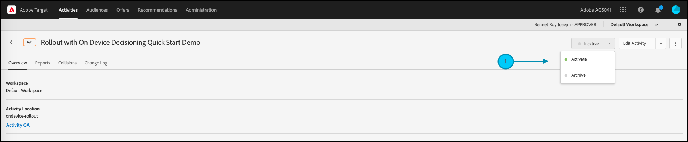

# 管理功能测试的转出

## 步骤摘要

1. 为您的组织启用[!UICONTROL on-device decisioning]
1. 创建[!UICONTROL A/B Test]活动
1. 定义您的功能和转出设置
1. 在应用程序中实施和渲染功能
1. 对应用程序中的事件实施跟踪
1. 激活A/B活动
1. 根据需要调整转出和流量分配

## 1.为您的组织启用[!UICONTROL on-device decisioning]

启用设备上决策可确保在几乎零延迟的情况下执行A/B活动。 要启用此功能，请在[!DNL Adobe Target]中导航到&#x200B;**[!UICONTROL Administration]** > **[!UICONTROL Implementation]** > **[!UICONTROL Account details]**，并启用&#x200B;**[!UICONTROL On-Device Decisioning]**&#x200B;切换开关。


>[!NOTE]
>
>您必须具有管理员或审批者[用户角色](https://experienceleague.adobe.com/docs/target/using/administer/manage-users/user-management.html?lang=zh-Hans)才能启用或禁用[!UICONTROL On-Device Decisioning]切换开关。

启用[!UICONTROL On-Device Decisioning]切换后，[!DNL Adobe Target]开始为您的客户端生成&#x200B;*规则工件*。

## 2.创建[!UICONTROL A/B Test]活动

1. 在[!DNL Adobe Target]中，导航到&#x200B;**[!UICONTROL Activities]**&#x200B;页面，然后选择&#x200B;**[!UICONTROL Create Activity]** > **[!UICONTROL A/B test]**。

   

1. 在&#x200B;**[!UICONTROL Create A/B Test Activity]**&#x200B;模式中，保留默认的&#x200B;**[!UICONTROL Web]**&#x200B;选项(1)，选择&#x200B;**[!UICONTROL Form]**&#x200B;作为体验编辑器(2)，选择带有&#x200B;**[!UICONTROL No Property Restrictions]** (3)的&#x200B;**[!UICONTROL Default Workspace]**，然后单击&#x200B;**[!UICONTROL Next]** (4)。

   

## 3.定义您的功能和转出设置

在活动创建的&#x200B;**[!UICONTROL Experiences]**&#x200B;步骤中，提供活动(1)的名称。 输入应用程序中要管理功能转出的位置(2)的名称。 例如，`ondevice-rollout`或`homepage-addtocart-rollout`是位置名称，指示管理功能转出的目标。 在下面显示的示例中，`ondevice-rollout`是为体验A定义的位置。您可以选择添加受众细化(4)以限制活动的资格。


1. 在同一页面的&#x200B;**[!UICONTROL Content]**&#x200B;部分中，从下拉列表(1)中选择&#x200B;**[!UICONTROL Create JSON Offer]**，如图所示。

   

1. 在出现的&#x200B;**[!UICONTROL JSON Data]**&#x200B;文本框中，为您打算在体验A (1)中与此活动一起推出的功能输入功能标志变量，使用有效的JSON对象(2)。

   

1. 单击&#x200B;**[!UICONTROL Next]** (1)以进入活动创建的&#x200B;**[!UICONTROL Targeting]**&#x200B;步骤。

   

1. 在&#x200B;**[!UICONTROL Targeting]**&#x200B;步骤中，保留&#x200B;**[!UICONTROL All Visitors]**&#x200B;受众(1)，以简化操作。 但是将流量分配(2)调整为10%。 这将限制此功能仅访问您网站访客的10%。 单击下一步(3)以前进到&#x200B;**[!UICONTROL Goals & Settings]**&#x200B;步骤。

   

1. 在&#x200B;**[!UICONTROL Goals & Settings]**&#x200B;步骤中，选择&#x200B;**[!UICONTROL Adobe Target]** (1)作为&#x200B;**[!UICONTROL Reporting Source]**，以便在[!DNL Adobe Target] UI中查看您的活动结果。

1. 选择&#x200B;**[!UICONTROL Goal Metric]**&#x200B;以测量该活动。 在此示例中，成功的转换基于用户是否购买商品，如用户是否到达orderConfirm(2)位置所示。

1. 单击&#x200B;**[!UICONTROL Save & Close]** (3)以保存活动。

   

## 4.在应用程序中实施并渲染功能

>[!BEGINTABS]

>[!TAB Node.js]

```js {line-numbers="true"}
targetClient.getAttributes(["ondevice-rollout"]).then(function(attributes) {
      const featureFlags = attributes.asObject("ondevice-rollout");

      // Your flag variables are now available in the featureFlags object variable.
      //If you failed to qualify for the Activity, you will have an empty object.
      console.log(featureFlags);
    });
```

>[!TAB Java]

```java {line-numbers="true"}
    Attributes attrs = targetJavaClient.getAttributes(targetDeliveryRequest, "ondevice-rollout");
    Map<String, Object> featureFlags = attrs.toMboxMap("ondevice-rollout");
​
    // Your flag variables are now available in the featureFlags object variable.
    //If you failed to qualify for the Activity, you will have an empty object.
    System.out.println(featureFlags);
```

>[!ENDTABS]

## 5.对应用程序中的事件实施跟踪

在使功能标志变量在应用程序中可用之后，您可以使用该变量来启用已属于应用程序的任何功能。 如果访客不符合活动资格，则意味着他们未包含在定义为受众的10%存储段中。

>[!BEGINTABS]

>[!TAB Node.js]

```js {line-numbers="true"}
//... Code removed for brevity

if(featureFlags.enable == "yes") { //Fell within 10% traffic
    console.log("Render Feature");
}
else {
    console.log("Disable Feature");
}

// alternatively, the getValue method could be used on the Attributes object.

if(attributes.getValue("ondevice-rollout", "enable") === "yes") { //Fell within 10% traffic
    console.log("Render Feature");
}
else {
    console.log("Disable Feature");
}
```

>[!TAB Java]

```java {line-numbers="true"}
//... Code removed for brevity
​
if("yes".equals(String.valueOf(featureFlags.get("enable")))) { //Fell within 10% traffic
    System.out.println("Render Feature");
}
else {
    System.out.println("Disable Feature");
}
​
// alternatively, the getString method could be used on the Attributes object.
​
if("yes".equals(attrs.getString("ondevice-rollout", "enable"))) { //Fell within 10% traffic
    System.out.println("Render Feature");
}
else {
    System.out.println("Disable Feature");
}
```

>[!ENDTABS]

## 6.激活您的转出活动



## 7.根据需要调整转出和流量分配

激活活动后，可随时编辑它以根据需要增加或减少流量分配。

由于初始转出成功，流量分配从10%增加到50%。


