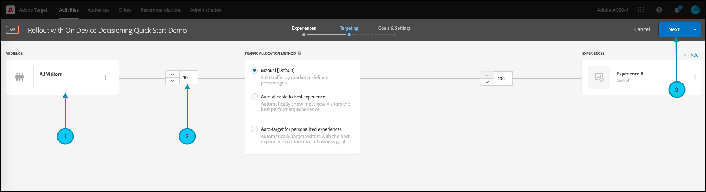

# 管理功能测试的转出

## 步骤摘要

1. 启用 [!UICONTROL 设备上决策] （贵组织）
1. 创建 [!UICONTROL A/B测试] 活动
1. 定义您的功能和转出设置
1. 在应用程序中实施和渲染功能
1. 对应用程序中的事件实施跟踪
1. 激活A/B活动
1. 根据需要调整转出和流量分配

## 1.启用 [!UICONTROL 设备上决策] （贵组织）

启用设备上决策可确保在几乎零延迟的情况下执行A/B活动。 要启用此功能，请导航到 **[!UICONTROL 管理]** > **[!UICONTROL 实现]** > **[!UICONTROL 帐户详细信息]** 在 [!DNL Adobe Target]，并启用 **[!UICONTROL 设备上决策]** 切换。


>[!NOTE]
>
>您必须具有管理员或审批者 [用户角色](https://experienceleague.adobe.com/docs/target/using/administer/manage-users/user-management.html) 启用或禁用 [!UICONTROL 设备上决策] 切换。

启用 [!UICONTROL 设备上决策] 切换， [!DNL Adobe Target] 开始生成 *规则对象* 你的委托人。

## 2.创建一个 [!UICONTROL A/B测试] 活动

1. 在 [!DNL Adobe Target]，导航到 **[!UICONTROL 活动]** 页面，然后选择 **[!UICONTROL 创建活动]** > **[!UICONTROL A/B测试]**.

   

1. 在 **[!UICONTROL 创建A/B测试活动]** 模式，保留默认值 **[!UICONTROL Web]** 已选择选项(1)，选择 **[!UICONTROL 表单]** 作为体验编辑器(2)，选择 **[!UICONTROL 默认工作区]** 替换为 **[!UICONTROL 无属性限制]** (3)，然后单击 **[!UICONTROL 下一个]** （四）。

   

## 3.定义您的功能和转出设置

在 **[!UICONTROL 体验]** 在活动创建步骤中，为您的活动提供一个名称(1)。 输入应用程序中要管理功能转出的位置(2)的名称。 例如，  `ondevice-rollout` 或 `homepage-addtocart-rollout` 是指示管理功能转出的目标的位置名称。 在以下示例中， `ondevice-rollout` 是为体验A定义的位置。您可以选择添加受众细化(4)以限制活动的资格。


1. 在 **[!UICONTROL 内容]** 部分，选择 **[!UICONTROL 创建JSON选件]** (1)中进行归因、筛选、流程、流失等。

   

1. 在 **[!UICONTROL JSON数据]** 在显示的文本框中，为您打算在体验A (1)中使用此活动推出的功能输入功能标志变量，并使用有效的JSON对象(2)。

   

1. 单击 **[!UICONTROL 下一个]** (1)垫付予本公司股东，作为本 **[!UICONTROL 定位]** 活动创建步骤。

   

1. 在 **[!UICONTROL 定位]** 步骤，保留 **[!UICONTROL 所有访客]** 受众(1)，为简单起见。 但是将流量分配(2)调整为10%。 这将限制此功能仅访问您网站访客的10%。 单击“下一步”(3)以前进到 **[!UICONTROL 目标和设置]** 步骤。

   

1. 在 **[!UICONTROL 目标和设置]** 步骤，选择 **[!UICONTROL Adobe Target]** (1)作为 **[!UICONTROL 报表源]** 要在中查看活动结果，请执行以下操作 [!DNL Adobe Target] UI。

1. 选择 **[!UICONTROL 目标量度]** 以测量活动。 在此示例中，成功的转换基于用户是否购买商品，如用户是否到达orderConfirm(2)位置所示。

1. 单击 **[!UICONTROL 保存并关闭]** (3)保存活动。

   

## 4.在应用程序中实施并渲染功能

>[!BEGINTABS]

>[!TAB Node.js]

```js {line-numbers="true"}
targetClient.getAttributes(["ondevice-rollout"]).then(function(attributes) {
      const featureFlags = attributes.asObject("ondevice-rollout");

      // Your flag variables are now available in the featureFlags object variable.
      //If you failed to qualify for the Activity, you will have an empty object.
      console.log(featureFlags);
    });
```

>[!TAB Java]

```java {line-numbers="true"}
    Attributes attrs = targetJavaClient.getAttributes(targetDeliveryRequest, "ondevice-rollout");
    Map<String, Object> featureFlags = attrs.toMboxMap("ondevice-rollout");
​
    // Your flag variables are now available in the featureFlags object variable.
    //If you failed to qualify for the Activity, you will have an empty object.
    System.out.println(featureFlags);
```

>[!ENDTABS]

## 5.对应用程序中的事件实施跟踪

在使功能标志变量在应用程序中可用之后，您可以使用该变量来启用已属于应用程序的任何功能。 如果访客不符合活动资格，则意味着他们未包含在定义为受众的10%存储段中。

>[!BEGINTABS]

>[!TAB Node.js]

```js {line-numbers="true"}
//... Code removed for brevity

if(featureFlags.enable == "yes") { //Fell within 10% traffic
    console.log("Render Feature");
}
else {
    console.log("Disable Feature");
}

// alternatively, the getValue method could be used on the Attributes object.

if(attributes.getValue("ondevice-rollout", "enable") === "yes") { //Fell within 10% traffic
    console.log("Render Feature");
}
else {
    console.log("Disable Feature");
}
```

>[!TAB Java]

```java {line-numbers="true"}
//... Code removed for brevity
​
if("yes".equals(String.valueOf(featureFlags.get("enable")))) { //Fell within 10% traffic
    System.out.println("Render Feature");
}
else {
    System.out.println("Disable Feature");
}
​
// alternatively, the getString method could be used on the Attributes object.
​
if("yes".equals(attrs.getString("ondevice-rollout", "enable"))) { //Fell within 10% traffic
    System.out.println("Render Feature");
}
else {
    System.out.println("Disable Feature");
}
```

>[!ENDTABS]

## 6.激活您的转出活动


## 7.根据需要调整转出和流量分配

激活活动后，可随时编辑它以根据需要增加或减少流量分配。

由于初始转出成功，流量分配从10%增加到50%。


