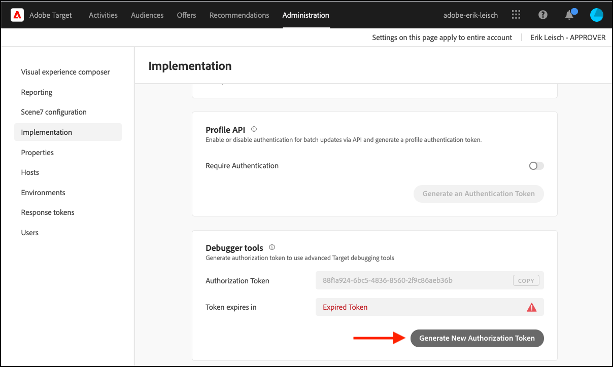

# 疑难解答 [!UICONTROL 设备上决策]

## 正在验证配置

### 步骤摘要

1. 确保 `logger` 已配置
1. 确保 [!DNL Target] 已启用跟踪
1. 验证 [!UICONTROL 设备上决策] *规则构件* 已根据定义的轮询间隔进行检索和缓存。
1. 通过创建测试来验证通过缓存的规则工件进行的内容交付 [!UICONTROL 设备上决策] 通过基于表单的体验编辑器进行活动。
1. Inspect发送通知错误

## 1.确保已配置日志程序

初始化SDK时，请确保启用日志记录。

**Node.js**

对于Node.js SDK a `logger` 应提供对象。

```js {line-numbers="true"}
const CONFIG = {
  client: "<your client code>",
  organizationId: "<your organization ID>",
  logger: console
};
```

**Java SDK**

适用于Java SDK的 `logRequests` 在 `ClientConfig` 应该启用。

```js {line-numbers="true"}
ClientConfig config = ClientConfig.builder()
  .client("<your client code>")
  .organizationId("<your organization ID>")
  .logRequests(true)
  .build();
```

此外，JVM应使用以下命令行参数启动：

```bash {line-numbers="true"}
java -Dorg.slf4j.simpleLogger.defaultLogLevel=DEBUG ...
```

## 2.确保[!DNL Target]已启用跟踪

启用跟踪将输出其他信息，来自 [!DNL Adobe Target] 关于规则成品。

1. 导航至[!DNL Target]中的UI [!DNL Experience Cloud].

   

1. 导航到 **[!UICONTROL 管理]** > **[!UICONTROL 实现]** 并单击 **[!UICONTROL 生成新的授权令牌]**.

   

1. 将新生成的授权令牌复制到剪贴板并将其添加到您的[!DNL Target]请求：

   **Node.js**

   ```js {line-numbers="true"}
   const request = {
     trace: {
       authorizationToken: "88f1a924-6bc5-4836-8560-2f9c86aeb36b"
     },
     execute: {
       mboxes: [{
         name: "sdk-mbox"
       }]
   }};
   ```

   **Java**

   ```js {line-numbers="true"}
   Trace trace = new Trace()
     .authorizationToken("88f1a924-6bc5-4836-8560-2f9c86aeb36b");
   Context context = new Context()
     .channel(ChannelType.WEB);
   MboxRequest mbox = new MboxRequest()
     .name("sdk-mbox")
     .index(0);
   ExecuteRequest executeRequest = new ExecuteRequest()
     .mboxes(Arrays.asList(mbox));
   
   TargetDeliveryRequest request = TargetDeliveryRequest.builder()
     .trace(trace)
     .context(context)
     .execute(executeRequest)
     .build();
   ```

1. 设置好记录器和跟踪后，启动您的应用程序并监视服务器终端。 记录器的以下输出确认已检索规则构件：

   **Node.js SDK**

   ```text {line-numbers="true"}
     AT: LD.ArtifactProvider fetching artifact - https://assets.adobetarget.com/your-client-code/production/v1/rules.json
     AT: LD.ArtifactProvider artifact received - status=200
   ```

## 3.验证 [!UICONTROL 设备上决策] *规则构件* 已根据定义的轮询间隔进行检索和缓存。

1. 等待轮询间隔的持续时间（默认值为20分钟），并确保SDK正在获取构件。 将输出相同的终端日志。

   此外，来自[!DNL Target]应将跟踪输出到终端，其中包含有关规则工件的详细信息。

   ```text {line-numbers="true"}
   "trace": {
     "clientCode": "your-client-code",
     "artifact": {
       "artifactLocation": "https://assets.adobetarget.com/your-client-code/production/v1/rules.json",
       "pollingInterval": 300000,
       "pollingHalted": false,
       "artifactVersion": "1.0.0",
       "artifactRetrievalCount": 10,
       "artifactLastRetrieved": "2020-09-20T00:09:42.707Z",
       "clientCode": "your-client-code",
       "environment": "production",
       "generatedAt": "2020-09-22T17:17:59.783Z"
     },
   ```

## 4.通过创建测试来验证通过缓存的规则工件进行的内容交付 [!UICONTROL 设备上决策] 通过基于表单的体验编辑器进行活动

1. 导航至[!DNL Target]Experience Cloud中的UI

   

1. 使用基于表单的体验编辑器创建新的XT活动。

   

1. 输入mbox名称，该名称用于[!DNL Target]请求作为XT活动的位置（请注意，这应该是一个专门用于开发的唯一mbox名称）。

   

1. 将内容更改为HTML选件或JSON选件。 此将返回到[!DNL Target]请求您的应用程序。 将活动的定位保留为“所有访客”，然后选择所需的任何量度。 命名活动，保存活动，然后激活活动以确保使用的mbox/位置仅用于开发。

   

1. 在您的应用程序中，为从您的应用程序收到的响应中收到的内容添加日志语句。[!DNL Target]请求

   **Node.js SDK**

   ```js {line-numbers="true"}
   try {
     const response = await targetClient.getOffers({ request });
     console.log('Response: ', response.response.execute.mboxes[0].options[0].content);
   } catch (error) {
     console.error('Something went wrong', error);
   }
   ```

   **Java SDK**

   ```js {line-numbers="true"}
   try {
     Context context = new Context()
       .channel(ChannelType.WEB);
     MboxRequest mbox = new MboxRequest()
       .name("sdk-mbox")
       .index(0);
     ExecuteRequest executeRequest = new ExecuteRequest()
       .mboxes(Arrays.asList(mbox));
   
     TargetDeliveryRequest request = TargetDeliveryRequest.builder()
       .context(context)
       .decisioningMethod(DecisioningMethod.ON_DEVICE)
       .execute(executeRequest)
       .build();
   
       TargetDeliveryResponse response = targetClient.getOffers(request);
     logger.debug("Response: ", response.getResponse().getExecute().getMboxes().get(0).getOptions().get(0).getContent());
   } catch (Exception exception) {
     logger.error("Something went wrong", exception);
   }
   ```

1. 查看您终端中的日志，以验证您的内容是否正在交付并通过服务器上的规则工件交付。 此 `LD.DeciscionProvider` 根据规则工件在设备上确定活动资格和决策时，输出对象。 此外，由于 `content`，您应该看到 `<div>test</div>` 或者，在创建测试活动时，您会决定采用哪种响应。

   **记录器输出**

   ```text {line-numbers="true"}
   AT: LD.DecisionProvider {...}
   AT: Response received {...}
   Response:  <div>test</div>
   ```

## Inspect发送通知错误

使用设备上决策时，会自动发送getOffers执行请求的通知。 这些请求将在后台静默发送。 通过订阅名为的事件，可以检查任何错误 `sendNotificationError`. 以下代码示例显示了如何使用Node.js SDK订阅通知错误。

```js {line-numbers="true"}
const TargetClient = require("@adobe/target-nodejs-sdk");
let client;

function onSendNotificationError({ notification, error }) {
  console.log(
    `There was an error when sending a notification: ${error.message}`
  );
  console.log(`Notification Payload: ${JSON.stringify(notification, null, 2)}`);
}

async function targetClientReady() {
  const request = {
    context: { channel: "web" },
    execute: {
      mboxes: [{
        name: "a1-serverside-ab",
        index: 1
      }]
    }
  };
  const targetResponse = await client.getOffers({ request });
}

client = TargetClient.create({
  events: {
    clientReady: targetClientReady,
    sendNotificationError: onSendNotificationError
  }
});
```

## 常见疑难解答方案

请务必查看 [支持的功能](supported-features.md) 对象 [!UICONTROL 设备上决策] 遇到问题时。

### 由于受众或活动不受支持，设备上决策活动无法执行

一个可能发生的常见问题是 [!UICONTROL 设备上决策] 由于正在使用的受众或活动类型不受支持，活动无法执行。

(1)使用记录器输出，查看响应对象中trace属性中的条目。 明确标识促销活动属性：

**跟踪输出**

```text {line-numbers="true"}
  "execute": {
  "mboxes": [
    {
      "name": "your-mbox-name",
      "index": 0,
      "trace": {
        "clientCode": "your-client-code",
        ...
        "campaigns": [],
        ...
      }
    }
```

您会注意到，您尝试符合条件的活动不在 `campaigns` 属性，因为不支持受众或活动类型。 如果活动列在 `campaigns` 属性，问题并非由于不支持的受众或活动类型所导致。

(2)此外，本公司将位于香港 `rules.json` 通过查看 `trace` > `artifact` > `artifactLocation` 在日志程序输出中，请注意您的活动在 `rules` > `mboxes` 属性：

**记录器输出**

```text {line-numbers="true"}
 ...
 rules: {
   mboxes: { },
   views: { }
 }
```

最后，导航到[!DNL Target]UI并找到相关活动： [experience.adobe.com/target](https://experience.adobe.com/target)

查看受众中使用的规则，并确保仅使用前面提到的受支持的规则。 此外，请确保活动类型为A/B或XT。


### 由于受众不合格，设备上决策活动无法执行

如果设备上决策活动未执行，但您已验证rules.json文件包含该活动，请执行以下步骤来运行：

(1)确保在应用程序中执行的mbox与活动使用的mbox相同：

>[!BEGINTABS]

>[!TAB rule.json]

```text {line-numbers="true"}
 ...
 rules: {
   mboxes: {
    target-only-node-sdk-mbox: [{ // this mbox name must match the mbox in your request
      ...
    }]
   }
 ...
```

>[!TAB Node.js SDK]

```js {line-numbers="true"}
 const request = {
   trace: {
     authorizationToken: '2dfc1dce-1e58-4e05-bbd6-a6725893d4d6'
   },
   execute: {
     mboxes: [{
       address: getAddress(req),
       name: "target-only-node-sdk-mbox-two" // this mbox name must match the mbox the activity is using
     }]
   }};
```

>[!TAB Java SDK]

```js {line-numbers="true"}
Context context = new Context()
  .channel(ChannelType.WEB);
MboxRequest mbox = new MboxRequest()
  .name("target-only-node-sdk-mbox-two")
  .index(0);
ExecuteRequest executeRequest = new ExecuteRequest()
  .mboxes(Arrays.asList(mbox));

TargetDeliveryRequest request = TargetDeliveryRequest.builder()
  .context(context)
  .decisioningMethod(DecisioningMethod.ON_DEVICE)
  .execute(executeRequest)
  .build();

TargetDeliveryResponse response = targetClient.getOffers(request);
```

>[!ENDTABS]

(2)通过查看 `matchedRuleConditions` 或 `unmatchedRuleConditions` 跟踪输出的属性：

**跟踪输出**

```text {line-numbers="true"}
...
},
"campaignId": 368564,
"campaignType": "landing",
"matchedSegmentIds": [],
"unmatchedSegmentIds": [
  6188838
      ],
      "matchedRuleConditions": [],
          "unmatchedRuleConditions": [
            {
              "in": [
                "true",
                {
                  "var": "mbox.auth_lc"
                }
              ]
            }
          ]
    ...
```

如果您有不匹配的规则条件，则不符合活动的条件，因此不会执行活动。 查看受众中的规则，了解您不符合条件的原因。

### 设备上决策活动未执行，但原因不明确

设备上决策活动无法执行的原因可能并不明显。 在这种情况下，请按照以下故障排除步骤来识别问题：

(1)阅读控制台中的记录器跟踪输出，并识别工件属性，该属性将类似于以下内容：

**跟踪输出**

```text {line-numbers="true"}
...
      "artifact": {
          "artifactLocation": "https://assets.adobetarget.com/your-client-code/production/v1/rules.json",
          "pollingInterval": 300000,
          "pollingHalted": false,
          "artifactVersion": "1.0.0",
          "artifactRetrievalCount": 3,
          "artifactLastRetrieved": "2020-10-16T00:56:27.596Z",
          "clientCode": "adobeinterikleisch",
          "environment": "production"
        },
...
```

查看 `artifactLastRetrieved` 项目的日期，并确保您拥有最新的 `rules.json` 文件已下载到您的应用程序。

(2)查找 `evaluatedCampaignTargets` 记录器输出中的属性：

**记录器输出**

```text {line-numbers="true"}
...
  "evaluatedCampaignTargets": [
      {
        "context": {
          "current_timestamp": 1602812599608,
          "current_time": "0143",
          "current_day": 5,
          "user": {
            "browserType": "unknown",
            "platform": "Unknown",
            "locale": "en",
            "browserVersion": -1
          },
          "page": {
            "url": "localhost:3000/",
            "path": "/",
            "query": "",
            "fragment": "",
            "subdomain": "",
            "domain": "3000",
            "topLevelDomain": "",
            "url_lc": "localhost:3000/",
            "path_lc": "/",
            "query_lc": "",
            "fragment_lc": "",
            "subdomain_lc": "",
            "domain_lc": "3000",
            "topLevelDomain_lc": ""
          },
          "referring": {
            "url": "localhost:3000/",
            "path": "/",
            "query": "",
            "fragment": "",
            "subdomain": "",
            "domain": "3000",
            "topLevelDomain": "",
            "url_lc": "localhost:3000/",
            "path_lc": "/",
            "query_lc": "",
            "fragment_lc": "",
            "subdomain_lc": "",
            "domain_lc": "3000",
            "topLevelDomain_lc": ""
          },
          "geo": {},
          "mbox": {},
          "allocation": 23.79
        },
        "campaignId": 368564,
        "campaignType": "landing",
        "matchedSegmentIds": [],
        "unmatchedSegmentIds": [
          6188838
        ],
        "matchedRuleConditions": [],
        "unmatchedRuleConditions": [
          {
            "in": [
              "true",
              {
                "var": "mbox.auth_lc"
              }
            ]
          }
        ]
...
```

(3)检阅 `context`， `page`、和 `referring` 数据，确保数据按预期显示，因为这可能会影响活动的定位资格。

(4)检阅 `campaignId` 以确保评估您预期执行的一个或多个活动。 此 `campaignId` 将与中的活动概述选项卡上的活动ID匹配[!DNL Target]UI：


(5)检阅 `matchedRuleConditions` 和 `unmatchedRuleConditions` 确定在给定活动中符合受众规则时出现的问题。

(6)检阅最新资讯 `rules.json` 文件，以确保包含要本地执行的一个或多个活动。 上述步骤1中引用了该位置。

(7)确保在请求和活动中使用相同的mbox名称。

(8)确保您使用的是支持的受众规则和支持的活动类型。

### 即使mbox下的活动设置显示“符合设备决策条件”，系统也会进行服务器调用。[!DNL Target]用户界面

进行服务器调用的原因有几个，即使设备符合设备上决策的条件：

* 当用于“符合设备上决策资格”活动的mbox也用于不符合“符合设备上决策资格”的其他活动时，mbox将列在 `remoteMboxes` 中的部分 `rules.json` 成品。 当mbox列在 `remoteMboxes`，任意 `getOffer(s)` 对该mbox的调用会导致服务器调用。

* 如果您在工作区/属性下设置活动，并且在配置SDK时未包含该活动，则可能会导致 `rules.josn` 要下载的默认工作区的，该工作区可以使用 `remoteMboxes` 部分。
